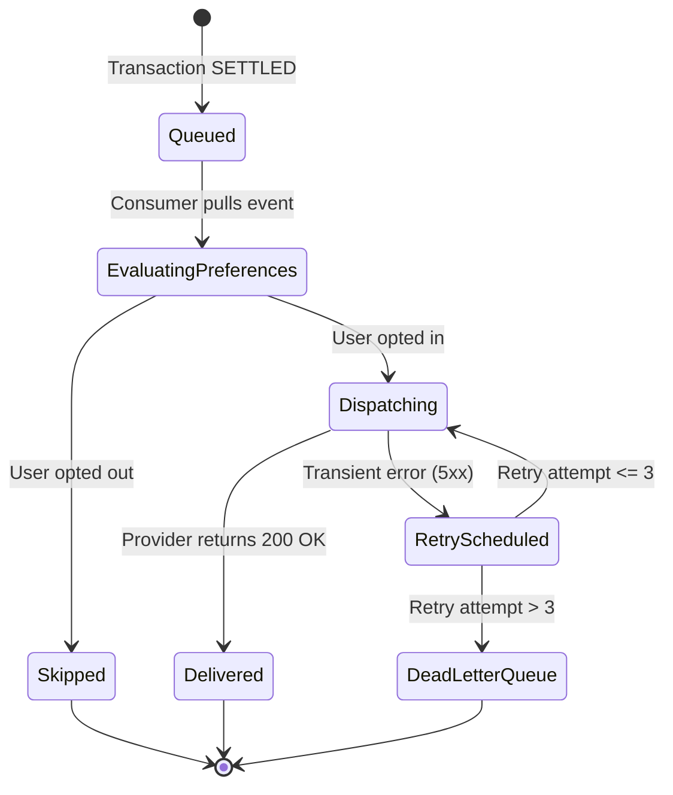
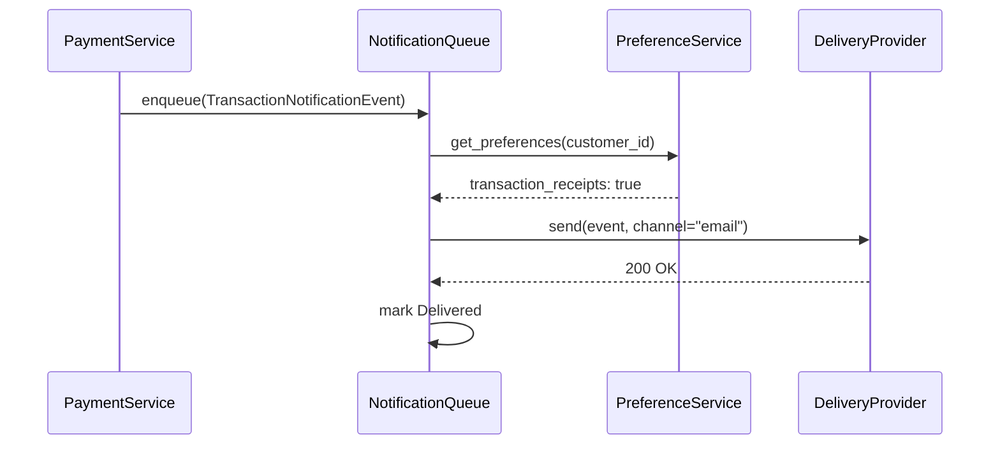
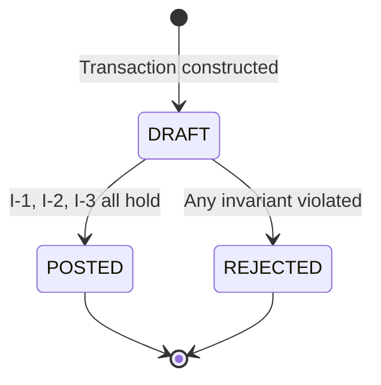

# Preface

For most of my working life, producing code was the expensive part of building software. Estimates were measured in developer-days of typing. Design reviews argued about how much work a feature would be to write, not about whether anyone understood it. We optimized the whole craft around that scarcity: frameworks to type less, libraries to type less, code generators to type less.

That scarcity is gone. A coding agent now turns three sentences into a working module faster than I can describe the module to a colleague. The cost of the first version of almost anything has collapsed toward zero. I do not think this is a small change in tooling. I think it relocates the hard part of engineering, and most teams have not noticed where it went.

What I notice is that teams fail differently now. The old failure was slowness: a team that could not ship, a backlog that outran the people working it, a rewrite that never landed. The new failure is speed without agreement.

The shapes it takes are easy to recognize once you are looking for them. A team ships four features in a week and cannot explain any of them. Two services disagree about what `paid` means, and both were generated from prompts that each sounded reasonable in isolation. A fix lands, the symptom disappears, and two invisible regressions appear in code nobody has read. Somebody asks why a retry window is sixty seconds and the answer lives in a chat log that no longer exists.

None of those are typing failures. They are failures of specification. When I look at a team drowning in generated code, the missing artifact is almost always the same one: a written, precise, reviewable statement of what the system must guarantee. The team has code, tests that assert whatever the code already does, and tickets that describe intentions in the vocabulary of a hallway conversation. It does not have a source of truth. So the code becomes the source of truth by default, which is exactly the situation the team was trying to escape when it started generating code in the first place.

This book argues one thing, and it is worth stating in a single sentence: **the specification is the software; the code is a build artifact.**

I mean that literally, not as a slogan. If the specification is the software, then it belongs in version control with the same seriousness you give code. It gets reviewed by people who can block it. It has a size limit, a structure, an owner, and a version number. It has names for the things that go wrong in it, and named procedures for fixing them. And the generated code is treated the way you treat compiler output: you read it, you test it, you ship it, and you do not hand-edit it to fix a defect that lives upstream. That last consequence is the most uncomfortable one, and I give it a name and a chapter of its own in Chapter 4.

I am modeling this book on *Clean Code*, and I want to be open about the debt. What made that book useful was not any individual rule about function length. It was the vocabulary. Once a team has the word "smell", a reviewer can say "this function smells" and be understood. Once a refactoring has a name and a set of mechanics, two engineers can agree on a change before either of them touches the editor. Principles with names, before-and-after pairs, a catalog of smells, a catalog of refactorings: that shape is what I am copying, and I am copying it because it works in rooms full of real engineers under real deadlines.

What is different is the reader. *Clean Code* is written for human maintainers, and human maintainers are forgiving in ways we rarely appreciate. They read between the lines. They notice that a function name contradicts its body and trust the body. When a requirement makes no sense, they walk over and ask. Every one of those recoveries is a repair performed by a reader who shares your context.

The reader of a specification is a probabilistic compiler. It does not ask. It does not flag the gap, or mark the sentence as ambiguous, or notice that you never said what happens when the amount is zero. It fills every hole you leave with the statistical average of everything it has read, and the average codebase on the public internet stores money in floating-point numbers, swallows exceptions, and has no concurrency story at all. Silence in your specification is not a question waiting to be asked. It is an instruction to guess, delivered confidently, and answered in code that compiles.

That one difference reshapes the rules. Ambiguity in a document for people is a stylistic weakness; ambiguity in a document for a generator is an unbounded output space. So this book pushes harder than a style guide would on quantifying every bound, enumerating every failure, closing every state machine, and writing the error cases before the happy path. It also pushes in the opposite direction where it matters: a specification that dictates syntax has stopped being a specification and become bad code in prose.

The machinery of the book is straightforward. Principles get bold names so you can cite them in a review. Most arguments arrive as a before-and-after pair, because I find that one weak sentence next to its repaired version teaches more than three paragraphs of theory. Part IV is a catalog of eleven ways specifications go wrong and nine named procedures for repairing them. Part V works three problems end to end, including one legacy rewrite, because principles that only appear in small examples are easy to believe and hard to use.

I should say what this book does not claim. It does not claim that coding agents are reliable, that engineers are becoming unnecessary, or that a good document removes the need for judgment. Agents fail constantly, and a large part of this book is about building the gates that catch those failures early. Engineering judgment does not disappear under this discipline. It moves upstream, into deciding what the system must guarantee, which was always the part that deserved senior attention and rarely got it.

<!-- AUTHOR: a real project where a missing invariant cost the team money or a weekend would anchor this preface; needs the domain, the invariant, and what the fix actually was. -->

<!-- AUTHOR: acknowledgements -->

# Who This Book Is For

I wrote this for senior developers, tech leads, and architects who already ship production software and who now have at least one coding agent in the loop every day. If you are the person who reviews what the agent produced, who gets paged when it is wrong, and who has to explain the system to a new hire six months later, you are the reader I had in mind on every page.

I assume a few things, and I assume them without apology because the book would double in length otherwise.

I assume you work in a typed language and read type annotations as information rather than decoration. The primary examples are Python 3 with type hints, with TypeScript as the secondary language. I assume you write tests and trust them enough to ship on green, because much of Part III is about deriving tests from a document instead of inventing them from intuition. I assume Git is a working tool for you and not a backup system: you branch, you review, you read history to answer questions about why a decision was made. And I assume you use a coding agent regularly enough to have been burned by one. The reader who has never watched an agent confidently produce plausible nonsense will find the early chapters overstated.

It helps enormously if you work in a domain with real invariants. Money, inventory, scheduling, permissions, billing: places where two numbers have to agree, where a state cannot be skipped, where a duplicate request must not charge a customer twice. The discipline in this book pays for itself fastest where being almost right is indistinguishable from being wrong.

Some readers should skip this book, and I would rather say so here than waste your evening. If you are learning to program, learn to read and write code first. You cannot review what you cannot read, and this whole discipline rests on your ability to judge whether generated code honors a contract. If you never work with agents, roughly half of what follows still applies, because contracts and invariants were good engineering long before any of this, but the economics I use to justify the effort will not land for you. And if you are hoping for a technique that lets you avoid understanding your own domain, this is the wrong book. Specification work is domain work. It gets harder and more valuable the less you already know, and no tool removes that cost.

Three things this book is not.

It is not a prompt-engineering guide. You will not find phrasings that coax better output from a particular language model, or tricks that stop working after an update. A specification is an engineering artifact that must outlive the language model that reads it, and that constraint rules out everything clever.

It is not a vendor manual. I deliberately name no language model, no vendor, no editor, and no hosted product anywhere in these pages. I do name open standards and tools that have stable public definitions, because a document that depends on a product is a document with an expiration date.

It is not a formal-methods textbook. I use Hoare triples, invariants, and state tables as writing disciplines, not as proof obligations. Nothing here requires a theorem prover or a semester of logic. If you can write a clear precondition and an honest failure table, you have everything the method needs.

# How to Read This Book

Read it front to back the first time. The five parts are built in dependency order, and the later catalogs assume the vocabulary the earlier parts establish. After that, Part IV and the appendices are the parts you will reopen.

Part I, Chapters 1 through 4, makes the argument. Chapter 1 is about what happened when code became cheap, and why a specification is the only artifact in the pipeline whose value grows over time. Chapter 2 explains, in plain words, what a language model actually does with your sentences, and introduces **Constraint Density** as the property you are optimizing. Chapter 3 borrows preconditions, postconditions, and invariants from Hoare logic and puts them to work in a document. Chapter 4 inverts the usual flow into Spec-Driven Development and states the rule everything else depends on.

Part II, Chapters 5 through 9, is anatomy. Chapter 5 dissects why natural language fails as an input to a generator and how RFC 2119 vocabulary repairs part of the damage. Chapter 6 builds the composite grammar this book uses throughout: Markdown for structure and norms, schemas for data, diagrams for dynamics. Chapter 7 introduces **The Three Levels** that keep a document readable by both people and agents. Chapter 8 rereads SOLID as a set of rules about documents. Chapter 9 covers naming, mandatory sections, and the size limits that keep a specification inside a useful context budget.

Part III, Chapters 10 through 12, is about proving any of it. Chapter 10 derives tests from the document instead of inventing them, and sets up **The Three Gates** that every change must pass. Chapter 11 describes the shape of an agent loop that cannot wander off, including what belongs in an agent instruction file and when the agent must stop and ask. Chapter 12 puts documents under version control: commit pairs, versioning, status lifecycle, and detecting spec drift in CI.

Part IV, Chapters 13 and 14, is the reference half. Chapter 13 is a catalog of spec smells, each with a symptom, an example, a consequence, and a cure. Chapter 14 is a catalog of refactorings in the familiar motivation-mechanics-example form, each one the cure that Chapter 13 names. Skim both on the first pass. Reopen them when you are reviewing someone's work and something feels wrong that you cannot yet name.

Part V, Chapters 15 through 17, works three problems all the way through: a double-entry ledger built from nothing, a legacy function reverse-specified into a document that can be trusted, and a single feature taken from a one-line ticket to a merged commit pair. The Epilogue is short and argues about what this does to the job.

A few conventions worth knowing before you start.

The running example is **Meridian**, a fictional mid-size e-commerce and payments platform with teams called Checkout, Billing, Ledger, Inventory, and Identity. Meridian exists so that an invariant introduced in Part II can be tested in Part III and refactored in Part IV without reintroducing a new domain each time. It is deliberately ordinary. I never describe more of it than a given example needs.

Specifications carry stable identifiers in the form `SPEC-<DOMAIN>-<NNN>`, such as `SPEC-PAY-042` for Meridian's transaction confirmation notifications. An identifier never changes meaning once assigned. Sections are cited as `SPEC-PAY-042 §3`, and individual numbered statements as `SPEC-PAY-042 N-3`, so that a review comment, a test name, and a commit message can all point at the same sentence. Chapter 9 explains the scheme and the numbering prefixes.

A few formulas appear, mostly in Part I. Every one of them is accompanied by a plain-English sentence saying what it means, and no formula ever stands alone as a paragraph. If notation slows you down, read the sentence and move on; you will lose nothing that the rest of the book depends on. Where precision genuinely pays, the notation lives inside a specification example rather than in my prose.

Every chapter opens with a scenario, and every scenario is hypothetical. You will see them start with "Imagine a team that", "Suppose you inherit", or "Picture a Tuesday afternoon". That phrasing is a promise: these are composites built to isolate one problem, not reports about real companies, and nothing in them should be read as a story about somebody's actual client. Where a true account from my own work would strengthen a point, I have marked the spot in the source rather than invent one.

Each chapter ends with **Key Takeaways**, five to eight bullets, each a single sentence stating one rule or one fact. They are there for the second reading and for the meeting where you have ten minutes to refresh before a review.

Four appendices close the book, and they exist to be copied rather than read. Appendix A is the Clean Spec template with its mandatory sections in fixed order. Appendix B is an RFC 2119 cheat sheet. Appendix C is a review checklist with one question per smell. Appendix D is a glossary of the terms this book uses precisely. Put Appendix A in your repository today and Appendix C in your pull request template; that alone will change the quality of the next document your team writes.

One suggestion before you begin. Pick the ugliest ticket currently in your backlog, the one everybody keeps deferring because nobody agrees what it means. Keep it in mind as you read. By Chapter 9 you will know how to write it down properly, and by Chapter 14 you will know what to do when the first attempt comes out wrong.


# Part I: Why Specifications Matter Now {.unnumbered .part}

# Chapter 1: The Commoditization of Code

Imagine a Meridian squad with a free weekend and a good idea. Three engineers from the Checkout team want a loyalty feature: customers spend money, earn points, and redeem points at the till. On Friday evening they open a coding agent, describe the idea in a paragraph, and start iterating. By Sunday night there is a running service with a data store, an API, a small admin page, and a demo that survives a live walkthrough on Monday morning. Two years earlier that same weekend would have bought a wireframe and an argument about frameworks.

The feature ships and customers like it. Billing asks for points on subscription renewals. Inventory asks for bonus points on clearance items. Identity asks what should happen to points when two accounts merge. Each request becomes another conversation with the agent, another patch, another green deployment.

Three months later the squad has a different relationship with the service. Every change breaks two things. Fixing the account-merge case quietly re-enables expired points. Adding renewals makes refunds award points twice. The squad writes a test after each incident, the tests pass, and the next change breaks something no test covered.

Then somebody in a review asks the question that ends the meeting: what does this service actually guarantee? Three answers are available, and none of them is a guarantee. You can read the code, which tells you what happens today and says nothing about what is allowed. You can ask the agent, which will produce a confident summary of code it is reading for the first time. You can read the tests, which assert whatever the implementation did on the day each one was written. Somebody asks why the redemption hold expires after sixty seconds, and the only honest answer is that a chat log said so, and the chat log is gone.

None of this is a typing failure, and none of it is carelessness. The squad produced a large amount of working code very quickly, and that was never the problem. The weekend was not the mistake either. The mistake was believing that the weekend had produced an engineering artifact, when what it produced was output. This chapter is about why that distinction suddenly matters so much, and why it did not matter nearly as much before.

## 1.1 Four leaps in abstraction

The history of software engineering is the history of raising the level of abstraction. Each major leap took an activity that consumed human attention and turned it into a subprocess that a machine performs reliably. It helps to look at the leaps together, because they share a shape, and the shape tells you what to expect from the one we are living through.

The table below lists four transitions, what each one automated, and which artifact engineers were left writing by hand afterward.

| Transition | What got automated | What became the primary artifact |
| :--- | :--- | :--- |
| Machine code to assembly | Manual translation into numeric opcodes, and hand-computed addresses | The symbolic assembly listing |
| Assembly to compiled procedural languages (Fortran, C) | Register allocation, call-stack layout, instruction selection | The procedural source file |
| Procedural to managed object-oriented languages (Java, C#, Python) | Memory lifecycle, bounds and type checking, dispatch tables | Class and interface definitions |
| Traditional programming to spec-driven agentic engineering | Translating intent into syntax: writing the statements themselves | The specification: contracts, invariants, failure modes |

Read the third column downward and you see the real story. Every leap moved the artifact that engineers author up one level, and every leap turned the previous artifact into something you can still read but no longer write. I can read the assembly a compiler emits. I have read it to chase a performance problem, and I expect to read it again. I have not authored a line of it in twenty years, and nobody on my teams checks it into version control.

Each of these transitions also arrived with the same objection, and the objection was never silly. Assembly programmers pointed out, correctly, that early compilers produced worse code than a careful human. Procedural programmers pointed out, correctly, that garbage collection introduced pauses they could not control. In both cases the critics were right about the immediate quality and wrong about the trajectory. The automated layer improved, the cost of not using it grew, and the argument ended not because anyone won it but because the generation that cared had moved on to harder problems.

There is a second pattern worth naming. Each leap did not reduce the total difficulty of building software; it relocated the difficulty. When register allocation stopped being your problem, data structure design became your problem, because you were now writing programs large enough for data structures to matter. Automation at one level exposes the next level's mistakes, and those mistakes are always more expensive, because they are mistakes about intent rather than mistakes about mechanism.

The fourth row is where we are now, and it differs from the first three in one important respect. The earlier leaps automated mechanical translation, where the correct output was determined by the input. This one automates the step where meaning is decided: turning a human idea into precise behavior. That is not a mechanical step, which is why the rest of this book exists.

The difference shows up in what "correct" means for the automated layer. A compiler is correct when its output preserves the semantics of the input, and the input has semantics, defined by a language standard that a committee spent years arguing over. When you hand a generator a paragraph of English, there is no semantics to preserve, because English sentences about software do not have one. What you are really asking for is a behavior consistent with your sentences, and a paragraph of English is consistent with an enormous number of different behaviors. That gap is where every problem in this book lives, and closing it is the whole job.

## 1.2 Source code as intermediate representation

If an inference engine turns a description of required behavior into running code, then conventional source code has changed category. Python, TypeScript, Go, and Rust files are no longer the original artifact. They are an **intermediate representation**: a lower-level form, produced from something else, that happens to be the form your runtime consumes.

I want to be precise about what "intermediate" does and does not mean here, because the word invites a misreading. It does not mean unimportant, and it does not mean disposable. The intermediate representation is the thing you deploy, profile, and get paged about at three in the morning. Compiler output is also the thing that actually runs, and we take it extremely seriously. "Intermediate" means only that it is derived: it is downstream of a more authoritative document, and when it disagrees with that document, it is the code that is wrong.

The engine producing it is a large language model (LLM), and from here on I will call it a language model. For the purposes of this chapter, what matters is the role it plays rather than how it works, and the role is best named directly: it is a **nondeterministic compiler**. It consumes a description in natural language and emits code, which is what a compiler does.

Everything else about it violates what we expect from compilers. Run it twice on the same input and you get two different programs, both plausible, sometimes differing in behavior you care about. It has no language standard, no reference semantics, and no errata list. Where a conventional compiler rejects what it cannot interpret, this one interprets everything, because producing output is the only thing it knows how to do.

The missing errata list is worth dwelling on, because it breaks a habit you rely on more than you notice. When a conventional toolchain miscompiles something, the bug has an identity: a number, a report, a version where it appears and a version where it is fixed. It also has a workaround you can write down and hand to the next person. A generator that makes a poor choice offers none of that. There is no defect to file, because nothing was violated; the output was one valid sample from a distribution that also contains better ones. You cannot fix it upstream and you cannot rely on it not recurring, so all you can do is change the input or check the output, which is a strong hint about where the engineering work has gone.

That last property is the one that reshapes the work. A conventional compiler treats silence in your source as a syntax error: omit the return type, and it either infers it by documented rules or refuses to proceed. A nondeterministic compiler treats silence as permission to choose. Omit what happens when the amount is zero, and you will get a choice, made from the statistical habits of an enormous amount of public code, and that code stores money in floating-point numbers and swallows exceptions. Your specification's gaps are not questions waiting to be asked. They are delegated decisions, and you will not be told which ones you delegated.

Consider what determinism was actually buying us. Compiler correctness is verified once, by the compiler's authors, for all programs. You do not test whether your compiler allocated registers correctly for your function; you test your function's logic and trust the translation. That trust is an enormous, invisible subsidy on every project, and a nondeterministic compiler withdraws it. Verification of the translation moves to you, and it moves per program, per feature, per run.

There are only two coherent responses to that withdrawal, and this book is about both. The first is to make the input carry enough constraints that the space of acceptable outputs is small, which is the property Chapter 2 defines and names. The second is to verify every output mechanically against the same document that produced it, which is what Chapter 10 builds. What you cannot do is treat the generated code as the authority and patch it by hand when it misbehaves. That move feels like engineering and is the single most expensive habit in this whole field; Chapter 4 gives it a name and a rule.

One more consequence deserves saying plainly. If code is an intermediate representation, then reading generated code remains a core skill and stops being the place where your judgment is most valuable. I read compiler output to diagnose, not to decide. You will read generated code the same way: to confirm that a contract holds, to find out why a gate failed, to understand a performance profile. The decisions live upstream, in the document the generator read.

## 1.3 The vibecoding curve

Vibecoding is the name that stuck for the informal practice: conversational prompts, untracked iteration, and verification by looking at the screen and deciding it seems to work. I use the word without contempt, because I do it too, and because it is genuinely the fastest path to a certain kind of answer. What I object to is not the practice but the belief that the curve it sits on keeps its shape.

The curve has two regimes. Below roughly a thousand lines, or inside a single domain with no real invariants, perceived productivity climbs steeply and the climb is not an illusion. You are getting real working software for a marginal fraction of what it used to cost. Past the toy threshold, which I would put somewhere past five thousand lines or the moment two application domains start interacting, the trend inverts. The absence of stated boundaries produces entropy, and the entropy compounds, because each fix is made by an agent that has no statement of global truth to check itself against. This is the regime where fixing one bug introduces two invisible regressions, and where the squad in the opening scenario spent its third month.

The chart below is the one I keep redrawing on whiteboards. The rising curve is the informal approach, whose verification cost climbs as the system gets more complex. The flat line is the disciplined one, Spec-Driven Development (SDD), whose verification cost starts higher and then stays roughly level. The interesting part is where the two meet.

```
Cost
  ^
  |                                                *  Informal approach (vibecoding):
  |                                               *   verification cost grows like N^2
  |                                             *
  |                                           *
  |                                        *
  |                                     *
  |                                 *
  |                             *
  |                        *
  |                   *
  |...............X......................................... Clean Spec (SDD):
  |             * ^                                          verification cost
  |          *    crossing point                             stays roughly constant
  |       *
  |    *
  +---------------------------------------------------------> System complexity (N)
```

Now the two claims in words, because notation that nobody unpacks is decoration. The cost of generating code is roughly constant per feature, written $O(1)$: the fiftieth feature costs about what the first one cost, because the generator's effort does not grow with the size of your system. That flatness is exactly why the early regime feels so good, and it is also the trap, because generation is the cheap half.

The second claim is about the other half. Without a written specification, the cost of verifying a change grows with the square of the number of implicit invariants in the system, written $O(N^2)$, where $N$ counts the rules that everyone assumes and nobody has recorded. The reason is combinatorial rather than mysterious. With $N$ unstated assumptions there are $N(N-1)/2$ pairs of them, which grows like $N^2$, and every pair is a place where satisfying one assumption can violate the other.

Meridian's loyalty service makes that concrete. Points expire after ninety days; merged accounts inherit balances. Each rule is obvious alone. Together they decide whether a merge resurrects expired points, and nobody has ever written down which answer is correct.

That is why verification cost, not generation cost, sets the pace of a mature system. Checking a change against an unwritten rule means reconstructing the rule first, from code and memory and whoever is still on the team, and then doing it again for the next pair. The work is invisible in planning, lands as incident response, and scales badly with exactly the thing that makes a system valuable, which is the number of rules it enforces.

A written specification flattens the curve because each stated invariant becomes independently checkable. Write down "expired points are never restored by an account merge" and it stops being one half of an unexamined pair. It becomes a sentence a reviewer can object to, a test that runs on every commit, and a constraint the agent reads before it generates. You still pay to state the rules, and that cost grows with the size of the domain. What you stop paying is the multiplicative cost of rediscovering the interactions, which is the term that was eating your quarter.

Trace the opening scenario along the curve and the months stop looking like bad luck. The weekend sat far to the left, where the squad had one domain, no interactions, and perhaps three implicit rules, so there was nothing to rediscover and the informal approach was the correct choice. Renewals, clearance bonuses, and account merges did not add three features; they added three domains touching a balance, and the count of implicit rules went up along with the count of pairs between them. By the third month the squad was spending most of its effort in the quadratic term, which is why the work felt heavier while the features got smaller. Nobody chose that; they simply crossed the line without a reason to look up.

I should be honest about the notation. These are shapes, not measurements, and I have never seen anyone instrument a codebase and recover a clean quadratic. The useful content is the relationship: one curve is flat in the variable that grows, the other is not, so any fixed comparison between them expires. Which brings us to the crossing point, which is the most practical thing in the chart. To the left of it, informal work really is cheaper, and a team that specifies a weekend prototype is wasting its weekend. To the right of it, the gap widens every month, and a team that keeps prompting is not saving time but borrowing it.

## 1.4 The only artifact with positive cognitive return

If synthesizing code is a commodity, engineering value moves upstream into four activities: clarifying what is required, modeling the domain and its invariants, enumerating what can go wrong, and fixing the contracts at interface boundaries. None of those produce code. All of them produce a document, and that document is now the expensive thing in the pipeline.

Those four deserve a second look, because they are not a list of phases and they are not equally familiar. Clarifying requirements is the one everybody claims to do and almost nobody finishes, since a requirement is only clear when a reasonable reader cannot produce two behaviors from it. Modeling invariants means writing the sentences that must be true before, during, and after every operation, which is the skill Chapter 3 borrows from Hoare logic. Enumerating failures means listing what goes wrong and what the system owes the caller in each case, before you have written the path where nothing goes wrong. Fixing contracts at boundaries means deciding what each side of an interface may assume, which is the part that survives longest and gets written down least.

I call the property that document has **positive cognitive return**. An artifact has positive cognitive return when the thinking you invest in it keeps paying after the occasion that prompted it, and keeps paying to readers who were not in the room. The test is simple: a year from now, does this artifact still answer questions, or does it only record answers that have since been overwritten? Most of what a software team produces fails that test, and it is worth walking the inventory.

Code depreciates, and it depreciated before any of this. It rots against its dependencies, it gets rewritten when the platform moves, and it answers "what happens" while staying silent on "what is allowed". Now it also costs almost nothing to reproduce, which finishes the argument: an artifact you can regenerate in an afternoon is not where your accumulated thinking should live.

Tests are the interesting case, because teams treat them as the durable record and they usually are not. A test written after the fact asserts what the code did on the day somebody observed it, which makes it a photograph of an implementation rather than a statement of intent. Such tests pass while the system is wrong and fail when the system is correctly changed. A test derived from a written rule is a different animal entirely, which is why Chapter 10 insists that tests are derived, not invented.

Conversations and tickets score worst of all. A chat log containing the reasoning behind a sixty-second window has a useful life measured in days: it is unsearchable, unreviewable, unversioned, and frequently deleted by a retention policy nobody chose. A ticket describes intent in the vocabulary of a hallway conversation and closes, and closing it is precisely the moment its content stops being maintained.

A specification written to a strict standard is the one artifact in that inventory whose value compounds. It outlives any particular generator, because it constrains behavior rather than phrasing, and it can be handed to a different agent next year without rewriting a word. It produces tests, because a stated invariant and a failure table are test definitions that only need transcribing. It answers the review question that ended the meeting in the opening scenario, in one place, in language a person can argue with. And it is the artifact a new engineer should read first, because it is the only one that distinguishes a decision from an accident.

There is a harder benefit that I value more than any of those. Writing a specification forces the disagreement to happen before the code exists. The question of whether a merged account inherits expired points has exactly one cheap moment in its life, and that moment is while two people are looking at a sentence neither of them has agreed to yet. Everywhere after that, the same question costs an incident. Keeping a specification readable while it accumulates that kind of detail is a structural problem, and Chapter 7 solves it with three levels.

<!-- AUTHOR: a real case where a written invariant paid for itself years later, ideally one where the original authors had all left the team, would close this section better than the loyalty-points example; needs the domain, the invariant, and what the later change would have broken. -->

## 1.5 What this book does not claim

Arguments like the one I have just made attract enthusiasm that I do not want. Three limits are worth stating flatly, before the rest of the book commits itself to the method.

First, agents produce wrong code from good specifications. This happens constantly, and it is not a transitional problem that better generators will eliminate. A nondeterministic compiler will misread a clause, satisfy eleven constraints and drop the twelfth, or generate something that passes every example you thought to give and fails the case you did not. A specification narrows the output space; it does not collapse it to one program. That is the entire reason Part III exists, and why every change in this discipline passes mechanical gates before a human reads it. If you take the method and skip the gates, you have swapped an unreviewed prompt for an unverified document and gained nothing.

Second, a specification does not replace engineering judgment. Deciding that expired points must never be restored by an account merge is not clerical work; it is a domain decision with revenue and support consequences, and no document template will make it for you. Judgment does not disappear under this discipline, and it does not diminish. It moves upstream, from choosing how to implement behavior to deciding what behavior must be guaranteed, which was always the part that deserved senior attention and rarely received a full share of it. If anything, this method is more demanding of judgment, because it removes the option of deferring the hard question until the code forces it.

Third, the discipline has a real cost, and below a certain size it does not pay. Writing contracts, enumerating failures, and closing state machines takes hours that could have produced running code. For a thirty-line script, a one-off data migration, or a spike whose purpose is to find out whether an approach is viable at all, that trade is bad and you should not make it. Go back to the crossing point in the chart: its existence is an argument for specifying, and equally an argument for not specifying to the left of it. Chapter 4 is explicit about where the line falls and about the honest exceptions.

I will add a fourth limit that is less about modesty and more about scope. Nothing in this book is prompt engineering. I name no generator, and I have deliberately avoided techniques that depend on one, because a specification has to outlive the thing that reads it. If a practice stops working when a generator is updated, it was never an engineering practice.

What remains after those subtractions is still, I think, the most important shift in the economics of our craft that I have seen. The cheap part of building software is now writing it. The expensive part is knowing precisely what it must do, and recording that knowledge in a form that a person can review and a machine can consume. We have a century of accumulated craft for the part that became cheap, and almost none for the part that became the bottleneck. The vocabulary for the second part, which is the vocabulary of smells and refactorings that Chapter 13 and Chapter 14 catalog, is what this book is trying to supply.

## Key Takeaways

- Every leap in abstraction automated a mechanical step and moved the artifact engineers author up one level; spec-driven agentic engineering moves it to the specification.
- Conventional source code is now an intermediate representation: still deployed, still read, but derived from a more authoritative document.
- A language model acting as a generator is a nondeterministic compiler, with no reference semantics and no way to reject an ambiguous input.
- Silence in a specification is not a question waiting to be asked; it is a decision delegated to the statistical habits of public code.
- Generation cost is roughly constant per feature, while verification cost without a written specification grows with the square of the number of implicit invariants, because every pair of unstated assumptions can interact.
- A specification has positive cognitive return: it outlives any generator, produces tests, and records decisions rather than their consequences.
- Agents still produce wrong code from good specifications, so the method is worthless without mechanical gates.
- The discipline costs real hours and only pays beyond toy size, so specify to the right of the crossing point and prototype freely to the left of it.


# Chapter 2: What a Language Model Does With Your Words

Imagine an engineer on Meridian's Ledger team with a small, well-understood job: move money between two internal accounts. They open a coding agent and type one line. "Implement a function to transfer an amount between two accounts." It is a Tuesday, the task is not interesting, and the sentence feels complete.

The first run produces a tidy function. Amounts are `float`. The balance of the source account is reduced, the balance of the destination is increased, and the whole thing sits inside a single database transaction at whatever isolation level the connection happened to default to. It reads well. It passes the two tests the agent wrote for it.

The engineer is interrupted, loses the session, and runs the same prompt again an hour later. The second run produces a different tidy function. This time amounts are integer minor units, and there is a validation branch that rejects negative values. The balances are updated in the opposite order. There is a retry decorator around the database call. That version also reads well, and also passes its own two tests.

Both functions are defensible. One of them stores money in a binary floating-point type, which means that in some currency and some sequence of operations a cent will evaporate. The other retries a write with no idempotency key, which means that under a timeout it may move the money twice. And here is the part that should bother you most: neither version checks that the source account is different from the destination.

Nobody asked for that check. Nobody asked for it because it is obvious, and it is obvious in the way that costs money. A transfer from an account to itself is either a no-op or, depending on how the two updates are sequenced and how the balance is read, a way to create funds out of nothing. The engineer did not decide to allow it. They did not decide anything. They wrote one sentence, and every decision that sentence did not make was made somewhere else.

This chapter is about where those decisions are actually made, and how to take them back.

## 2.1 What the language model is really doing

Chapter 1 called the generator a nondeterministic compiler and left the mechanism alone. Now the mechanism matters, because you cannot write effective input for a system whose behavior you have the wrong model of. Strip away the interface and the tooling and a large language model (LLM) does one thing repeatedly: given a sequence of tokens, it produces a probability distribution over what the next token might be, samples from that distribution, appends the result, and repeats.

Written out, the quantity it computes for each step is this conditional probability:

$$P(T_n \mid T_1, T_2, \dots, T_{n-1})$$

In words: the model picks each next token based on everything before it. There is no separate planning phase, no internal representation of your intent that it consults and then renders into code. There is a running prefix — your specification, the files it has been shown, and whatever it has already written — and a repeated bet about what comes next.

Two consequences follow immediately, and both are practical rather than philosophical.

The first is that generation is sampling, so identical input yields different programs. The distribution at each step assigns nonzero probability to many continuations, and the sampler takes one. The two transfer functions in the opening scenario were not a malfunction. They were two draws from the same distribution, which is exactly what sampling means. Any workflow that depends on the generator producing the same thing twice is built on a false assumption, which is why verification in this discipline is mechanical and repeated rather than observed once.

The second consequence is the useful one. Because every token is conditioned on the entire prefix, your text does not "instruct" the language model in the way a function call instructs a runtime. It reweights. Each constraint you state makes some continuations much more likely and others much less likely, and the effect persists for the rest of the generation. This is why the distinction between saying something and saying it precisely is not stylistic. A vague sentence reweights weakly. A typed, quantified, numbered sentence reweights hard.

I find it helpful to name the thing being reweighted. Call the set of programs the generator could plausibly produce from a given input its **output space**. Every program in that space is consistent with what you wrote. Most of them are wrong in ways you care about. The entire craft of specification engineering, as I practice it, is the craft of making that space small enough that its remaining members are all acceptable, and then checking mechanically that the one you got is a member.

Notice what this framing does to the usual advice about communicating with agents. "Be clear" is not wrong, but it is aimed at the wrong target, because clarity is a property measured against a human reader who will ask you a question when confused. A generator never asks. What you need is not clarity but constraint, and those two come apart constantly: a paragraph can be perfectly clear to a colleague and still leave ten thousand acceptable programs in the output space.

## 2.2 Collapsing the output space

Here is the vague version of the transfer requirement, written the way it usually gets written:

> Handle financial transactions carefully.

As a sentence to a person, it communicates a stance. As input to a generator, it is nearly empty. It fixes a domain and a register and nothing else. The output space it selects contains essentially every program in the training distribution that looks like a transfer: float amounts and integer amounts, validated inputs and unvalidated ones, transactional and non-transactional, idempotent and not. The spread of behaviors in that space is enormous, and "carefully" does not narrow it, because the word has no operational content. There is no test you can write that fails when code is insufficiently careful.

Now the same requirement stated as constraints. First in words, because the words are the specification and the notation is only a compact restatement of it.

A transfer is a triple of a source account, a destination account, and an amount. The source must not be the same account as the destination. The amount must be a positive integer in minor units. When a transfer succeeds, the source balance decreases by exactly the amount and the destination balance increases by exactly the amount, and no other balance changes. The transfer executes under serializable isolation, so no interleaved transfer can observe or modify either balance mid-operation. Every transfer carries an idempotency key, a UUID supplied by the caller; a repeated key returns the original result and moves no money a second time.

The same content in notation, for the parts where notation is tighter than prose:

$$T = \langle S, D, A \rangle \quad \text{with } S \neq D,\; A \in \mathbb{N}^{+},\; \Delta_{\text{balance}}(S) = -A,\; \Delta_{\text{balance}}(D) = +A$$

Read that as: a transfer consists of a source, a destination, and an amount; the source and destination differ; the amount is a positive whole number; and the operation changes the source balance by minus the amount and the destination balance by plus the amount, exactly. The symbols earn their place here because the relationship between the two balance changes is precisely what English sentences blur. "Debits the source and credits the destination" does not say the two magnitudes are equal; the formula does.

What did those five sentences and one line of notation actually do to the output space? They eliminated float amounts, because the type is stated. They eliminated the self-transfer that neither run in the scenario caught, because inequality is stated. They eliminated fee deductions, rounding adjustments, and partial transfers, because the balance deltas are stated as exact and equal. They eliminated the lost-update interleaving, because the isolation level is named rather than left to a connection default. They eliminated double-spending under retry, because idempotency is specified with a concrete key type instead of being implied by the word "safely".

Each of those eliminations removes a family of programs that the vague version permitted. That is what specification does mechanically: not persuasion, but subtraction. And note that the dense version is barely longer than a careful paragraph of prose. Precision is cheap in tokens; it is expensive only in thought, which is the point Chapter 1 made about where engineering value moved.

One thing that version is not yet: a contract. It states what must hold without separating what the caller owes from what the operation guarantees, and without naming the failures. That separation is the subject of Chapter 3, and the formal sentences above are a preview of it rather than the finished form.

## 2.3 Where the defaults come from

If your specification does not decide something, the generator still has to emit tokens, and it emits the ones with the highest probability given everything else it has seen. That probability was shaped by an enormous amount of public code. So the practical question is not "what will the agent do when I am silent", which is unanswerable, but "what does the average of all published code do", which is depressingly answerable.

The table below lists the silences I see most often in payment and ledger work, the choice that public code makes by sheer volume, and what it costs in a domain where money is involved.

| Silence in the specification | The statistically popular choice | What it costs in a money domain |
| :--- | :--- | :--- |
| The type of a monetary amount | A binary floating-point number | Fractions of a cent appear and disappear; sums stop reconciling |
| What happens on an unexpected error | Catch broadly, log, continue | A failed transfer looks successful to the caller |
| Transaction boundaries and isolation | Whatever the connection defaults to | Concurrent transfers overwrite each other's balance reads |
| Behavior on retry | Retry the call, no key | A timeout becomes a double payment |
| Validation of inputs | Trust the caller | Negative and zero amounts reach the ledger |
| Identifiers | Sequential integers | Identifiers become guessable and leak volume data |
| Rounding | The language's default rounding mode | Pennies accumulate in the wrong direction, consistently |

None of these choices is stupid in general. Floating point is correct for physics and graphics, broad exception handling is reasonable in a batch script, and sequential identifiers are fine for a local cache. They are popular because most published code is not a ledger. The generator is not choosing badly; it is choosing typically, and your domain is atypical.

This is why "the agent made a mistake" is usually the wrong diagnosis, and an expensive one, because it sends you to fix the output instead of the input. In the opening scenario the agent made no mistake. It was asked for a transfer and it produced a transfer, twice, each time filling the unstated parts with the most common pattern available. The float was not an error; it was a default. The missing self-transfer check was not an oversight; it was an unasked question.

There is a corollary worth stating, because it changes how you review. The most dangerous part of a generated file is the part nobody specified, and that part is invisible in a diff. A reviewer reads what is there and judges whether it looks right. What they cannot see is the set of decisions that were never anybody's decision. The only defense I know is to enumerate the decisions in advance, in the document, which is what the failure matrices of Chapter 7 and the gates of Chapter 10 operationalize.

## 2.4 Longer is not better

The natural reaction to everything so far is to write more. That reaction is half right, and the wrong half is expensive, because a language model's effectiveness does not grow linearly with the length of its input.

Three distinct effects work against length. The first is the hard limit: the context window. Everything the generator can condition on — your specification, the source files it was given, its own prior output, the tool results — must fit in a finite budget of tokens. Exceed it and something is dropped or summarized, and you do not choose what. A specification that is too long to fit alongside the code it governs is not a thorough specification; it is a specification that will be partially read.

The second effect appears well before the limit. As the input grows, attention to material in the middle of it degrades measurably, an effect usually called **lost in the middle**. Constraints at the very beginning and the very end of a long input carry more weight than identical constraints buried at forty percent of its length. I treat this as a layout constraint on my documents, not as a curiosity. If a rule is critical, it belongs somewhere the geometry favors, and it may belong in two places. Chapter 8 turns the same observation into a structural principle about giving each agent only the slice of specification its task requires.

The third effect is the one that does real damage, and it is **context poisoning**. Once irrelevant, outdated, or contradictory material is in the context, it conditions every subsequent token. A superseded requirement that nobody deleted does not sit quietly; it competes with the current one. A pasted snippet of a rejected design competes with the accepted design. An obsolete example of a response shape will be reproduced faithfully, because examples are the strongest signal a generator receives, stronger than the prose around them telling it not to. Picture a stale code block in an appendix that drives three rounds of wrong generation while everyone argues about the prompt; the document says one thing and the example says another, and the example wins every time.

<!-- AUTHOR: a real example of stale context driving repeated wrong generation would fit here. -->

Context poisoning explains something that confuses teams new to this discipline: adding material to a specification can make the output worse, not merely no better. The mechanism is dilution plus competition. Every token you add reduces the relative weight of every constraint already there, and if the added tokens conflict with those constraints, the generator resolves the conflict by sampling, invisibly. Chapter 11 treats the context as a budget to be managed deliberately, and Chapter 13 catalogs the document-level smells that poison it.

There is a conclusion here that took me a while to accept. Deleting a paragraph from a specification can be an improvement with no compensating addition. Length is a cost, relevance is the good, and the ratio between them is the thing worth measuring.

## 2.5 Constraint Density

That ratio deserves a name, because it is the property I optimize for when I edit a specification. **Constraint Density** is the number of formal constraints a document states divided by the number of tokens it spends stating them:

$$D_c = \frac{\text{formal constraints (types, invariants, preconditions, postconditions)}}{\text{total tokens}}$$

In words: Constraint Density measures how many checkable facts you get per token of context you spend. A Clean Spec maximizes it. The numerator counts only statements that eliminate programs from the output space — a named type, a quantified bound, a stated invariant, an enumerated error, a pre- or postcondition. Encouragement, context, rationale, and politeness contribute to the denominator and nothing to the numerator.

A worked comparison makes the arithmetic concrete. Here is a requirement written in the register most of us were trained to use in ticket descriptions:

> We would really appreciate it if you could take a careful look at the money transfer part of the ledger, which has caused us some trouble in the past and is quite important to the business. Please make sure everything is handled correctly and safely, because this is financial code and our customers depend on it working properly. It would be good if the implementation followed best practices and was written in a clean, maintainable style, with sensible error handling and perhaps some logging so that the operations team can see what is going on. Do try to be careful about amounts and balances, and about what happens when two transfers arrive at roughly the same moment.

That is about 120 words, which is roughly 155 tokens. Count the formal constraints in it and you get zero. Not a low number — zero. There is no type, no bound, no invariant, no named isolation level, no error condition. "Carefully", "safely", "properly", and "best practices" are all unfalsifiable: no test can fail because of them. The paragraph communicates anxiety, and anxiety is not a constraint.

Now the same requirement, rewritten as constraints:

- `Transfer = (source: AccountId, destination: AccountId, amount: Money)`
- `amount.cents` **MUST** be a positive integer.
- `source` **MUST NOT** equal `destination`.
- Source balance `-amount`, destination `+amount`, exactly; no other balance changes.
- Isolation: SERIALIZABLE.
- Repeated `idempotency_key` (UUID): return first result, move no money.
- On failure: no balance changes.

That is about 45 words, roughly 60 tokens, and it states nine formal constraints: the type, the positive-integer bound, the inequality, the two exact deltas, the no-other-change rule, the isolation level, idempotency, and atomicity on failure. The table below compares the two versions on the three numbers that matter.

| Version | Approximate words | Approximate tokens | Formal constraints | Constraint Density |
| :--- | ---: | ---: | ---: | ---: |
| Polite paragraph | 120 | 155 | 0 | 0.00 |
| Dense rewrite | 45 | 60 | 9 | 0.15 |

The dense version is a little over a third of the length and states nine things the long one did not. It is also, and this surprises people, easier to review: a colleague can disagree with line three specifically, which is not a move you can make against "handled correctly and safely". Reviewability and Constraint Density rise together, because both depend on each statement being separately true or false.

Two honest caveats. Constraint Density is a ratio to reason with, not a metric to report in a dashboard; the moment a team starts measuring it, somebody will game it by splitting one constraint into three. And maximizing it does not mean deleting all explanation. A short rationale next to a surprising constraint earns its tokens, because it stops a future reader — or a future agent asked to refactor — from helpfully removing the constraint. What I am against is the preamble that explains nothing and the courtesy that constrains nothing.

## 2.6 Six rules that raise density

These are the edits I make mechanically, in this order, when I tighten a specification. They are numbered so that later chapters can cite them.

**Rule 1: Delete pleasantries and preambles.** Remove "please", "we would like", "it would be good if", and every sentence that describes the business importance of the work. A generator does not work harder on text that says the task matters. Remove background narrative too, unless a specific constraint depends on it. This edit typically removes a quarter of a document and zero constraints.

**Rule 2: One fact per line.** Break compound sentences into single statements, each independently true or false. "Validate the amount and make sure balances stay consistent" is one sentence holding two vague obligations; split it and each half becomes something you can state precisely or discover you cannot state at all. This rule is also the cheapest way to find gaps: a fact you cannot put on its own line is usually a fact you have not decided.

**Rule 3: Tables over paragraphs.** Any content with repeating structure — error conditions, field definitions, state transitions, rate tiers — belongs in a table. Tables are denser per token, they make omissions visible as empty cells, and they resist the drift that creeps into parallel prose. A missing row in a failure matrix is obvious in a way that a missing clause in the fourth sentence of a paragraph never is.

**Rule 4: Name every type.** Replace every bare scalar with a named type carrying its unit and its constraint: `Money` rather than "amount", `AccountId` rather than "the account", `DurationSeconds` rather than "the timeout". A type is the most powerful constraint available, because it applies at every use site without being restated, and because it is checkable by a tool rather than by a reviewer's attention. This is the single edit that most reliably removes float money.

**Rule 5: Number every rule.** Give each normative statement an identifier, so that a review comment, a test name, and a commit message can all point at the same sentence. Unnumbered rules cannot be cited, and uncitable rules cannot be traced to the tests that enforce them. Chapter 10 depends on this rule completely, because its gates are built by transcribing numbered statements into checks.

**Rule 6: Put the most important constraints first and last.** Because of the lost-in-the-middle effect, position carries weight. Open with the invariants that must never be violated and close with the constraints you most expect an agent to forget, and accept the small redundancy of stating something twice when it is genuinely critical. Put narrative, examples, and rationale in the middle, where attention is weakest and the cost of drift is lowest.

Applied together, these six rules typically cut a specification's length by a third to a half while increasing the number of constraints it states. That combination is the whole point: you are not writing less, you are spending fewer tokens on things that do not eliminate programs. Chapter 5 explains why natural language fails at this job in the first place, and Chapter 6 gives you the mixed grammar — Markdown, schemas, diagrams, tables — that makes high density practical to write and pleasant to read.

The engineer in the opening scenario did not need a longer prompt. They needed eight lines. Two runs of eight lines would still have produced two different programs, because sampling is sampling, and Chapter 1 already promised you that a specification narrows the output space without collapsing it to a point. But both programs would have used integer minor units, both would have rejected the self-transfer, and both would have been checkable against the same document. That is the difference between a nondeterministic compiler you have constrained and one you have merely addressed politely.

## Key Takeaways

- A language model computes a probability distribution over the next token conditioned on everything before it, so identical input produces different programs and your text reweights that distribution rather than instructing it.
- The set of programs a generator could plausibly produce from your input is its output space, and specification engineering is the craft of making that space small enough that every remaining member is acceptable.
- Vague words such as "carefully" and "safely" eliminate nothing from the output space, because no test can fail on account of them.
- Whatever your specification leaves unstated is filled with the statistically popular choice in public code, which means float money, swallowed exceptions, default isolation, and retries without idempotency keys.
- Effectiveness does not grow with length: the context window is finite, attention degrades for material in the middle of a long input, and irrelevant or contradictory material poisons every token that follows.
- **Constraint Density** is formal constraints divided by total tokens, and a Clean Spec maximizes it; a 40-word rewrite stating nine constraints beats a 120-word paragraph stating none.
- The six rules that raise density are to delete pleasantries, state one fact per line, prefer tables to paragraphs, name every type, number every rule, and place the most important constraints first and last.
- Deleting text can improve a specification on its own, because length is a cost and only checkable constraints are the good.


# Chapter 3: Contracts, Not Conversations: Hoare Logic for Working Engineers

Imagine an engineer on Meridian's Ledger team picking up a ticket whose entire body reads "customers should be able to withdraw money". They open a coding agent and type the obvious sentence: "Implement withdraw money from the account." Nothing in that exchange feels careless. The ticket was written by a product manager who knows what a withdrawal is, the engineer knows what a withdrawal is, and so, in a statistical sense, does the generator.

What comes back is sixty lines of competent Python. It accepts an account identifier and an amount, loads the account, subtracts the amount from the balance, saves the row, logs the operation at info level, and returns the new balance in a small result object. It has a docstring. The agent also writes two unit tests: one withdraws twenty from a balance of a hundred and checks that eighty remains, the other checks that the returned object carries the right account identifier. Both pass. The engineer skims the diff, sees nothing objectionable, and opens a pull request.

The integration suite is where it surfaces. One fixture in that suite drives a short sequence of operations against a seeded account and then runs a reconciliation check, comparing the sum of all account balances against the ledger total. The sequence happens to withdraw fifty from an account holding twenty. The withdrawal succeeds. The balance becomes negative thirty. Reconciliation fails, and the failure message is about a ledger mismatch, which sends two people into the ledger code for half a day before anyone looks at the account row.

Here is the part worth sitting with. No test asserted that the balance may not go negative, because nobody had ever written that sentence down anywhere. The generated code is not wrong with respect to its input. It was asked to withdraw money from the account and it withdrew money from the account. The engineer's instinct is to go back to the chat and type "don't let the balance go negative", which will fix this instance, teach the repository nothing, and survive exactly as long as the session does.

What was missing is not a better sentence. It is a contract.

## 3.1 The Hoare triple in plain words

In 1969 Tony Hoare published a notation for saying precisely what a piece of code does, and it remains the most useful formal idea an ordinary working engineer can carry around. It looks like this:

$$\{P\}\; C \;\{Q\}$$

In words: if the condition $P$ holds before the code $C$ runs, then the condition $Q$ holds after it finishes. $P$ is the **precondition**, the state of the world the code is entitled to assume. $C$ is the **command**, the operation itself, which in our setting is the unit of code the agent synthesizes. $Q$ is the **postcondition**, the state of the world the code guarantees on exit. To those three I add a fourth element that Hoare logic treats separately and that specification work cannot do without: the **invariant** $I$, a condition that is true before, during, and after every operation in the system.

That is the whole apparatus. No proof calculus, no weakest-precondition arithmetic, no theorem prover. I am not asking you to verify programs mechanically; I am asking you to use a three-part shape as the unit of thought when you write down what an operation must do. The shape matters because it forces three separate questions that prose lets you blur into one.

The three questions are: what must be true for this call to be legitimate, what do I owe the caller when it returns, and what must never be false regardless of what anyone calls. Most requirement documents I have reviewed answer a fuzzy average of the three and none of them completely. The withdrawal ticket in the opening scenario answered none.

There is a second reason the shape earns its place, and it is specific to working with a nondeterministic compiler. Chapter 2 described the set of programs a generator could plausibly produce from your input as its output space, and argued that specification works by subtraction. A Hoare triple is an unusually efficient subtractor. A stated precondition eliminates every program that validates the wrong things or validates nothing. A stated postcondition eliminates every program whose effect is approximately right, which in a money domain is the same as wrong. A stated invariant eliminates every program that can reach a forbidden state by any path, including paths nobody enumerated. Three short statements rule out more programs than three pages of narrative, which is exactly what high Constraint Density means in practice.

Chapter 2 closed its rewrite of the transfer requirement by admitting that the result was not yet a contract, because it mixed what the caller owes with what the operation guarantees and never named the failures. This chapter is the finished form of that move.

## 3.2 Preconditions: what the caller promises

A precondition is an obligation on the caller. It is not a defensive check and it is not input validation in the ordinary sense; it is a statement of the circumstances under which the operation is defined at all. If the caller violates a precondition, the operation's guarantees simply do not apply, and the contract says nothing about what happens next.

For `withdraw`, two obligations are genuine preconditions. The amount must be positive, expressed as `amount.cents > 0`, which rules out zero-value and negative withdrawals, the second being a deposit wearing a disguise. And the account must exist and be in the `ACTIVE` state, which rules out withdrawals against closed, frozen, and imaginary accounts. Write those down and a whole family of implementations disappears from the output space: every version that accepts a negative amount and quietly credits the account, every version that creates a row when the identifier is unknown.

Now the question that separates people who have written contracts from people who have read about them. Is "the balance is at least the amount" a precondition?

It is tempting, and it is wrong here. The test is whether the caller can reliably establish the condition before calling. A caller cannot, because the balance is shared mutable state: any balance the caller reads may be stale by the time the call lands, and a concurrent withdrawal can invalidate it in between. A condition the caller cannot verify is not an obligation you may impose on the caller. It is a case the operation must handle, which means it belongs in the failure list with a named error code, not in the preconditions. That is why the contract in 3.5 carries `INSUFFICIENT_FUNDS` as an error rather than a precondition, and it is the single most common mistake I correct in spec reviews.

The daily withdrawal limit behaves the same way and fails the same test. Whether today's withdrawals plus this amount exceed the account's limit depends on state the caller does not own and cannot lock, so it becomes `DAILY_LIMIT_EXCEEDED` in the failure list. Notice what the distinction buys you beyond tidiness: everything in the failure list is a documented, testable, returnable outcome with a code a client can branch on, while everything in the preconditions is a bug in the caller. Putting a runtime condition in the wrong column is how you end up with exceptions in production that no client knows how to handle.

One more rule about preconditions, stated flatly because it saves arguments. Every precondition must be checkable by something. If you cannot name the code, the type, or the test that establishes it, you have written a wish. A precondition enforced by a value object constructor is better than one enforced by a validation branch, because `Money` that cannot hold a negative number of cents makes `P-1` unviolatable rather than merely checked, and Chapter 7 makes that substitution a standing recommendation.

## 3.3 Postconditions: what the operation promises

A postcondition is the part engineers skip, and skipping it is what produced the scenario. It states the guaranteed effect of the operation, in terms strong enough that an implementation satisfying it cannot be doing something else.

The discipline that makes postconditions useful is to state effects exactly and to state them as relations between the state before and the state after. "The balance is reduced" is not a postcondition; it permits a fee, a rounding adjustment, and a partial withdrawal. "On success, the account balance decreases by exactly `amount`" is a postcondition, because it fixes the magnitude and, by saying "exactly", forbids every helpful extra deduction an agent might have seen in its training data. The word carries real weight in a specification and I use it deliberately.

The second postcondition is the one almost nobody writes and everybody assumes: on any failure, no balance changes. That sentence is the entire content of atomicity as a caller experiences it, and leaving it unstated is how you get an implementation that deducts the amount, fails to record the ledger entry, and returns an error to a client that now has less money and no record of why. State it and you have eliminated from the output space every implementation that mutates before it validates, every implementation that catches an exception halfway through and returns a polite error, and every implementation whose database work is not inside one transaction.

Postconditions are also where you say what the operation does *not* change, and this is worth a deliberate habit. A postcondition that mentions only the source account leaves the status of everything else ambiguous, which is an invitation: the generated code may well update a `last_activity` column, emit an event, or touch a cached aggregate, and none of that is forbidden. When the set of things that may change is small and important, enumerate it and close the list. "No other account balance changes" is one clause and it rules out an entire category of surprise.

There is a failure mode on the other side, and it is worth naming because the cure for vagueness is often overdose. A postcondition must describe the effect, not the procedure. "Begin a transaction, select the row for update, subtract, insert a ledger entry, commit" is not a postcondition; it is an implementation, and writing it in a specification throws away the one thing a nondeterministic compiler is genuinely good at. Chapter 13 catalogs that habit as the Syntactic Micromanagement smell and Chapter 14 gives the refactoring that reverses it. The rule of thumb I apply: if a clause would have to change because someone swapped the persistence technology, it is procedure, not postcondition.

## 3.4 Invariants: what is always true

Preconditions and postconditions are local. They talk about one operation, at two moments. An invariant is global in both dimensions: it is a property of the system that must hold at every moment an outside observer could look, for every path through the code, for all time. Formally:

$$\forall s \in S,\; I(s) = \text{true}$$

In words: for every reachable state $s$ of the system, the invariant $I$ evaluates to true. The quantifier is the whole point. A postcondition is a promise about the state after one operation; an invariant is a promise about every state that can ever exist, which means it constrains operations nobody has written yet. That is what makes invariants the highest-leverage sentences in a specification, and it is why I write them first.

The invariant missing from the opening scenario is one clause long: `balance.cents >= 0` for every account at all times. Had it been written down anywhere, three things would have followed mechanically. The agent would have had a stated reason to reject the withdrawal. The test suite would have contained a check derived from it rather than a reconciliation check that failed for the wrong reason. And the reviewer reading the diff would have had something to compare the code against. Instead the rule lived in everyone's head, which is the same as living nowhere.

It helps to separate two things that share the word "invariant", because conflating them makes specifications worse. A **domain invariant** is a truth about the business: balances are never negative, the sum of debits equals the sum of credits, a reserved unit of stock is never also sold. It belongs in the specification, it survives every rewrite of the implementation, and it is the kind of statement that outlives the team. A **loop invariant** is a truth about a mechanism: a property that holds at the top of each iteration of some particular loop, used to reason about why that loop terminates correctly. It belongs in the implementation, at most in a comment, and it is none of a specification's business. When a review turns up loop invariants in a spec, the document has drifted into describing procedure, and Chapter 13 names that drift as Syntactic Micromanagement.

Domain invariants have a property that makes them unusually cheap to enforce, which is that they are checkable without knowing what operation produced the state. You can assert one after every test in the suite, audit it with a query against production data, and encode it as a database constraint. Chapter 10 turns each of them into a property-based test, because an invariant is precisely a property in the sense that generative testing tools mean, and Chapter 15 works through a ledger whose three invariants carry the whole specification.

A warning about the most common invariant failure, which is not an unstated invariant but an unenforced one. An invariant written in a document and enforced nowhere is worse than no invariant, because it creates the confident belief that the system has a property it does not have. Chapter 13 calls that a Ghost Invariant. Every invariant you write should have at least one mechanical enforcer, and ideally two: a type or a constraint that makes violation impossible, and a test that fails if someone removes it.

## 3.5 The contract block

Here is the shape I use for every operation contract in this book, applied to the withdrawal that went wrong. It is an excerpt from section 4 of `SPEC-ACCT-003`, which the nine-section template of Chapter 9 reserves for invariants and the contracts that rest on them; it is therefore cited as `SPEC-ACCT-003 §4`. The full specification arrives in Chapter 7, where the decision table of `SPEC-ACCT-003 §6` works out which of these failures wins when several apply at once.

### SPEC-ACCT-003: Withdrawal Authorization

#### 4. Invariants

**Operation:** `withdraw(account_id: AccountId, amount: Money) -> WithdrawalResult`

**Preconditions**
- P-1: `amount.cents > 0`
- P-2: The account identified by `account_id` exists and is `ACTIVE`.

**Postconditions**
- Q-1: On success, the account balance decreases by exactly `amount`.
- Q-2: On any failure, no balance changes.

**Invariants**
- I-1: `balance.cents >= 0` for every account at all times.

**Errors**
- `INSUFFICIENT_FUNDS` when `balance < amount`.
- `DAILY_LIMIT_EXCEEDED` when the sum of amounts already withdrawn from `account_id` in the current UTC day plus `amount` exceeds the account's daily limit.

That is the entire contract: six clauses and two error codes, well under a hundred words. Several things about its form are deliberate.

The four headings are fixed and always present, in that order. A contract with no `Errors` section is not a contract with no errors; it is a contract whose author did not think about errors, and the distinction is invisible unless the heading is mandatory. I would rather see `Errors: none` than silence.

Every clause is numbered, with `P-` for preconditions, `Q-` for postconditions, and `I-` for invariants. Chapter 9 fixes that convention for the whole manuscript, and the reason is traceability in both directions. A test can be named after `Q-2`, a review comment can object to `P-2` specifically, a commit message can say which clause it implements, and a failure report can name the clause that broke. Unnumbered rules cannot be cited, and uncitable rules cannot be traced.

The clauses are written in code where code is precise and in English where English is precise. `amount.cents > 0` is better than a sentence about positive amounts because it names the representation: cents, an integer, not a float. "The account identified by `account_id` exists and is `ACTIVE`" is better as prose because the condition is about lifecycle state, and the uppercase `ACTIVE` ties it to an enumerated value elsewhere in the specification. Mixing the two registers inside one block is not inconsistency; it is using each where it subtracts more from the output space.

Finally, notice what is absent. There is no mention of tables, transactions, isolation levels, HTTP status codes, or logging. Those belong in other sections of `SPEC-ACCT-003` or in the architecture specification that Chapter 7 introduces. This block says what a withdrawal is, and nothing about how Meridian happens to implement one this year.

## 3.6 From contract to test

A numbered contract is not only input for a generator. It is a test plan that needs transcription rather than invention, and the transcription rule is one test per clause.

The sketch below covers the two postconditions and the invariant from `SPEC-ACCT-003 §4`. It assumes a `pytest` fixture supplying an active account and a helper that reads a balance.

```python
import pytest
from meridian.accounts import Money, WithdrawalError, balance_of, withdraw

def test_q1_success_decreases_balance_by_exactly_amount(active_account):
    before = balance_of(active_account)
    withdraw(active_account, Money(cents=2_500))
    assert balance_of(active_account) == before - Money(cents=2_500)

def test_q2_failure_changes_no_balance(active_account):
    before = balance_of(active_account)
    with pytest.raises(WithdrawalError) as raised:
        withdraw(active_account, before + Money(cents=1))
    assert raised.value.code == "INSUFFICIENT_FUNDS"
    assert balance_of(active_account) == before

def test_i1_balance_never_goes_negative(active_account):
    with pytest.raises(WithdrawalError):
        withdraw(active_account, balance_of(active_account) + Money(cents=1))
    assert balance_of(active_account).cents >= 0
```

Three properties of those tests matter more than their content. Each test name carries the clause identifier, so a red build names the broken promise rather than the broken function. Each test asserts one clause, so a failure localizes. And none of them was invented: every assertion is a transcription of a sentence somebody reviewed and agreed to, which means the suite cannot drift away from the specification without the drift being visible as a clause with no test.

The preconditions get tests of their own, in a different register: they assert that a violated precondition is rejected rather than absorbed. Zero and negative amounts for `P-1`, a closed account for `P-2`. The failure list gets one test per code, which is the pattern Chapter 10 builds out into a contract test per row of a failure matrix.

What example-based tests like these cannot do is cover the quantifier in `I-1`. Three examples do not establish a property that must hold for every reachable state, and a generator that has learned to make tests pass will cheerfully satisfy three examples. The answer is property-based testing, where the tool generates amounts and sequences and the assertion is the invariant itself; Chapter 10 develops it as the anti-hallucination guarantee, and Chapter 15 applies it to a ledger. For now, note the ordering that makes the whole method work: the contract is written first, the tests are derived from the contract, and the implementation is synthesized last, against both.

## 3.7 How strong may an implementation be?

Contracts raise a question that matters the moment more than one implementation exists behind the same operation: how much freedom does an implementer have to differ from the contract and still be correct?

The answer is asymmetric, and the asymmetry is the useful part. **An implementation may accept more than its contract requires and guarantee more than its contract promises, but never less of either.** That is the substitution rule, and everything else in this section is a gloss on it.

Accepting more means weakening the precondition. If the contract requires an `ACTIVE` account and an implementation also handles `FROZEN` accounts correctly, no caller that obeyed the contract can tell, because every call the contract permitted still works. Guaranteeing more means strengthening the postcondition. If the contract promises that the balance decreases by exactly the amount and an implementation also emits an audit record, no caller that relied on the contract is harmed, because everything promised still holds and more besides.

The reverse directions both break callers, which is why the table below is the whole rule in two rows.

| Clause | Allowed direction | Forbidden direction |
| :--- | :--- | :--- |
| Preconditions | Weaken: accept everything the contract allows, and possibly more | Strengthen: demand something the contract did not require |
| Postconditions | Strengthen: guarantee everything the contract promises, and possibly more | Weaken: deliver less than the contract promised |

Read the forbidden column as a list of outage reports. An implementation that strengthens a precondition rejects calls the contract said were legitimate, so correct callers start failing against a component that was swapped in underneath them. An implementation that weakens a postcondition returns success having done less than promised, which is the worse of the two, because nothing fails at the boundary and the damage appears later somewhere else.

Invariants admit no weakening at all. An implementation may add invariants of its own, since a stricter system state is still a valid one. It may never relax `I-1`, because another component's correctness may rest on it, and "balances are never negative" is exactly the kind of sentence that ends up baked into a reconciliation job three teams away.

This is Liskov's substitution principle, stated over contracts instead of over types, and it is the reason a specification can be satisfied by more than one implementation without becoming a lie. Chapter 8 takes the rule, cites it as the substitution rule of Chapter 3, and applies it to the thing that actually breaks in practice: a port with several adapters, each of which quietly has its own idea of what the contract said.

## 3.8 What a missing contract costs

Return to the opening scenario and ask what the generator actually did with "withdraw money from the account". It did not fail to find a precondition, a postcondition, and an invariant. It supplied all three, by extrapolation, and then implemented them faithfully.

That is the mechanism worth internalizing. An operation cannot be synthesized without some implicit contract, because code has to decide what it checks, what it changes, and what it refuses. If your document does not state those decisions, they are made by sampling from the statistical habits of an enormous amount of public code, and Chapter 2's table of popular defaults tells you what you get. The implicit contract behind the sixty lines in the scenario was roughly this: the precondition is that the account row exists, the postcondition is that the balance is lower than it was, and the invariant set is empty. Every one of those is defensible as a sample. Together they are a bug with a reconciliation failure attached.

I call the result structural instability, because "bug" understates it in a specific way. A bug is a deviation from intent that you can identify, fix, and regression-test. An extrapolated contract is not a deviation from anything: there is no statement it contradicts, nothing to file, and nothing to regression-test against, so the same gap will be filled differently on the next generation and differently again by the next agent. The code is not unstable because it is bad. It is unstable because its contract is resampled every time someone regenerates.

This also explains why the conversational fix fails. Typing "don't let the balance go negative" into a session supplies the missing invariant to exactly one generation. It does not put the clause where the next agent will read it, where a reviewer can object to it, or where a test can be derived from it. Chapter 1 made the general form of that argument about artifacts with positive cognitive return; the specific form here is that a sentence in a chat log is a contract with a lifetime of one request.

The cost is asymmetric in your favor, which is the encouraging part of this chapter. The contract in 3.5 took six clauses and under a hundred words. Finding the negative balance in the scenario took two engineers half a day in the wrong subsystem, and that was the cheap outcome, the one where an integration suite caught it before a customer did. Writing a contract is among the highest-return uses of fifteen minutes available to a working engineer, and unlike most things that claim that, the arithmetic is easy to check.

So the discipline is small and mechanical. Before you describe an operation to an agent, answer three questions in writing: what must be true for this call to be legitimate, what do I guarantee when it returns, and what must never be false no matter what anyone calls. Number the answers. Name the errors. Then let the generator write the code, and let the clauses write the tests. Chapter 4 puts that loop in its proper order and gives it a rule strong enough to argue with.

## Key Takeaways

- A Hoare triple says that if the precondition holds before the operation runs, the postcondition holds after, and it is the unit of thought for specifying any operation.
- A precondition is an obligation on the caller, so any condition the caller cannot reliably establish belongs in the failure list with a named error code instead.
- A postcondition must state the effect exactly, including what does not change and what is guaranteed on failure, and must never describe the procedure.
- A domain invariant holds for every reachable state and therefore constrains operations nobody has written yet, which makes invariants the highest-leverage clauses in a specification; loop invariants belong in the implementation.
- An invariant with no mechanical enforcer is worse than none at all, and since examples cannot cover its quantifier, the enforcer is a property-based test plus, where possible, a type that makes violation impossible.
- Number every clause as `P-`, `Q-`, or `I-` and transcribe one test per clause with the identifier in its name, so that tests, review comments, and failure reports all point at the same sentence.
- An implementation may accept more than its contract requires and guarantee more than its contract promises, but never less of either.
- An operation with no written contract still has one: the agent extrapolates it from public code, which is resampled on every generation and contradicts nothing you can point to.


# Chapter 4: Spec-Driven Development: Inverting the Flow

Imagine Meridian launches a promotions program and hands the same requirement to two teams: a customer applies a promo code, and the discount comes off the total the same way at the web till and at a subscription renewal. Checkout owns the first surface, Billing owns the second. Neither team sets out to run an experiment; each works the way it already works.

Checkout starts on Monday. An engineer opens a coding agent, pastes the ticket, and iterates. By Wednesday there is a working endpoint, a percentage discount, and a demo. Product then asks about fixed-amount codes, stacking, expiry, and refunds on a discounted order. Each answer is another conversation and another green build.

Billing starts on Monday by not writing code. Two engineers spend a day and a half on a document: types for a code and a discount, the invariant that a discounted total never drops below zero, a decision table for stacking, a failure matrix with six named errors, and the open question of what a refund returns. They take the stacking question to product, who changes their mind twice before lunch. On Wednesday they hand the document to an agent, which writes tests first and code second. Billing's feature works by Friday, two days behind.

Week six separates the two stories, on three numbers.

Change lead time. A new rule says that loyalty-campaign codes never stack with seasonal codes. Billing amends one row of the decision table, regenerates, and watches the gates go green in under two hours. Checkout spends a day and a half, most of it discovering where the current stacking behavior is decided.

Regressions. Checkout has shipped four corrective releases, each of which broke something else; the fourth reintroduced the bug the first one fixed. Billing has shipped one regression, caught before merge by a property test derived from the zero-floor invariant.

Onboarding. A new engineer joins the on-call rotation for both surfaces. For Billing they read a 240-line document and can say, on day one, what happens when an expired code is applied to an order that was later refunded. For Checkout they read three thousand lines of generated code and a closed ticket, then hunt for the engineer who ran the original session, who has moved to Inventory.

Nobody on Checkout was careless. The two teams simply disagreed, without ever discussing it, about which artifact they were producing.

## 4.1 From TDD to SDD

**Spec-Driven Development (SDD)** is not an accessory evolution of Test-Driven Development. It is what TDD was reaching for, finished off under conditions TDD never had to face. In human TDD, the engineer writes a failing test to clarify the requirement to themselves, then writes the code that satisfies it. Both halves are authored by the same person, minutes apart, and the clarification happens in that person's head. In SDD the engineer writes a structured specification, the specification determines the tests, and an agent synthesizes the code that must satisfy both.

The shift is easiest to see by laying four methods side by side. The table below names who authors each of the three artifacts under each method, and which artifact a team treats as authoritative when two of them disagree.

| Method | Who writes the requirements | Who writes the tests | Who writes the code | Source of truth |
| :--- | :--- | :--- | :--- | :--- |
| Waterfall | Analyst, up front, in prose | A separate QA group, after the code exists | Developers | The requirements document, until the code overtakes it |
| Agile | Product owner, as user stories | Developers, alongside or after the code | Developers | The running code, plus the team's shared memory |
| TDD | Product owner, as user stories | The developer, before the code | The same developer | The test suite |
| SDD | The engineer, as a specification | Derived from the specification, transcribed by an agent, reviewed by a human | A coding agent | The specification |

Read the last column downward, because that is the column the whole book is about. Waterfall had the right idea about authority and the wrong idea about timing: it wrote the authoritative document once, before anyone had learned anything, and then let the code drift away from it for two years. Agile fixed the timing by abandoning the document, and the price it paid was that "the source of truth is the code" means nobody can state a guarantee without reading an implementation. TDD made an artifact that actually was maintained in step with the code, which is a real advance and the reason TDD worked.

So why not stop at TDD? Because a test suite is a poor source of truth, for two reasons that have nothing to do with discipline. First, tests are examples, and examples under-determine behavior. A hundred assertions about a discount engine tell you what happens at a hundred points and say nothing about the space between them, which is where Chapter 3's quantified invariant lives. Second, a test suite is not reviewable as a statement of intent. You cannot hand four hundred test functions to a product manager and ask whether the stacking rule is right. The thing a human needs to argue with and the thing a machine needs to check are not the same artifact, and TDD only ever produced the second one.

There is a third reason, specific to this era. TDD assumed that the person writing the test and the person writing the code shared a mind. When the code is written by a nondeterministic compiler, as Chapter 1 named it, that assumption is gone. The tests no longer clarify the requirement to the author of the code, because the author of the code has no memory of yesterday and no access to the hallway. Everything the implementer needs to know must exist in the document, in a form that survives being read by a stranger. That is a specification, and it is why the inversion in this chapter is not optional.

Notice what SDD does not invert. It does not move work from humans to machines; it moves human work upstream. Under TDD, a team spends its thinking on how to make the code testable. Under SDD, it spends the same thinking on what must be true, and gets the testability as a consequence, because a numbered contract is already a test plan waiting to be transcribed.

## 4.2 The SDD pipeline

The method has a shape, and the shape is worth drawing before arguing about it. One document at the top, two derivations from it, one deterministic judgment, and two exits.

```
       +-------------------------------------------------------+
       |              CLEAN SPEC  (author: human)              |
       |   types, invariants, state machines, contracts,       |
       |   RFC 2119 normative statements                       |
       +-------------------------------------------------------+
                                  |
            +---------------------+---------------------+
            v                                           v
+-----------------------+                   +-----------------------+
|  Property tests and   |                   |  Application code     |
|  contract tests       |                   |  synthesis            |
|  (derived, reviewed)  |                   |  (coding agent)       |
+-----------------------+                   +-----------------------+
            |                                           |
            +---------------------+---------------------+
                                  v
                    +---------------------------+
                    |  Deterministic execution  |
                    |  and validation           |
                    |  (CI: lint, types, tests) |
                    +---------------------------+
                                  |
                  [failure]       |       [success]
                       +----------+----------+
                       v                     v
             Amend the spec, then        Commit and
             re-run the agent            deploy
             (correction loop)
```

The top box is the only one a human authors by hand, and everything about its contents has been argued for in the first three chapters. Types and value objects remove whole families of representation mistakes. Invariants constrain states that nobody has enumerated. Contracts say what a caller may assume and what an operation owes. State machines close the transitions that prose leaves open. RFC 2119 keywords, which Chapter 5 takes apart in detail, distinguish an obligation from a preference so that a reader and an agent reach the same reading. What makes this box expensive is not its length but its Constraint Density, in the sense Chapter 2 defines: how much it rules out per token it costs.

Then the flow splits, and the split is the most important structural feature of the diagram. Both branches descend from the same document, and neither descends from the other. The tests are not written against the code, which is the habit that produces a suite asserting whatever the implementation happened to do. The code is not written against the tests, which is the habit that produces an implementation shaped to pass examples. They are siblings, derived independently from one parent, and that independence is what gives the green build any meaning at all.

The left branch is mechanical transcription. A decision-table row becomes a test case, a schema bound becomes a boundary test, a failure-matrix entry becomes a test that asserts the named error code, and an invariant becomes a property test whose generator explores the space that examples cannot reach. Chapter 10 works through the derivation rule by rule. An agent can do the transcription, and usually should, but a human reviews the result against the specification, because an untranscribed clause is a hole that nothing else in the pipeline will find.

The right branch is the part people think of as the whole method, and it is the least interesting part. The agent reads the specification, plus whatever architectural context Chapter 11 decides it needs, and synthesizes an implementation. It is allowed to be creative about mechanism and not allowed to be creative about behavior. If it needs to make a behavioral decision to proceed, the correct move is to stop and ask, which is a stop condition rather than a failure.

The convergence box is where the two branches meet, and the word that earns its place there is deterministic. Nothing in that box has an opinion. A linter, a strict type checker, and a contract suite either pass or fail, identically on every run, on every machine, for every reviewer. That is the property the rest of the pipeline lacks and depends on: a generator that samples from a distribution is made safe by a judge that does not. Chapter 10 formalizes this box as the Three Gates.

Failure takes the left exit, and the left exit is where the discipline is won or lost. The arrow does not point at the code. It points back at the top box, with a detour: you read the failure, you decide whether the specification said what you meant, and only then do you act. Sometimes the agent misread a clause that is in fact clear, and re-running is the whole fix. More often the failure is a sentence you never wrote, and the repair belongs upstream. What you may not do is reach into the generated code and adjust it until the gate goes green, and the reason is the subject of 4.3.

Success takes the right exit, and it carries a commit pair rather than a commit: the specification change and the regenerated implementation, linked, in the order Chapter 12 prescribes. A deployment whose specification change is missing from history is a deployment nobody can later explain.

## 4.3 The Golden Rule of Clean Spec

Everything in the pipeline rests on one prohibition, and because it is the prohibition that teams break first, it gets a name. This is **The Golden Rule of Clean Spec**:

> Never hand-edit generated code. If the code is wrong, incomplete, or slow, the defect is in the specification. Fix the spec, then run the agent again.

I state it as an absolute because the hedged version does not survive contact with a sprint. A rule with a standing exception becomes a rule with a habit, and this particular habit is the one that returns a repository to the condition Chapter 1 described, where the only account of what the system guarantees is the system itself.

Start with why the edit is so tempting. The gate is red, the fix is four lines, and the specification change is a paragraph that needs a review. Editing the code is faster by a factor of ten and it works. It works today, and the cost arrives later, which is the structure of every bad engineering habit ever recorded.

The cost is that the repository now has two sources of truth that disagree, and no mechanism for noticing. The specification describes a behavior the code does not have. The code has a behavior no document mentions. Nothing is broken, no test fails, and the divergence is invisible until the next regeneration silently deletes your four lines, or the next engineer reads the document and believes it. That condition has a name in this book, spec drift, and Chapter 12 is about detecting it mechanically, because human attention has a perfect record of failing to.

The compiler analogy from Chapter 1 does the rest of the argument. You have spent years not patching compiler output. When a program misbehaves you do not open the emitted assembly and correct an instruction, even though you could, and even though it would work for that one build. You change the source and recompile, because the source is the artifact and the output is a consequence. The Golden Rule says nothing more exotic than that, applied to an output that happens to be readable enough to tempt you.

Three words in the rule deserve separate attention. **Wrong** is the easy case: the code does something the specification forbids, or fails to do something it requires. Usually the clause was ambiguous, and the repair is to make it unambiguous.

**Incomplete** is more common and more dangerous, because the gate often passes. The code handles four of the five cases and nothing told it about the fifth. A missing case in generated code is almost always a missing row in a decision table or a missing entry in a failure matrix, and the repair is to add it, which also adds the test that will catch it forever.

**Slow** is the word engineers expect to be an exception, and it is not one. If an endpoint must answer within 200 milliseconds at the ninety-fifth percentile, that is a requirement, and a requirement that is not written down has been delegated, exactly like every other silence. The repair for slow generated code is to state the budget, state the constraints that make it achievable — no query inside the loop, at most one round trip to the payment port — and let the agent work inside them. Performance constraints belong in the document for the same reason correctness constraints do: if they are not stated, the next regeneration resamples them.

The rule also changes what a code review is for, and I consider this a benefit rather than a loss. You are no longer reviewing generated code to improve it, because improving it by hand is forbidden. You are reading it to answer one question: does this implementation reveal something my specification failed to say? Every review comment becomes a candidate specification change. That reframing makes reviews faster and much better, because a comment that ends up in the document protects every future generation, while a comment that ends up in the diff protects one.

There is exactly one situation in which a human writes into generated code with my blessing, and it is a bounded emergency with a mandatory repair afterward.

## 4.4 Objections and answers

I have made this argument to a lot of skeptical senior engineers, and the objections arrive in a reliable order. All four are reasonable, and three of them have answers that make the method stronger rather than weaker.

### What about production hotfixes?

This is the strongest objection and the one I concede most of. It is two in the morning, checkout is returning errors on every discounted order, and the fix is a one-line null check. You are not going to amend a decision table, get a spec review, regenerate a module, and wait for a full gate run while revenue stops. Neither am I. Ship the one-line fix.

What the Golden Rule actually forbids is not the hotfix. It is leaving the hotfix as the end of the story. The patch creates a known, deliberate divergence, and a deliberate divergence needs an owner, a ticket, and a deadline. The repair runs backward through the pipeline: the hand-written fix is read as evidence of a missing clause, the clause is added to the specification, a test is derived from it, and the module is regenerated so that the temporary patch is reproduced by the generator rather than preserved by hand. That is the reverse-drift procedure of Chapter 12, and it is the only sanctioned path from hand-edited code back to a clean repository.

Two rules keep this from becoming a loophole. The divergence is recorded where tooling can see it, not only in a person's memory, so that the conformance linter of Chapter 12 can fail the build if it is still open next week. And the deadline is short — days, not quarters. A hotfix that has outlived its repair ticket is no longer a hotfix; it is the beginning of a second source of truth.

### Regeneration is expensive

Often this objection means wall-clock time, and sometimes it means money. Both are worth taking seriously, and both are usually mis-measured.

The first answer is that you should not be regenerating the whole system. If a change to one module forces you to regenerate six, the problem is not the method; it is that your specifications do not have boundaries, and Chapter 8 is entirely about giving them boundaries. A well-factored specification set regenerates one module, runs that module's gates, and leaves the rest of the repository untouched. The 300-line rule of thumb that Chapter 9 defends exists partly for this reason.

The second answer is about what you compare the cost against. Regeneration is expensive relative to a four-line hand edit and cheap relative to the bug that the hand edit causes in eleven weeks. Checkout's six weeks in the opening scenario were not slow because generation was slow. They were slow because every change required rediscovering an unwritten rule, which is the quadratic term from Chapter 1, and no amount of faster generation touches it.

The third answer is that regeneration cost is partly a property of your document, which means you can engineer it. A specification with high Constraint Density, in the sense of Chapter 2, succeeds on the first attempt more often, because it leaves fewer decisions to sampling. Teams that experience regeneration as expensive are usually regenerating three or four times per change, and the cause is almost always a vague document rather than a slow generator. Raising density lowers the number of attempts, and the number of attempts is the term that dominates.

### Sometimes the model is wrong and the spec is fine

This objection is true as stated and misleading in what it implies. Agents do produce wrong code from good documents; Chapter 1 listed that as one of the three things this book does not claim away. A specification narrows the output space, it does not collapse it to a single program, and a careless reading of a perfectly clear clause happens every day.

Then the question is what you do about it, and "hand-edit the output" is still the wrong answer. Consider what happened concretely. A wrong implementation passed through a gate whose entire purpose is to stop wrong implementations. That is the interesting failure, and it is not the agent's.

So the diagnosis changes from "the spec was wrong" to something more precise and more useful: the specification lacked the test requirement that would have caught this. The behavioral clause may well be correct and complete. What is missing is the instruction that turns that clause into a check — the boundary case, the property, the failure-matrix row that should have produced a red build. Chapter 9 gives test requirements a mandatory section of their own, and Chapter 10 shows how to write them, precisely because a clause that nothing verifies is a clause you will have to defend by hand forever.

So the repair is the same shape as every other repair, and the specification still changes. You add a test requirement, regenerate, and now the agent's next careless reading of that clause fails in CI instead of in production. You have converted a one-time catch by an alert human into a permanent mechanical one. An agent that is wrong in a way your gates detect is not a problem with the method; it is the method working.

### What about exploratory code?

Here I have no argument to make, because the objection is correct. When the purpose of writing code is to find out something you do not know, a specification cannot come first, since the specification would have to state the thing you are trying to learn. Writing one would be a ritual.

The honest answer is that exploratory work is outside the pipeline, and saying so protects the method rather than weakening it. A spike is a question with a deadline, and its deliverable is an answer, not an artifact. What matters is the boundary: a spike is not merged, or it is merged behind a flag with a deletion date, and the knowledge it produced leaves the repository as clauses in a document rather than as code nobody dares remove. The rule I use is blunt. Write the throwaway code, learn the thing, then write the specification from what you learned and regenerate the implementation. Keeping the spike is how a prototype becomes a production system by accident, which is the opening scenario of Chapter 1.

## 4.5 What lives where

If the specification is the source of truth, the repository has to say so in its layout, because a principle that is not visible in the directory structure will be forgotten by the third new hire. The tree below is the minimal shape; Chapter 11 expands it into the full layout an agent navigates.

```
meridian-checkout/
├── CLAUDE.md                     hand-written: agent instruction file
├── specs/
│   ├── architecture.md           hand-written: boundaries, dependency rule
│   └── modules/
│       └── promotions/
│           ├── promo-code.md     hand-written: the normative document
│           └── promo-code.schema.json   hand-written: the data contract
├── tests/
│   ├── contract/                 generated from specs/, reviewed by a human
│   └── property/                 generated from specs/, reviewed by a human
└── src/
    └── promotions/               generated: never hand-edited
```

Three categories, and the boundaries between them are the point. `specs/` and the agent instruction file are hand-written, and they are the only things in the repository that are. Everything under `tests/` is generated from `specs/` and then read by a person, which is a middle category I insist on: machines transcribe tests well and omit clauses silently, so a human checks coverage of the document rather than coverage of the lines. Everything under `src/` is generated and nobody touches it, which is what the Golden Rule means when you express it as a file permission rather than as a sentence in a book.

Two conventions make the boundary enforceable instead of aspirational. Generated files carry a header naming the specification and section they implement, which Chapter 12 develops into the traceability tags a conformance linter reads. And `src/` is regenerable from `specs/` at any commit: if you cannot delete a module and get it back, something is in there that was never written down, and finding out on an ordinary Tuesday is much better than finding out during an incident.

The agent instruction file deserves a word, since it is hand-written but is not a specification. An agent instruction file such as CLAUDE.md carries the standing rules of the repository — the gates that must pass, the directories that may be written, the stop conditions that require asking a human. It describes how work is done here; the documents under `specs/` describe what must be true. Chapter 11 writes one out in full.

What is absent from the tree matters as much as what is in it. There is no directory of prompts, because a prompt is an input to a generator and a specification is an artifact, and the day you start versioning prompts you have two documents competing to be authoritative. There are no design notes that restate the specification in friendlier language, for the same reason. One document per module, addressable by section, is the whole discipline.

## 4.6 When SDD is the wrong tool

A method that claims to fit everything fits nothing, so here is where I do not use this one.

Throwaway scripts. A forty-line data fix that runs once, in a terminal, under supervision, and is then deleted has no future readers and no regeneration. Specifying it is pure overhead. The test is whether the code will exist next month: if the answer is no, prompt it and move on.

Spikes. As 4.4 conceded, a question cannot be specified before it is answered. Keep the boundary sharp and the deletion date real.

Unknown domains. This is the case that is most often misdiagnosed, so it deserves care. Sometimes you cannot write the invariant because you do not yet know what the business rule is, and no amount of discipline conjures the knowledge. But the distinction matters enormously: not knowing the rule is a reason to go find out, not a reason to let a generator pick one. What you do in an unknown domain is write the specification with an Open Questions section and let it be honestly incomplete, which Chapter 9 makes a mandatory section precisely so that ignorance has a place to live where a reviewer can see it. A document that says "we do not know what a refund does to a stacked discount" is worth far more than silence, because it tells the agent to stop rather than to guess.

Below the crossing point. Chapter 1's chart had a crossing point, and its existence is an argument in both directions. One module, one domain, three implicit rules, two weeks of life: stay to the left and prompt freely. Two domains touching the same number, a rule somebody will ask about in a year, an on-call rotation: you are to the right, and you were to the right before it felt like it.

The remaining case is the one I want to leave you with, because it is where the discipline pays most and gets applied least: code that already exists. A system with no specification and nine years of behavior is not outside this method. It is the hardest and most valuable application of it, because the specification has to be recovered from the implementation before anything can be regenerated against it. Chapter 16 reverse-specifies a nine-hundred-line function that nobody dares touch, and the procedure there is the same pipeline run backward once.

Part I ends here. The argument is complete: code has become a derived artifact, a language model is a nondeterministic compiler that treats your silences as permissions, contracts are the unit that removes the silences, and the pipeline in 4.2 with the rule in 4.3 is how a team works once it believes all three. What Part I has not done is tell you what a specification actually looks like — which words, which structure, which sections, which size. Chapter 5 starts there, with the reason plain English was never going to be enough.

## Key Takeaways

- Spec-Driven Development completes TDD rather than replacing it: the specification is authored by a human, the tests are derived from it, and the code is synthesized against both.
- A test suite is a poor source of truth because examples under-determine behavior and four hundred test functions cannot be reviewed as a statement of intent.
- Tests and code are siblings derived independently from the same document, and that independence is what makes a green build mean something.
- **The Golden Rule of Clean Spec**: never hand-edit generated code; if the code is wrong, incomplete, or slow — and performance is a specification concern, so an unstated latency budget is a delegated decision like any other — fix the specification and run the agent again.
- A production hotfix may be hand-written, but it creates a recorded divergence with an owner and a short deadline, repaired by the reverse-drift procedure of Chapter 12.
- When an agent misreads a clause that was genuinely clear, the specification lacked the test requirement that would have caught it, so the repair is still upstream.
- `specs/` is hand-written, `tests/` is generated and reviewed by a human, `src/` is generated and never edited, and a module you cannot delete and regenerate contains something nobody wrote down.
- Skip the discipline for throwaway scripts, spikes, and anything left of the crossing point, but record an unknown domain as an Open Question rather than letting a generator choose for you.


# Part II: Anatomy of a Clean Spec {.unnumbered .part}

# Chapter 5: The Failure of Natural Language

Picture a Tuesday afternoon at Meridian when a product manager drops one sentence into a shared document and calls the requirement done: "The user must receive a notification if the payment succeeds, unless they have disabled alerts." Sixteen words, no jargon, nothing a reasonable adult could object to. Three engineers pick up related tickets that sprint, and a coding agent gets the same sentence as its starting brief for a fourth surface. All four treat the sentence as sufficient, because it reads as sufficient.

The Checkout engineer is building the web till confirmation and ships it as an SMS, because Checkout's customers are mobile shoppers and SMS is what the team already has wired up. The Billing engineer is building the subscription-renewal receipt and queues it onto an existing background worker with no delivery deadline, so receipts usually arrive within a minute and occasionally arrive two days later, behind a backlog nobody is watching. The Identity engineer owns the preferences screen that "disabled alerts" must be reading, and wires the checkbox to the same flag that already suppresses marketing email, because that is the flag that exists. The agent, prompted for a new internal reconciliation tool, reads "unless they have disabled alerts" as a condition on the whole operation and writes code that rolls back the payment itself when the notification call times out, on the reasoning that an operation with an unmet condition should not be considered to have succeeded.

At the joint demo, the four implementations disagree with each other in every direction that matters. A customer who opted out of marketing mail gets no receipt at all, though they never asked to lose that one. A customer with no SMS number gets nothing from Checkout. A subscription receipt lands during a support call about a renewal the customer swears never happened. And once, in staging, a slow notification provider takes down a completed payment along with it.

Nobody misread the sentence. Every one of the four readings is a defensible parse of exactly what it says. That is the actual defect, and it is not a defect this team can review its way out of by reading the sentence more carefully, because there is nothing wrong with the sentence at the level where careful reading operates.

## 5.1 Why natural language works for people and fails for compilers

Ordinary English is not a broken specification language. It is an extremely good communication protocol, tuned by use for a purpose that has nothing to do with generating code. It is optimized for two people who already share a great deal: a common situation, a common vocabulary shaped by common experience, and — this is the part that matters here — the ability to ask each other what they meant. A sentence like "the user must receive a notification" works between two Meridian engineers in a hallway because one of them can immediately say "which channel?" and get an answer in three seconds. The sentence was never carrying the whole meaning. The conversation was.

Linguists call the part the sentence does not carry implicature, and human listeners fill it in constantly, often without noticing they have done it. Ask a colleague to "notify the user" and they will silently assume the channel the team already uses, the timing the team already expects, and the exceptions the team has already argued about twice. None of that assumption is wrong. It is the entire reason natural language is efficient enough for two people to build a shared plan out of sixteen words instead of four hundred.

A language model reading the same sentence has none of that shared situation, and — this is the operative difference — no way to get it during generation. Chapter 2 described what a model does with an ambiguous instruction: it does not detect the gap and refuse; it resolves the gap by sampling from whatever pattern was statistically dominant in its training data and commits to one reading, silently, as if it were the only reading available. A human reader who is uncertain can pause and ask. A generator produces an artifact. The uncertainty does not surface as a question. It surfaces as a decision nobody remembers making, embedded in sixty lines of working code that passes review because nothing about it looks wrong.

The second difference compounds the first. Two people who each fill an ambiguous instruction from shared context tend to converge, because the shared context is the same context. Two runs of a generator filling the same instruction from a statistical prior are not guaranteed to converge at all, because the sampling is not required to land on the same plausible reading twice. Chapter 1 called this the central fact of working with a nondeterministic compiler. Here is its sharpest consequence: the same requirement sentence, handed to the same agent on two different days, can produce SMS delivery once and email delivery the next time, and both outputs will look like reasonable software. A specification that depends on natural-language inference to fill its gaps is not merely imprecise. It is unstable in a way that has nothing to do with anyone's competence.

None of this is an argument that natural language is a bad tool. It is the best tool ever built for the job it was built for. The argument is narrower and harder to dismiss: the job of instructing a probabilistic generator that cannot ask a follow-up question is not that job, and pretending otherwise is where the notification sentence went wrong for four different people in four different and equally reasonable ways.

There is one more asymmetry worth naming, because it explains why the failure is so easy to miss during review. A human reader who fills a gap from shared context usually fills it correctly, because the shared context is real and current. A reviewer skimming the notification sentence has the same shared context the writer did, so the sentence feels complete to both of them, and it will keep feeling complete right up until a generator, with none of that context, fills the same gap from a different and much larger distribution: every notification system that ever appeared in its training data, weighted by frequency rather than by relevance to Meridian. The sentence was never ambiguous to the people in the room. It was only ever ambiguous to the reader who was never in a room, and that reader is the one who ends up writing the code.

## 5.2 A taxonomy of ambiguity

It helps to have names for the ways a sentence can fail, because "vague" is too blunt a diagnosis to fix anything. The table below names six kinds, and the notification sentence that opened this chapter turns out to contain an example of every one of them at once, which is less an indictment of that sentence than a demonstration of how ordinary this failure is.

| Kind | What is left open | Where it appears in the sentence |
| :--- | :--- | :--- |
| Lexical | A word has more than one accepted meaning | "Notification" — push, email, SMS, and an in-app banner are all correct dictionary readings |
| Syntactic | The grammar admits more than one parse | "Unless they have disabled alerts" can attach to "receive a notification" (suppress delivery) or to the entire conditional (treat the payment itself as unresolved) |
| Scope | How far a qualifier reaches is undefined | Does "disabled alerts" suppress this one receipt, or every notification this transaction could ever trigger, including a refund receipt three weeks later? |
| Referential | A pronoun or phrase has more than one plausible antecedent | "They" — the person who initiated the payment, or the account owner, when a shared corporate card or a guest checkout makes the two different people |
| Temporal | Timing is left unstated | "Must receive" — synchronously with the payment call, within the same request, or at some point before end of day? |
| Quantifier | Words like "a," "any," or "all" leave cardinality open | "Disabled alerts" — any single alert category, or every category the account offers? |

Two things about this table are worth sitting with. First, none of the six ambiguities is a sign of a careless author; a product manager who wrote a sentence free of all six would have written something closer to a legal contract than a ticket, and nobody wants tickets written that way. Second, the six are independent: resolving the lexical ambiguity of "notification" by picking a channel says nothing about the temporal ambiguity of "must receive," and a spec review that catches one and declares victory will still ship the other five.

The taxonomy is a diagnostic tool, not an exercise. When you read a requirement sentence and it feels fine, run it against these six columns before you believe your own comfort with it. Comfort with a sentence and precision of a sentence are unrelated properties, and the notification sentence had plenty of the first and none of the second.

Use the table the way a reviewer uses a checklist rather than the way a student passes an exam. You do not need a name for every ambiguity you remove; you need the habit of checking all six columns before you sign off on a sentence, because a reviewer who only ever notices lexical ambiguity — the kind that is easiest to spot, since it usually involves one obviously overloaded word — will wave through temporal and referential gaps every time, and those are the two that produced the two-day-late receipt and the rollback bug in the opening scenario, not the channel confusion that was easiest to see.

## 5.3 RFC 2119 and RFC 8174 vocabulary

One of the six kinds deserves special attention because it has a standard, off-the-shelf fix. Ordinary English modal verbs — must, should, may, will, can — carry obligation strength so inconsistently that "the system should notify the user" can mean a firm requirement, a soft preference, or a prediction about future behavior, depending on who wrote it and how they were feeling. IETF engineers hit the identical problem writing protocol documents in the 1990s and solved it once, in RFC 2119: a fixed vocabulary of keywords, each with one meaning, used consistently across every specification that adopts the standard.

| Keyword | Meaning |
| :--- | :--- |
| MUST / SHALL | An absolute requirement of the specification |
| MUST NOT / SHALL NOT | An absolute prohibition |
| SHOULD / RECOMMENDED | A recommendation; valid reasons may exist to deviate, but the full implications must be understood and weighed before choosing to |
| SHOULD NOT / NOT RECOMMENDED | The inverse recommendation; the same weighing applies before permitting the behavior |
| MAY / OPTIONAL | A genuinely discretionary feature; no caller may assume its presence, and none may assume its absence |

RFC 8174 closed the one gap RFC 2119 left open: nothing in the original document said what happens when the same word appears in lowercase. Writers noticed, and started hedging with lowercase "must" when they meant something softer than the uppercase keyword, which reintroduced exactly the ambiguity the vocabulary was built to remove. RFC 8174 fixes this with a rule and a sentence every Clean Spec should carry near its top:

> The key words "MUST", "MUST NOT", "REQUIRED", "SHALL", "SHALL NOT", "SHOULD", "SHOULD NOT", "RECOMMENDED", "MAY", and "OPTIONAL" in this document are to be interpreted as described in RFC 2119 and RFC 8174, when, and only when, they appear in all capitals, as shown here.

The uppercase rule is not a stylistic quirk. It is what makes the vocabulary load-bearing: a reader or a generator can scan for capital letters and know, without inferring tone or context, exactly which fifteen-word promise a sentence is making. Lowercase "must" is prose again, with all of prose's ambiguity intact. This is also why a Clean Spec's normative statements are bolded in this book's examples, per the convention Chapter 9 fixes for the whole manuscript: the keyword is the part of the sentence doing the legal work, and it should be visually impossible to skim past.

Adopting RFC 2119 resolves exactly one of the six kinds of ambiguity from 5.2. It says nothing about which channel "notification" means, nothing about whose preferences govern the exception, nothing about timing. What it buys is narrower and still essential: once you have decided that something is required, the vocabulary guarantees that "required" survives the trip from your head to the reader's, human or otherwise, without degrading into a suggestion along the way.

## 5.4 Rewriting the sentence

Put the taxonomy and the vocabulary to work on the sentence that started this chapter. The exercise is not stylistic polish; it is the mechanical process of walking each of the six ambiguities to a decision and writing the decision down as a numbered, keyword-bearing statement. What follows is an excerpt from the normative constraints section of `SPEC-PAY-042`, the specification Chapter 6 assembles in full.

### SPEC-PAY-042: Transaction Confirmation Notifications

#### 1. Normative Constraints

- N-1: Upon a transaction reaching `SETTLED` status, the system **MUST** enqueue a notification event within 2 seconds.
- N-2: Notification dispatch **MUST NOT** block or fail the payment transaction that triggered it.
- N-3: The default delivery channel **MUST** be email, sent to the address on the paying customer's account; the system **MAY** additionally deliver by SMS or push notification if that customer has separately opted into that specific channel.
- N-4: If the paying customer's `preferences.notifications.transaction_receipts` field is `false`, the dispatcher **MUST** suppress delivery on every channel for that event and **MUST** record an audit entry with status `SKIPPED`.
- N-5: If a delivery attempt fails for any reason other than a suppressed preference, the system **MUST** retry according to the retry policy in §6; a delivery failure **MUST NOT** cause the settled transaction to be reversed.

Read the five statements against the four questions the original sentence left open, because each one is answered by exactly one clause. The lexical ambiguity of "notification" is gone: N-3 names email as the default and states the exact condition under which another channel is added, closing the quantifier question of "which channels" at the same time. The temporal ambiguity of "must receive" is gone: N-1 puts a two-second bound on enqueueing and N-2 fixes it as asynchronous with respect to the payment call, which also settles the syntactic question of what "unless" was allowed to reach — nothing here can unwind the transaction. The referential and scope ambiguity of "they" and "disabled alerts" is gone: N-4 names the exact preference field, `transaction_receipts`, rather than a general alerts toggle, so Identity's preferences screen has one unambiguous flag to read instead of a shared marketing switch that happens to be nearby. And N-5 answers a question the original sentence never addressed at all: a delivery failure is retried, not treated as a reason to distrust a settled payment.

Five clauses, numbered `N-1` through `N-5` so that a review comment, a test, or a bug report can cite one of them by name — Chapter 9 fixes that convention, along with `P-`, `Q-`, and `I-` from Chapter 3, for the rest of this book. Under a hundred words longer than the sentence it replaces, and every one of the four implementations from the opening scenario becomes impossible to write correctly without contradicting something on the page.

## 5.5 Common misuses

Adopting the vocabulary does not immunize a document against misuse, and four mistakes account for nearly everything I see go wrong in spec reviews.

**SHOULD as a polite MUST.** An engineer means "this is required," feels that MUST sounds harsh toward a colleague who will implement it, and writes SHOULD instead. The softening is generous and it is a lie the vocabulary was built to prevent. A reader, or an agent under time pressure, is entitled to treat SHOULD as something it may skip for a documented reason, and it will. If noncompliance would be a bug you'd block a release over, the word is MUST, and manners belong in the pull request comment, not in the requirement.

**MAY for an undecided question.** A writer does not yet know whether a feature is wanted and reaches for MAY, because it sounds like the tentative word. It is not. MAY means the behavior is a genuine implementation choice that no caller may depend on either way, which is a much stronger and much more specific claim than "we have not decided." An undecided question is not a MAY clause. It is an Open Question, which Chapter 9 makes a mandatory section precisely so that unresolved decisions have a place to be honest about themselves instead of hiding inside a keyword that means something else.

**"Will."** Plain future tense reads like an obligation and is not one; it is a prediction. "The system will notify the user" describes an expected outcome, the way a weather forecast describes rain, and it carries none of RFC 2119's defined force because it is not one of the defined words. I see this most often when a writer is translating from a design conversation into a document and keeps the conversational tense without noticing that the translation dropped the obligation on the floor.

**The negated SHOULD.** SHOULD NOT is not MUST NOT with a softer tone; it permits the behavior when there is a documented reason and a weighed consequence, exactly as SHOULD permits deviation in the other direction. Writers reach for "should not" when they mean an absolute prohibition and get a recommendation instead. If the behavior must never happen, the sentence needs MUST NOT, full stop, and no amount of surrounding emphasis substitutes for the correct keyword.

All four mistakes share one root cause: the writer is still thinking in the register of a conversation with a trusted colleague who will infer the intended strength from context, tone, and the relationship. That register is the one 5.1 described as excellent for its purpose and unusable for this one.

## 5.6 Beyond modal verbs: quantify everything

RFC 2119 fixes the strength of an obligation. It does nothing for the five other kinds of ambiguity in 5.2's table, and the most common way those five survive into a "clean-looking" specification is through a word that sounds precise and is not: an adjective or adverb with no number behind it.

"Quickly" is not a time bound; "within 200 milliseconds at the 95th percentile" is. "A few retries" is not a retry policy; "at most 3 attempts, with exponential backoff starting at 500 milliseconds" is. "A large withdrawal" is not a threshold; "an amount of 10,000.00 USD or more" is. "Recently" is not a window; "within the preceding 24 hours, UTC" is. Each pair says roughly the same thing to a person skimming for meaning and something entirely different to a generator asked to implement it, because only the second half of each pair removes a decision from the output space rather than describing one loosely enough to fit several.

The discipline is to treat every number, unit, time bound, and cardinality in a requirement as mandatory rather than as a detail to add later during implementation. "Later" is exactly when the decision gets made by sampling instead of by you, which is Chapter 2's argument about defaults applied one level down: a specification with unquantified magnitudes has the same failure mode as one with unquantified obligations, just spread across adjectives instead of modal verbs. Every quantity you write down is one more thing a nondeterministic compiler no longer has to guess, and Chapter 2's Constraint Density is precisely the ratio of how many of those you have written down against how many tokens it took.

This is also where the taxonomy in 5.2 earns its keep as more than a classification exercise. Read a draft sentence and ask, for each of the six kinds: is there a number, a name, or a keyword here that closes this particular gap, or is there an adjective standing in for one? "Fast," "large," "recent," and "several" are the words that taxonomy exists to catch, and every one of them, left in a specification, is a silent instruction to guess.

Resolving obligation strength and quantifying every magnitude gets a sentence most of the way to unambiguous, and it is still only prose. `N-1` through `N-5` say what must be true; they say nothing about the exact shape of the notification payload, and nothing about the sequence of states a delivery attempt moves through on its way to `Delivered` or a dead letter queue. Prose is the wrong tool for both of those jobs, for reasons Chapter 6 takes up next: some of what a specification needs to say is not a sentence at all.

## Key Takeaways

- Natural language is optimized for two people who share context and can ask each other follow-up questions; a generator has neither, so it resolves ambiguity by sampling a default instead of asking, silently and possibly differently each time.
- Six independent kinds of ambiguity — lexical, syntactic, scope, referential, temporal, and quantifier — can all live inside one ordinary-sounding sentence at once, and resolving one says nothing about the other five.
- RFC 2119 and RFC 8174 fix exactly one of those kinds: obligation strength. MUST, MUST NOT, SHOULD, SHOULD NOT, and MAY each carry one defined meaning, and only when written in uppercase.
- The four recurring misuses are SHOULD written to soften a real MUST, MAY written to avoid an undecided question that belongs in Open Questions instead, "will" mistaken for an obligation when it is only a prediction, and SHOULD NOT mistaken for an absolute prohibition.
- Quantify every magnitude — numbers, units, time bounds, cardinalities — because an adjective like "quickly" or "a few" reintroduces exactly the ambiguity the modal vocabulary was built to remove, one level down.
- Numbering normative statements as `N-1`, `N-2`, and so on makes each one citable by a review comment, a test, or a bug report, the same way Chapter 3 numbers preconditions, postconditions, and invariants.
- A sentence with no unresolved ambiguity is still only prose, and prose cannot state a payload's exact shape or a process's exact sequence of states as precisely as a schema or a diagram can.


# Chapter 6: A Composite Grammar: Markdown, Schemas, Diagrams

Suppose the Payments guild at Meridian holds a spec review for the notification requirement that closed Chapter 5, and the draft on the screen is one page of careful prose. It states, correctly, that a settled transaction must enqueue a notification within two seconds, that the default channel is email, that a suppressed preference must be logged, and that a delivery failure must not reverse the transaction. Every sentence is a clean normative statement. The reviewer from Identity reads it twice and asks a question the prose cannot answer: "What are the exact fields on the event, and what type is each one?" The reviewer from the on-call rotation asks a second question the prose also cannot answer: "When a delivery fails and a retry is scheduled, and then that retry also fails, what actually happens — in order?"

The author is not being vague. The prose says a notification event is enqueued; it does not and structurally cannot say, in a form anyone can check mechanically, that the event has exactly six fields, that `amount_in_cents` is a positive integer, and that `currency` is a three-letter uppercase code. It says delivery is retried on failure; it does not show, in a form a reader can trace with a finger, the exact sequence of states a delivery attempt passes through between the moment it is queued and the moment it lands in a dead letter queue after three attempts. Prose can assert that a shape and a sequence exist. It is a poor tool for showing what they are.

The fix the guild settles on is not to write more prose. It is to stop asking one grammar to do three jobs. The normative statements stay exactly as they are, in Markdown, because English earns its place stating obligations. The event's shape moves into a JSON Schema, because a schema can enumerate every field, its type, and its bounds in a form a machine can validate and a human can scan. The delivery sequence moves into a state diagram, because a diagram can show every transition at once in a way a paragraph has to serialize into a story with a beginning that obscures the ending. The revised document is longer in line count and answers both questions in under ten seconds. That document, assembled in full at the end of this chapter, is `SPEC-PAY-042`.

## 6.1 Three layers for three jobs

A Clean Spec is not written in one language. It is written in three, each assigned to the kind of statement it expresses without loss, and the discipline is knowing which sentence belongs in which layer rather than trying to force all three into prose because prose is the layer everyone already knows.

**Markdown carries structure and norms.** It gives the document addressable headings, ordered sections, and a place for the RFC 2119 vocabulary from Chapter 5 to state what must, must not, should, and may happen. Markdown is the layer a human reads first and the layer that carries the obligations nothing else can express as cleanly, because "the system MUST reject the transaction" is a sentence, not a data shape or a sequence.

**Schemas carry data.** A payload, a command, a stored record — anything that crosses a boundary as structured data belongs in a schema, because a schema states field names, types, bounds, and required-ness exhaustively and checkably, in a form both a person and a validator can read without interpretation. Chapter 5 already showed what happens when a data shape is left to a sentence: "notification" turned out to mean four different things to four different readers. A schema does not admit that failure mode, because a field either appears in it or it does not.

**Diagrams carry dynamics.** Anything that unfolds over time — a state machine, a sequence of calls between components, a retry loop — belongs in a diagram, because a diagram shows every transition simultaneously, while prose has to pick an order to describe them in and readers reliably lose the transitions that arrive out of that order. The delivery sequence in the opening scenario is the clearest case: three sentences of prose describing five states and seven transitions is not more readable than the five states and seven transitions themselves, drawn.

It helps to think of the three layers as answering three different reviewer questions, because that is the test I use when I am not sure which layer a new sentence belongs in. "What must be true" is a Markdown question, and the answer is a normative statement. "What does it look like on the wire" is a schema question, and the answer is a field with a type and a bound. "What happens next, and after that" is a diagram question, and the answer is a transition. A sentence that cannot be sorted into one of those three questions is usually a sentence that does not belong in the specification at all — it is commentary, or it is an implementation detail dressed up as a requirement, and both have other homes.

None of the three layers is optional and none substitutes for another. A specification that is all Markdown drowns its data shapes and its sequences in paragraphs nobody can verify mechanically. A specification that is all schema has contracts with no stated obligations around them — a JSON Schema cannot say that a field must not be read by a caller under a given condition, only what the field looks like when it is present. A specification that is all diagrams shows transitions with no stated rules for why they fire. The three layers are complementary because each is precise about exactly the thing prose, schema, and diagram notation are respectively good at, and imprecise or silent about the other two.

## 6.2 Markdown conventions

The Markdown layer of a Clean Spec follows three conventions worth stating on their own, because they are what makes the document usable as a target for citation rather than only as a document to read start to finish.

Headings are addressable. Every section that states a rule gets a heading a reviewer can point to by name — "`SPEC-PAY-042` §3" is a location, not a description, and it stays valid as long as the section keeps its number even if its prose changes. Chapter 9 fixes the full section numbering scheme for the whole manuscript; what matters here is the habit: number sections, and never rename or renumber one once other documents or code comments cite it, because a citation that silently points at the wrong thing is worse than no citation.

Normative statements are numbered. Chapter 5 introduced the `N-` prefix for exactly this reason: `N-3` is citable in a review comment, a commit message, or a failed test in a way that "the third bullet in the notifications section" is not, because bullets move when someone edits the document and numbers, by convention, do not.

Tables carry anything with more than one dimension. A failure matrix, a decision table, a comparison of methods — Chapter 4's table of Waterfall, Agile, TDD, and SDD is an example already behind you — belongs in a Markdown table rather than in a paragraph enumerating the same cells in prose, because a table lets a reader scan one column in isolation, which a paragraph never allows. Every table in this book carries a one-sentence lead-in stating what it shows, and a Clean Spec should hold itself to the same rule: a table with no introduction forces the reader to reverse-engineer its purpose from its headers.

What Markdown does not carry, in a Clean Spec, is data shape or process dynamics dressed up as prose. "The payload contains a transaction identifier, an amount, and a currency" is a sentence that looks harmless and is actually the data model escaping its layer, because it states a shape informally in a place nothing will validate it against. The next section shows where that sentence belongs instead.

## 6.3 JSON Schema for contracts

Anything that crosses a boundary as data gets a JSON Schema, written against the 2020-12 specification, and every object schema in this book sets `additionalProperties: false`, because a contract that permits arbitrary extra fields is not a contract; it is a suggestion with an escape hatch. Here is the schema for the notification payload the opening scenario's reviewer asked about, keyword by keyword.

```json
{
  "$schema": "https://json-schema.org/draft/2020-12/schema",
  "title": "TransactionNotificationEvent",
  "type": "object",
  "properties": {
    "event_id": { "type": "string", "format": "uuid" },
    "transaction_id": { "type": "string", "format": "uuid" },
    "amount_in_cents": { "type": "integer", "minimum": 1 },
    "currency": { "type": "string", "pattern": "^[A-Z]{3}$" },
    "channel": { "type": "string", "enum": ["email", "sms", "push"] },
    "queued_at": { "type": "string", "format": "date-time" }
  },
  "required": [
    "event_id", "transaction_id", "amount_in_cents",
    "currency", "channel", "queued_at"
  ],
  "additionalProperties": false
}
```

`title` names the type, and it is the name generated code and generated tests both refer to, so it earns the same care as a class name. `type: object` fixes the payload's kind before anything else is said about it. Each property gets its own narrowest description rather than a shared informal type: `event_id` and `transaction_id` are both `format: uuid`, which is stricter than `string` alone and rules out every payload where a caller passed a sequential integer or a human-readable slug. `amount_in_cents` is an `integer` with `minimum: 1`, which states in one clause what Chapter 3's `amount.cents > 0` stated in prose for an operation's precondition — the same rule, expressed in the layer appropriate to a stored field rather than a function argument. `currency` uses `pattern` rather than `enum`, deliberately: a pattern says "three uppercase letters" without enumerating every ISO 4217 code the business might add, which is the schema's version of stating an invariant rather than a list of examples. `channel` is an `enum`, correctly this time, because the set of valid channels is small, closed, and exactly what N-3 from Chapter 5 already named.

`required` lists every field with no default, and the list is not the same as the property list above it by accident — in this schema every field is required, because a notification event with an absent amount or a missing channel is not a valid event with some fields unset, it is not an event. And `additionalProperties: false` closes the object: a payload with a seventh field is rejected, not silently accepted and silently ignored, which is what stops the schema from drifting the moment someone adds a field to the producer and forgets the consumer.

A schema this size answers the reviewer's first question completely and mechanically. Feed a payload to a validator and it either satisfies every clause above or it does not, with no interpretation involved, which is exactly the property Chapter 5 argued natural language cannot deliver.

## 6.4 Typed alternatives

JSON Schema is not the only way to state a data contract, and two alternatives are common enough in this book to name and place. A Pydantic model in Python and a type definition in TypeScript both express the same contract as native code:

```python
from pydantic import BaseModel, Field
from datetime import datetime
from uuid import UUID

class TransactionNotificationEvent(BaseModel):
    event_id: UUID
    transaction_id: UUID
    amount_in_cents: int = Field(gt=0)
    currency: str = Field(pattern=r"^[A-Z]{3}$")
    channel: str = Field(pattern=r"^(email|sms|push)$")
    queued_at: datetime

    class Config:
        extra = "forbid"
```

The two forms are not competitors; they answer different questions well. A JSON Schema is language-agnostic and lives naturally at a boundary between services, or teams, or organizations, where the consumer may not be written in the same language as the producer, and where the contract needs to be validated by a gateway that has no opinion about Python or TypeScript at all. A typed model lives naturally inside a single codebase, where the contract and the code that uses it share a language, and where the payoff is that a type checker enforces the contract on every call site at compile time rather than only at the moment a payload crosses a wire.

The rule I use is about where the boundary actually is. If `TransactionNotificationEvent` is produced by the payments service and consumed by a third-party delivery provider's webhook receiver, the JSON Schema is the specification and it is the only one that matters, because the two sides do not share a compiler. If the same type is constructed and consumed entirely inside one Python service, a Pydantic model is the more useful artifact day to day, because it is enforced continuously rather than only at serialization boundaries — but the JSON Schema should still exist as the canonical statement in the specification, with the Pydantic model treated as a generated or hand-synchronized projection of it, never the other way around. A specification that lives only as a class definition in one codebase stops being language-agnostic the moment a second service needs to read the same event, which is precisely the moment it starts to matter.

## 6.5 Mermaid for dynamics

The reviewer's second question — what happens, in order, when a retry also fails — belongs to the third layer. A state diagram shows every state a notification event can occupy and every transition between them, all at once, which is the property a sequence of paragraphs cannot have because paragraphs are read one at a time.



Every arrow in that diagram is a transition somebody has to have decided on, and the diagram makes a missing decision visually obvious in a way prose does not: there is no arrow leaving `DeadLetterQueue`, which is a deliberate statement that a message that exhausts its retries stays there until a human intervenes, rather than an omission a reader has to notice is missing from a paragraph.

A state diagram shows what states exist and what moves an event between them. It does not show which component initiates each move, and when that matters — when a reviewer needs to see not just that dispatch happens but which service calls which port to make it happen — a sequence diagram is the better tool, because time runs top to bottom and each participant gets its own lifeline.



The two diagrams are not redundant. The state diagram answers "what can this event's status ever be, and how does it get there." The sequence diagram answers "which component talks to which, and in what order, for one representative path through that state machine." A reviewer asking about the retry count needs the first. An engineer wiring up the `DeliveryProvider` port needs the second. A Clean Spec includes both when both questions matter, and the discipline is choosing the diagram type that answers the actual question rather than defaulting to whichever one the author drew first.

## 6.6 The assembled SPEC-PAY-042

Here is the document the Payments guild ends the meeting with, section by section, each in the layer that fits it. Nothing below is new; every clause was derived in 5.4 or drawn in 6.3 and 6.5. What is new is that all three now live under one heading, addressable as one specification.

### SPEC-PAY-042: Transaction Confirmation Notifications

#### 1. Scope

This specification governs the notification sent to a paying customer when a transaction settles. It covers channel selection, delivery timing, preference handling, and retry behavior. It does not cover the content or template of the notification message, which is governed by a separate specification owned by the messaging platform team.

#### 2. Normative Constraints

- N-1: Upon a transaction reaching `SETTLED` status, the system **MUST** enqueue a notification event within 2 seconds.
- N-2: Notification dispatch **MUST NOT** block or fail the payment transaction that triggered it.
- N-3: The default delivery channel **MUST** be email, sent to the address on the paying customer's account; the system **MAY** additionally deliver by SMS or push notification if that customer has separately opted into that specific channel.
- N-4: If the paying customer's `preferences.notifications.transaction_receipts` field is `false`, the dispatcher **MUST** suppress delivery on every channel for that event and **MUST** record an audit entry with status `SKIPPED`.
- N-5: If a delivery attempt fails for any reason other than a suppressed preference, the system **MUST** retry according to the retry policy in §6; a delivery failure **MUST NOT** cause the settled transaction to be reversed.

#### 3. Data Model

```json
{
  "$schema": "https://json-schema.org/draft/2020-12/schema",
  "title": "TransactionNotificationEvent",
  "type": "object",
  "properties": {
    "event_id": { "type": "string", "format": "uuid" },
    "transaction_id": { "type": "string", "format": "uuid" },
    "amount_in_cents": { "type": "integer", "minimum": 1 },
    "currency": { "type": "string", "pattern": "^[A-Z]{3}$" },
    "channel": { "type": "string", "enum": ["email", "sms", "push"] },
    "queued_at": { "type": "string", "format": "date-time" }
  },
  "required": [
    "event_id", "transaction_id", "amount_in_cents",
    "currency", "channel", "queued_at"
  ],
  "additionalProperties": false
}
```

#### 6. State Rules

*(Sections 4, Invariants, and 5, Failure Modes Matrix, are omitted from this excerpt; the delivery machinery below has no domain invariant beyond N-1 through N-5 and inherits its failure vocabulary from the platform-wide `PERSISTENCE_TIMEOUT` and `MALFORMED_PAYLOAD` codes Chapter 7 catalogs.)


Retry policy: exponential backoff starting at 500 milliseconds, at most 3 attempts, after which the event moves to `DeadLetterQueue` and pages the on-call rotation.

Four short sections, three grammars, and both of the reviewer's questions are now answered by pointing at a heading rather than by re-reading a paragraph and hoping. That is the entire payoff of the composite grammar: not more words, but the right notation carrying each kind of statement so that a reader — human or agent — never has to reconstruct a schema or a sequence from prose that was never precise enough to encode one.

## 6.7 What not to put in a spec

The composite grammar has a discipline of exclusion as well as inclusion, and three habits are worth naming because they creep into specifications that otherwise follow every rule in this chapter.

Screenshots do not belong in a Clean Spec. An image of a form is not addressable, not diffable, and not readable by an agent that has no vision step in its pipeline; whatever the screenshot shows — field order, validation states, labels — belongs in prose, a schema, or a diagram instead, in a form that survives being read as text.

Pseudo-code does not belong in a Clean Spec. It looks precise and is not: it has no compiler, no type checker, and no agreed grammar, which means it inherits every ambiguity of natural language while looking like it does not. Chapter 3's substitution rule and Chapter 13's Syntactic Micromanagement smell both target the same instinct from different angles — a specification states what must be true, not a sketch of how to make it true, and pseudo-code is almost always the second thing wearing the costume of the first.

Prose that duplicates the schema does not belong in a Clean Spec. "The payload contains an event identifier, a transaction identifier, an amount in cents, a currency code, a channel, and a timestamp" adds nothing the schema in 6.3 does not already say more precisely, and it adds a second copy that can silently drift out of sync with the first the next time a field is added. When a reviewer wants to know the shape of a payload, point them at the schema section by number. When they want to know why a field exists or what invariant it protects, that belongs in prose — but the shape itself has exactly one home, and duplicating it in a second layer is not redundancy for safety, it is two sources of truth wearing one heading, and Chapter 12 has a name for what happens when two sources of truth disagree.

## Key Takeaways

- A Clean Spec uses three grammars for three jobs: Markdown for structure and normative obligations, JSON Schema for data shape, and Mermaid diagrams for anything that unfolds over time.
- Markdown sections should be addressable by number and normative statements numbered with the `N-` prefix, so a review comment or a test can cite one clause without restating it.
- Every object schema in this book sets `additionalProperties: false`, because a contract that admits arbitrary extra fields is a suggestion, not a contract.
- Typed models such as Pydantic classes or TypeScript types are useful projections of a schema inside one codebase, but a schema crossing a boundary between services or organizations is the canonical form.
- A state diagram answers what states exist and how an entity moves between them; a sequence diagram answers which component initiates each move and in what order — use the one that answers the actual question.
- The assembled `SPEC-PAY-042` shows the whole method in miniature: four short sections, each written in the notation that carries its kind of statement without loss.
- Screenshots, pseudo-code, and prose that restates a schema in less precise language have no place in a Clean Spec; each either cannot be validated mechanically or creates a second source of truth that can silently drift from the first.


# Chapter 7: The Three Levels of a Spec

Imagine an engineer on Meridian's Accounts team asks a coding agent to add one behavior: a withdrawal that trips the fraud detector should be suspended for compliance review instead of silently rejected. It is a small change, a few hours of work for a human who already knows the codebase. The engineer, wanting to be thorough, points the agent at `specs/` and lets it read everything, on the theory that more context can only help.

`specs/` at Meridian is, by this point in the company's life, about four hundred pages: the platform architecture, five domains' worth of contracts and data models, a dozen state machines, and every failure matrix anyone has written since the migration off spreadsheets. The agent reads all of it, because nothing told it not to. What comes back is technically functional and structurally wrong in a way that takes a careful review to catch: it adds the suspension behavior, and it also renames a field in the failure matrix it happened to read most recently, on the reasonable-looking theory that the naming was inconsistent with a convention from an unrelated Billing document three hundred pages earlier. Nothing about the diff looks like a mistake. The agent was not confused. It was given four hundred pages and no way to know that three hundred and ninety of them were not its problem.

The failure here is not verbosity, and it is not the agent's judgment. It is that "the specification" was never one document with one shape; it is at least three different kinds of statement, answering three different questions, at three different distances from any given task. Architecture rarely changes and every task needs to respect it. A domain's contracts change occasionally and only tasks touching that domain need them. A specific operation's edge cases change often and only a task touching that exact operation needs them. Handing an agent all three, undifferentiated, at every distance, is not generosity. It is asking a reader to find one relevant paragraph in a phone book with no headings, and blaming the reader when a wrong page gets edited.

Meridian's fix is not a shorter document. It is a structure with levels, so that a task like this one can be told, precisely, which level to read and which to leave alone.

## 7.1 The concentric levels

The three levels nest, and the nesting mirrors Clean Architecture's own concentric circles for a reason: dependencies in a codebase point inward, from infrastructure toward the domain core, and the specifications describing that codebase point inward too, from broad and stable at the outside toward narrow and volatile at the center.

```
   +-----------------------------------------------+
   | Level 0: Domain Boundaries & Architecture      |
   |  +-------------------------------------------+ |
   |  | Level 1: I/O Contracts & Data Model        | |
   |  |  +---------------------------------------+ | |
   |  |  | Level 2: State Rules & Edge Cases      | | |
   |  |  +---------------------------------------+ | |
   |  +-------------------------------------------+ |
   +-----------------------------------------------+
```

Level 0 is the outermost ring and the one that changes least: it says what the system's boundaries are and which direction dependencies are allowed to point, and it is true for every module in the repository at once. Level 1 sits inside it and says what data crosses the boundaries of one particular component, in what shape, with what failures — true for one module, changing when that module's contracts change. Level 2 is the innermost ring and says exactly how one operation in that module behaves under every combination of its inputs — true for one operation, changing whenever the business adds a rule.

The nesting is not decorative. It fixes what a task needs to read as a function of what the task touches, which is the property the opening scenario's agent was missing entirely. A task that adds a new module respects Level 0 and writes new Level 1 and Level 2 documents. A task that adds a field to an existing contract reads Level 0 for the constraints it must not violate and Level 1 for the module it is changing, and has no business anywhere near another module's Level 2. A task that adds one edge case, like the fraud-suspension behavior in the opening scenario, reads Level 0 once, confirms it is not violating a boundary, and then lives entirely inside one operation's Level 2 — which is the whole document this chapter's engineer actually needed, buried inside the four hundred pages the agent was handed instead.

The three levels also change at three different rates, and the rate is a second, independent reason the nesting matters. `SPEC-ARCH-000` might be revised twice a year, when the platform adds a new bounded context or changes a technology constraint that touches every service. A module's Level 1 contract changes when the module gains or loses a field, an error code, or a dependency — a handful of times a quarter for an actively developed domain. A single operation's Level 2 decision table can change every sprint, because edge cases are where product decisions actually land. Collapsing all three into one document forces the slowest-changing material to be re-reviewed every time the fastest-changing material is touched, which is its own tax on a team even before an agent enters the picture: a reviewer approving a one-row change to a decision table should not have to re-read the platform's dependency rule to do it, and in a properly leveled specification, they never have to.

### Reading outward from a task

A short example fixes the reading direction before the chapter builds out what each level actually contains. Suppose a task adds a new optional `memo` field to a withdrawal request. Reading outward from that task: Level 2 changes, because a new field may interact with existing rules — does a memo affect fraud scoring? Level 1 changes, because the field appears in the operation's input contract and, if it is free text, needs a length bound and a character-set constraint stated the same way `Money` and `EmailAddress` are constrained elsewhere in the document. Level 0 does not change at all, because adding a field to one operation's contract crosses no architectural boundary — and a task that does not touch Level 0 should never need to open `SPEC-ARCH-000` for anything beyond the single confirming glance that nothing about the change violates the dependency rule. The habit of asking, for any task, "which of the three levels does this actually move" is the whole discipline of this chapter compressed into one question.

## 7.2 Level 0: architecture and boundaries

Level 0 is the specification of the system as a system, and it exists once per repository, not once per module. It states the dependency rule and the boundaries the rule creates, and every other specification in the repository operates inside the constraints it sets without restating them.

### SPEC-ARCH-000: Meridian Platform Architecture (Level 0)

#### 1. Dependency Rule

- N-1: Source code dependencies **MUST** point only inward, from infrastructure toward the domain core; a domain entity or use case **MUST NOT** import a database driver, a web framework, or a third-party SDK.
- N-2: A domain layer **MUST** depend only on abstractions it defines itself — ports — and **MUST NOT** depend on any concrete adapter that implements one.

#### 2. Allowed Components per Layer

| Layer | Permitted contents | Forbidden contents |
| :--- | :--- | :--- |
| Domain | Entities, value objects, use cases, port definitions | Database clients, HTTP clients, framework decorators |
| Application | Use case orchestration, port composition | Direct SQL, direct HTTP calls |
| Adapters | Port implementations (Postgres repository, Stripe client, SMTP sender) | Business rules, invariant checks |

#### 3. Technology Constraints

- N-3: Domain and application code **MUST** be typed and **MUST** pass strict static type checking (`mypy --strict` for Python services, `tsc --strict` for TypeScript services) as a required CI gate.
- N-4: Money **MUST NOT** be represented as a floating-point type anywhere in the domain or application layers.

Notice what this document does not contain. It says nothing about withdrawals, notifications, or subscriptions, because none of those are architecture; they are Level 1 and Level 2 concerns living in their own modules. It says nothing about which cloud provider hosts the database, because that is an adapter's business, several layers removed from anything a domain use case is allowed to know about. Level 0 is short on purpose — this excerpt is nearly the whole document — because its job is to be the one thing every task reads regardless of what it touches, and a document everyone must read on every task has to earn its place in every context window it occupies.

## 7.3 Level 1: contracts and data model

Level 1 belongs to one module, and it says precisely what crosses that module's boundary: the shape of its inputs and outputs, and the full catalog of ways an operation can fail. Two disciplines make a Level 1 document worth reading instead of merely worth having.

The first is value objects over primitives. A Level 1 data model never passes a currency amount as a bare `int` or `float`, an email address as a bare `str`, or a country as a two-letter code with no validation attached. Each becomes a named type — `Money`, `EmailAddress`, `ISOCountryCode` — whose constructor is the enforcement mechanism for the invariants a primitive cannot carry. This is Chapter 3's rule about checkable preconditions taken one level up: a `Money` value object that cannot be constructed with a negative amount makes an entire family of bugs impossible before any function body runs, rather than merely caught by a validation branch someone has to remember to write. Chapter 8 develops the substitution reasoning behind this choice in full; here it is enough to say that a primitive-typed contract is a contract with holes in it, because nothing stops a caller from passing a string that happens to compile but is not, in fact, an email address.

The second discipline is the Failure Modes Matrix, and it exists because a contract that states only the success case is half a contract. Every operation a module exposes maps the complete, enumerated set of ways it can fail — not "may throw an exception," but which exception, under which condition, with which caller-visible consequence.

| Error Condition | Category | Domain Code | HTTP Status / RPC Code | Required Action |
| :--- | :--- | :--- | :--- | :--- |
| Source account does not exist | Business Error | `SRC_ACC_NOT_FOUND` | 404 Not Found | Terminate the flow |
| Insufficient balance | Business Error | `INSUFFICIENT_FUNDS` | 422 Unprocessable Entity | Reject the transaction |
| Persistence timeout | Infra Error | `PERSISTENCE_TIMEOUT` | 504 Gateway Timeout | Exponential retry |
| Payload does not conform to schema | Contract Error | `MALFORMED_PAYLOAD` | 400 Bad Request | Reject with detail |

Building one is mechanical once the habit is in place. Walk every dependency the operation touches — the database, an external gateway, a message queue — and ask what happens when each one is unavailable, slow, or returns something unexpected; that produces the infra-error rows. Walk every business rule the operation enforces and ask what happens when a caller violates each one; that produces the business-error rows. Walk the operation's own input contract and ask what happens when a caller sends something the schema from Chapter 6 rejects; that produces the contract-error rows. A matrix built this way is closed by construction — every row traces back to something enumerable — rather than open-ended and hoping a reviewer thinks of the missing case, which Chapter 10 turns into the direct source of one contract test per row.

The category column earns its keep beyond bookkeeping. A Business Error means the caller did something the domain forbids, and the correct response is almost always to reject cleanly and tell the caller why. An Infra Error means a dependency the operation needs is unavailable right now, and the correct response is almost always to retry, because the request itself was legitimate. A Contract Error means the caller's request was malformed before the operation's own logic ever ran, and the correct response is to reject with enough detail that the caller can fix the request without guessing. Collapsing all three into one undifferentiated "error" bucket, which is what a bare `try/except` in generated code defaults to when nothing tells it otherwise, throws away exactly the distinction a caller needs to decide whether to retry, alert a human, or give up — and it is the single most common way the Handwave smell that Chapter 13 catalogs shows up in a contract nobody thought was vague.

## 7.4 Level 2: state rules and edge cases

Level 2 belongs to one operation, and it is where the most common failure in informal specifications lives: entrusting a sequence of conditions and their interactions to a paragraph of prose. "If the balance covers it and the daily limit isn't exceeded, approve the withdrawal, unless fraud detection flags it, in which case hold it for review" is exactly the shape of sentence Chapter 5 spent a chapter warning about — a chain of conditionals that reads as clear and hides at least one combination nobody thought through, usually the one where two conditions conflict.

A decision table replaces the chain with an exhaustive grid. Here is the one that governs the withdrawal from Chapter 3, now given in full as part of `SPEC-ACCT-003`.

### SPEC-ACCT-003: Withdrawal Authorization

#### 6. Decision Table: Withdrawal Authorization

| Rule | Balance Available ≥ Requested | Daily Limit Respected | Fraud Signal = LOW | Outcome | Side Effect |
| :--- | :---: | :---: | :---: | :--- | :--- |
| R1 | Yes | Yes | Yes | `APPROVED` | Decrement balance; emit `WithdrawalSettled` event |
| R2 | No | Any | Any | `REJECTED` | Return error `INSUFFICIENT_FUNDS` |
| R3 | Yes | No | Any | `REJECTED` | Return error `DAILY_LIMIT_EXCEEDED` |
| R4 | Yes | Yes | No | `SUSPENDED` | Forward to compliance queue; no balance change |

Notice that this table reuses `INSUFFICIENT_FUNDS` and `DAILY_LIMIT_EXCEEDED` verbatim from the errors Chapter 3 named for this same operation — a decision table does not invent a new vocabulary of outcomes, it arranges the vocabulary the contract already declared, which is exactly why the two sections cannot silently drift apart the way two independently maintained prose descriptions can.

A decision table earns its place over prose because it can be checked for two properties a paragraph cannot be checked for at all. **Completeness** asks whether every combination of conditions has a row: three boolean-ish conditions with a small number of outcomes each define a finite grid, and a reviewer — or a linter — can walk it mechanically and ask whether any combination falls through with no matching rule. **Consistency** asks whether any two rows contradict each other for the same combination of conditions: R2 uses "Any" for the last two columns because an insufficient balance overrides every other consideration, and stating that explicitly, as a wildcard, is what prevents a reader from wondering whether a low fraud signal could somehow rescue an overdrawn withdrawal. Both checks are exactly the kind of question 7.3's Failure Matrix and this table share: walk every combination that could occur, and either give it a row or explain, in the table itself, why the row is subsumed by a wildcard in an earlier one.

The order of the rules matters and should always be stated as a rule of its own rather than left to be inferred from row position: here, evaluation proceeds top to bottom and the first matching rule wins, which is why R2's balance check is checked before R4's fraud check even though fraud detection might reasonably run first in an implementation. The specification is not describing execution order; it is describing precedence among outcomes, and conflating the two is a common way a decision table quietly becomes ambiguous again.

It is worth working through what the prose version of this table actually hid, because the comparison is the whole argument for the format. The sentence at the start of this section says nothing about what happens when the balance is sufficient, the daily limit is respected, and the fraud signal is not LOW — which is exactly R4, and exactly the case the engineer in the opening scenario was trying to add. A reader skimming the prose fills that gap the way Chapter 5 predicted: by assuming the nearest analogous case applies, which here would wrongly suggest an outright rejection rather than a hold for review. The decision table does not merely describe R4 more clearly than the prose did. It is the only one of the two forms in which R4's absence would have been visible as a gap before anyone shipped code that guessed.

A decision table also degrades gracefully as the business adds conditions, which prose does not. Adding a fourth boolean condition to the withdrawal rule — say, whether the account is jointly held — means adding a column and working out which existing rows need to split into two, a mechanical exercise with a checkable outcome: the table either still covers every combination or it visibly does not. Adding the same condition to a paragraph means rewriting the paragraph and trusting that the rewrite is still exhaustive, which is precisely the trust Chapter 5's taxonomy argued natural language cannot support once a sentence is doing more than one job.

## 7.5 How the levels reference each other

The three levels are not independent documents that happen to share a repository. Level 2 cites the error codes Level 1 declared, as the withdrawal decision table just did. Level 1 operates inside the boundaries Level 0 set, never importing a concrete adapter, never representing money as a float. And nothing at any level restates what an outer level already said — the decision table does not repeat that money is represented as integer cents, because that is `SPEC-ARCH-000`'s business, cited by reference rather than duplicated by habit.

This is what answers the opening scenario's actual question: what should an agent read for a given task? The rule is to read outward from the operation the task touches, not inward from the top of the tree. A task confined to one operation's edge cases — the fraud-suspension behavior the engineer wanted — reads that operation's Level 2 document in full, its module's Level 1 document for the error vocabulary and data shapes it is allowed to use, and `SPEC-ARCH-000` once, briefly, to confirm the change does not cross a boundary it should not. It does not read Billing's contracts, Ledger's state machines, or Checkout's decision tables, because none of them constrain an operation inside Accounts, and an agent that reads them anyway is exposed to exactly the failure mode from the opening scenario: material with no bearing on the task, sitting in context, available to be misapplied.

Chapter 11 turns this reading rule into a concrete context budget — what an agent instruction file should load for a given class of task, and what it should leave on disk unless asked for. The three levels are what make that budget possible to write down at all: without them, "read what's relevant" has no mechanical definition, because relevance was never structural, only a property a human happened to hold in their head while skimming. With them, relevance is a function of which level a task's boundary sits at, and an agent — or a reviewer — can compute it without having read all four hundred pages first.

Rerun the opening scenario with the levels in place and the failure disappears without anyone having to trust the agent to exercise better judgment. The fraud-suspension task declares, in its own ticket, that it touches `specs/modules/accounts/withdrawal.md` — the file holding `SPEC-ACCT-003` — and nothing else. The agent instruction file's routing rule, which Chapter 11 writes out in full, resolves that declaration to exactly three reads: `SPEC-ARCH-000` for the boundary check, the Accounts module's Level 1 document for its error vocabulary, and the withdrawal operation's Level 2 decision table, where the new `SUSPENDED` outcome actually belongs. Billing's contracts never enter context, so there is nothing left for the agent to misapply a naming convention from, and the diff that comes back touches one file: the decision table this chapter just finished building.

## Key Takeaways

- A specification is not one document but three nested levels: Level 0 architecture and boundaries, Level 1 contracts and data model, Level 2 state rules and edge cases, each answering a question at a different distance from any given task.
- Level 0, `SPEC-ARCH-000`, states the dependency rule and the allowed contents of each architectural layer, is true for the whole repository at once, and stays short because every task reads it.
- Level 1 replaces primitive types with value objects so invariants are enforced by construction, and pairs every operation with a Failure Modes Matrix built by walking its dependencies, its business rules, and its input contract systematically rather than by guessing.
- Level 2 replaces conditional prose with a decision table, which can be checked for completeness — every combination has a row — and consistency — no two rows contradict each other — in a way a paragraph cannot be checked at all.
- A decision table cites the error vocabulary its module's Level 1 document already declared rather than inventing new outcome names, and it states its evaluation order explicitly rather than leaving precedence to be inferred from row position.
- The levels reference each other outward — Level 2 cites Level 1's codes, Level 1 respects Level 0's boundaries — and nothing at an inner level restates what an outer level already settled.
- An agent, or a reviewer, should read outward from the operation a task touches: that operation's Level 2, its module's Level 1, and Level 0 once for boundary confirmation — never every level of every module regardless of what the task actually changes.


# Chapter 8: SOLID for Specifications

Picture `checkout-core.md`, a specification file at Meridian that started, eighteen months ago, as the normative document for the web till. It has since accreted the user registration validation rules, because registration happens during checkout for guests. It has accreted the payment gateway's fee schedule, because fees affect the total shown at checkout. It has accreted the shipping carrier's rate table, because shipping cost is part of the same total. It has accreted the fraud team's scoring thresholds, because fraud review happens before an order confirms. And it has accreted three paragraphs of UI copy guidelines, because someone once needed to specify exact button text and this was the document open at the time.

The file is two thousand one hundred lines long, and it changes almost every week, for a different reason each time. This week the payment gateway revises its fee tiers, and an engineer edits the file to update a number in section 4. Nobody on the fraud team reviews that change, because nobody on the fraud team reads a file whose name suggests it is about checkout flow, and the pull request lists one line changed in a two-thousand-line file, which nobody has the patience to read in full before approving. The following week the fraud team changes a scoring threshold, in the same file, and the payment team does not review that one either, for the same reason in reverse. Both changes ship clean. Both changes are, separately, entirely correct.

The problem surfaces the month a coding agent is asked to regenerate the fee-calculation module after the gateway migration, and it is handed `checkout-core.md` as its authoritative source, because that is the only document that mentions fees. The agent reads two thousand lines to find the two hundred it needs, and in the process picks up the fraud thresholds, the shipping rates, and the UI copy as context it has no way to know is irrelevant to the task. The regenerated module comes back with a fraud-adjacent comment nobody asked for, referencing a threshold from a section the agent had no business reading, because nothing in the document told it where its job ended and someone else's began.

`checkout-core.md` has, by any honest count, at least five reasons to change, owned by four different teams. Robert C. Martin named this failure for object-oriented classes forty years before it started happening to Markdown files, and the principles he named it with turn out to transfer with almost no adjustment.

## 8.1 Single Responsibility Spec

**A specification file has one reason to change.** That is the whole principle, restated from code to documents, and it is stricter here than it ever was for a class, because a class with two responsibilities merely tangles two kinds of logic — a specification with two responsibilities routes two teams' review authority through the same pull request and hands an agent two unrelated contexts it cannot tell apart.

`checkout-core.md` violates the principle five times over. The fix is not to shrink the file with better prose; it is to split it along its actual reasons to change, which is a different exercise from splitting it along its section headings. Registration validation moves to Identity's module, because Identity owns the reason that section changes. Fee calculation moves to a Payments module, fraud thresholds to a Fraud module, shipping rates to an Inventory-adjacent Logistics module. What remains under `checkout-core.md` is the orchestration that is actually checkout's own responsibility: the sequence in which these modules are called and what the till does with each one's result.

The rule of thumb that keeps the split honest is one this book has already named without deriving it: no atomic specification exceeds three hundred lines of Markdown. Chapter 9 works out the token arithmetic behind that number in detail; the reasoning behind it belongs here, because the 300-Line Rule is a symptom check for Single Responsibility rather than an independent constraint. A file that is honestly about one reason to change rarely needs three hundred lines to say so — `SPEC-ACCT-003`'s contract from Chapter 3 took under a hundred words for six clauses. A file pushing past the limit is very often a file where a second responsibility has quietly moved in, the way the fraud thresholds moved into `checkout-core.md` one convenient edit at a time, and the length is the first symptom a reviewer can catch mechanically, before reading closely enough to notice the second responsibility by name.

Notice what the test is not. It is not a word count applied blindly, and a specification that pads itself with scenario-setting and cross-references to stay under three hundred lines while still mixing five domains has not satisfied the principle; it has only gamed the symptom. The real test is the one the principle states directly: name the actors who could ask for a change to this document, and if the honest answer is more than one — Fraud wants a new threshold, Payments wants a new fee tier, Product wants new copy — the document has more than one responsibility regardless of its length, and length is only useful as the cheap, mechanical proxy that catches most violations without requiring a reviewer to interview four teams every time a file grows.

The organizational payoff is the part engineers underestimate until they have lived through the alternative. Once `checkout-core.md` is split along its actual responsibilities, a pull request that changes the payment gateway's fee schedule touches exactly one file, owned by exactly one team, and the reviewer list an ordinary CODEOWNERS rule produces is exactly the set of people who understand the change. Nobody on Fraud is asked to approve a fee change they cannot meaningfully evaluate, and nobody on Payments discovers, three months later, that a fraud threshold moved underneath a document they thought was theirs. The specification's boundaries and the team's boundaries become the same boundaries, which is the entire promise Conway's Law makes about code and, it turns out, keeps just as faithfully about documents.

## 8.2 Open/Closed Spec

**A specification should be open to extension and closed to modification.** In code, this principle asks you to add behavior through new classes rather than by editing an existing one everyone depends on. In a specification, it asks the same question about the document itself: when the business wants a new capability, does it require rewriting a stable core, or does it require writing a new document that plugs into a boundary the core already declared?

`SPEC-PAY-042` from Chapter 6 is already built to make the right answer easy. Its normative constraints name a specific set of channels — email by default, SMS and push on opt-in — through a `channel` field the schema already enumerates. Adding a fourth channel, say an in-app inbox message, does not require reopening the core notification constraints, the delivery state machine, or the payload schema at all. It requires a new, small specification — `SPEC-PAY-042a`, say, or a subsection scoped to the in-app channel — that declares itself a subscriber to the same `TransactionNotificationEvent` the core already emits, states its own delivery rules, and leaves N-1 through N-5 untouched. The core is closed: nobody needed permission to touch `SPEC-PAY-042`'s existing sections, and nobody's review of the SMS channel needs to re-examine the email path it never mentions. The system is open: the event contract was designed with exactly the surface a new subscriber needs and nothing it doesn't.

The discipline this requires up front is naming the extension points before you need them, in the same way a well-designed abstract class names its extension methods before a second implementation exists. A core specification earns the label "closed" only if its boundary is something other documents can attach to without negotiation — an event, a port, an enumerated field with room to grow. A core specification that has no declared extension point is not closed in the principle's sense; it is merely unfinished, and the first new requirement that arrives will not extend it, it will reopen it, because there was never anywhere else for the new rule to go.

That failure mode has a specific and costly shape worth naming here rather than waiting for Chapter 13. A core document that gets reopened for every extension eventually accumulates enough scar tissue — half-finished extension points, contradictory special cases bolted on under deadline — that engineers stop trusting it as the place changes belong, and start making the actual change in code instead, quietly, because editing the document has become slower and riskier than editing the implementation. The document keeps existing. It stops being read. Chapter 13 names that condition the Zombie Spec, and Open/Closed is the principle whose absence produces it: a spec with no extension points is a spec its own team eventually routes around.

## 8.3 Liskov Substitution for Specs

Chapter 3 stated the substitution rule for a single operation's contract: an implementation may accept more than its precondition requires and guarantee more than its postcondition promises, but never less of either. The same rule governs a port with more than one adapter behind it, and it is worth restating at that scale because the failure mode changes shape when a second implementation enters the picture.

`PaymentGatewayPort` is the abstraction Meridian's Payments module defines so that Checkout never has to know whether a charge is routed through one processor or another.

**Operation:** `charge(order_id: OrderId, amount: Money, idempotency_key: IdempotencyKey) -> ChargeResult`

**Invariants**
- I-1: A `charge` call carrying an `idempotency_key` already seen within the preceding 60 seconds **MUST** return the original result without creating a second charge.

**Forbidden for any adapter**
- An adapter **MUST NOT** require a parameter beyond those the port declares.
- An adapter **MUST NOT** narrow the 60-second idempotency window stated in I-1.

Three adapters — Stripe, Adyen, and a test double used in CI — implement this port, and the principle says exactly what freedom each one has. An adapter may guarantee more: a provider whose infrastructure happens to support a five-minute idempotency window may keep it, because every caller relying on the promised 60 seconds still gets at least that. An adapter may accept more: a provider that tolerates a slightly malformed `idempotency_key` gracefully is free to. What no adapter may do is guarantee less. An adapter that only deduplicates within 10 seconds has silently broken every caller that trusted I-1, and the break is invisible exactly where it matters most — nothing in `PaymentGatewayPort`'s own text changed, so a reviewer reading the port's specification would have no reason to suspect that one of its three implementations quietly violates it.

That invisibility is the specific failure Chapter 13 names Ghost Invariant: a rule stated once, in the abstraction everyone reads, and enforced nowhere for the one implementation that happens not to comply. The cure is not a longer sentence in the port's specification — I-1 is already unambiguous. It is a conformance test, run against every adapter, that calls `charge` twice with the same key inside the window and asserts one charge resulted; an invariant with no mechanical enforcer per adapter, Chapter 3 already argued, is worse than no invariant, because it produces the confident and false belief that all three adapters agree.

The same reasoning runs in the other direction, and it is the direction engineers more often miss, because a strengthened guarantee looks like a strict improvement until a caller starts depending on it. Suppose the test double used in CI happens to make `charge` synchronous and immediately consistent, guaranteeing more than the port promises. A test suite written against the double, and passing, can quietly come to assume synchronous consistency nowhere near I-1 actually promises it, and that suite will pass every day in CI while the assumption it encodes is false the moment the same code runs against Stripe or Adyen in production. The substitution rule protects callers against an adapter that promises less. It does nothing to protect a test suite against an adapter that, by promising more, taught the suite to expect something the contract never committed to — which is why a conformance suite must run against every adapter, the double included, and never let the double's extra generosity stand in for a genuine cross-adapter guarantee.

## 8.4 Interface Segregation Spec

**No agent or module should be forced to depend on a specification it has no use for.** Meridian's platform API has, at last count, past fifty endpoints across a dozen domains, and for a long stretch the entire contract lived in one OpenAPI document, because one document was simpler to keep in sync than fifty small ones.

That simplicity is exactly what the principle warns against, and the cost lands on the agent, not the human maintaining the file. Hand a coding agent the full fifty-endpoint schema to implement one endpoint in the Billing domain, and every field from Checkout, Identity, Inventory, and Ledger sits in its context alongside the two or three fields it actually needs, competing for attention on every token the model generates. The failure that follows is not a crash; it is quieter and more expensive, the kind Chapter 2 already named when it described a language model committing to a plausible-looking default under pressure from irrelevant surrounding text. A field from an unrelated domain, sitting nearby in context, becomes something the agent references by analogy, or worse, half-remembers the shape of and reproduces slightly wrong — the same discretionary surface that MAY was supposed to bound in one domain gets stretched, under the weight of fifty domains' worth of examples, to cover cases none of them actually licensed.

The fix is role-specific views: segment the monolithic schema into scoped sub-schemas, one per bounded context, and give an agent working on a Billing endpoint only Billing's slice. This is not duplication of the underlying contract — the sub-schemas are generated from the same source, the way an interface in code can be narrower than the class implementing it without forking the implementation. It is a second grammar problem in the sense Chapter 6 used the word: the full schema is the correct artifact for a client SDK generator that genuinely needs every endpoint, and it is the wrong artifact to hand a generator whose task touches one.

The principle applies just as directly to the Markdown layer as it does to schemas, and it is worth naming both, because teams that fix the schema half often leave the prose half untouched. A single, enormous `CONTRIBUTING.md`-style document that states every module's conventions, every team's review policy, and every domain's glossary in one file forces an agent working on one Billing endpoint to read Identity's naming conventions and Inventory's glossary along the way, for no reason connected to the task. The cure is the same segregation, applied to prose sections instead of schema properties: a Billing-specific conventions file that an agent reading a Billing task actually loads, and an Identity-specific one it does not, rather than one shared document every task reads in full regardless of which domain it touches. Chapter 11's context budget is where this segregation becomes a concrete loading rule rather than a principle stated in the abstract; the point to fix here is narrower — that "interface" in Interface Segregation means every surface a consumer is handed, prose included, not only the formally typed ones.

## 8.5 Dependency Inversion Spec

**A high-level specification must not depend on a low-level specification's details; both depend on an abstraction.** This is the principle Chapter 7's `SPEC-ARCH-000` already assumes — domain code depends only on ports it defines — and it is worth a section of its own here because it is the principle most often violated by a specification that otherwise reads as clean prose.

Here is the violation, drawn from an early draft of `SPEC-BILL-017`, Meridian's tiered subscription upgrade specification: "The use case computes the customer's tax liability for the upgrade and saves the result into the Postgres `tax_records` table with an UPSERT query." Every word of that sentence is precise, in Chapter 5's sense — no ambiguity survives a reader's first pass — and the sentence is still wrong, because it names a database, a table, and a specific SQL operation inside a document whose job is to state what the billing domain guarantees, not how Meridian happens to persist it this year. The moment the platform migrates off Postgres, or the tax-records table gets sharded, this specification is wrong on its face even though nothing about tax liability changed, because the sentence baked a low-level detail into a high-level document.

The corrected form inverts the dependency: "The use case computes the tax record for the upgrade and delegates it to `TaxRecordPersistencePort.save(TaxRecord)`." `SPEC-BILL-017` now depends on an abstraction it defines — the port — rather than on Postgres, and a separate, low-level specification for the Postgres adapter depends on that same abstraction from the other side. Both documents point at the port; neither points at the other.

The test for whether a sentence belongs in the high-level document or the adapter document is the one Chapter 3 already gave for postconditions, applied here to specifications instead of single operations: would this clause have to change if the team swapped the persistence technology? "The use case delegates the tax record to `TaxRecordPersistencePort.save`" survives a Postgres-to-DynamoDB migration untouched, because it never named Postgres. "Save the result with an UPSERT query" does not survive, because UPSERT is a SQL concept a document store does not share, and a sentence that breaks the moment an unrelated infrastructure decision changes was never a business rule to begin with — it was an implementation detail that had wandered into the wrong document and acquired the authority of one by sitting there long enough. This is the same shape as `SPEC-ARCH-000`'s dependency rule from Chapter 7, applied one level down from architecture to a single use case, and Chapter 13 names its violation Domain Leakage: infrastructure detail migrating into a document whose only job was to state a business rule, which is exactly what makes the rule impossible to reuse the day someone needs the same tax calculation from a CLI tool or a batch job that has no Postgres connection at all.

## 8.6 Summary

Each principle targets a different way a specification's structure can quietly fail, and each one is the standing cure for a smell Chapter 13 catalogs in detail.

| Principle | What the spec form looks like | Smell it prevents |
| :--- | :--- | :--- |
| Single Responsibility | One file, one team, one reason to change, under 300 lines | The Omniprompt |
| Open/Closed | A core with declared extension points; new capability arrives as a new document | Zombie Spec |
| Liskov Substitution | A port's invariants hold for every adapter, checked by a shared conformance test | Ghost Invariant |
| Interface Segregation | Role-specific schema views, scoped to what one task actually touches | Modal Mush |
| Dependency Inversion | High-level specs depend on ports they define, never on a named database or protocol | Domain Leakage |

The five rows are not independent tips. They are the same underlying discipline — a specification's boundaries should match the boundaries of what actually changes together, and nothing on either side of a boundary should have to know what is on the other — applied to five different places that discipline tends to erode first: the file, the extension point, the substitutable implementation, the interface surface, and the dependency direction. `checkout-core.md`, at the top of this chapter, violated all five at once, which is not a coincidence; a document that accretes responsibilities past the point of Single Responsibility is usually already leaking domain details, hard-coding channels instead of declaring extension points, and handing every reader — human or agent — far more surface than the task in front of them required.

## Key Takeaways

- A specification file should have exactly one reason to change; a file that changes weekly for five unrelated reasons is a specification with five responsibilities hiding under one filename.
- The 300-Line Rule is a symptom check for Single Responsibility, not an independent constraint — a file honestly about one reason to change rarely needs to be long.
- Open/Closed asks a core specification to declare extension points, such as an event a new subscriber can attach to, so new capability arrives as a new document rather than a reopened core; a core with no extension points gets routed around instead of extended, which is how a Zombie Spec is born.
- Liskov Substitution over ports means every adapter must hold a port's invariants exactly, never weaker, and an invariant with no conformance test per adapter is a Ghost Invariant nobody can trust.
- Interface Segregation means handing an agent the schema slice its task actually touches, not the whole platform's surface, because irrelevant fields sitting in context get referenced by analogy and produce Modal Mush.
- Dependency Inversion means a high-level specification names a port it defines, such as `TaxRecordPersistencePort.save`, never a specific database, table, or query — naming the low-level detail is Domain Leakage into a document that should have stayed reusable.
- All five principles are one discipline read from five angles: a specification's boundaries should match what actually changes together, and nothing on either side should depend on the other's details.


# Chapter 9: Naming, Structure, and Size of a Spec

Picture a release readiness meeting at Meridian where someone asks a question that should have a one-word answer: "Which spec is current for tiered subscription upgrades?" Three people answer at once, and no two answers match. The engineer who built the feature points to a Google Doc titled "Subscription Upgrade — Design v3," last edited eight months ago, before two rounds of scope changes that never made it back into the document. The product manager points to a Confluence page called "Billing Tiers Overview," which states the business rule correctly but has never mentioned an error code in its life. The on-call engineer, the one who actually has to answer a page about this feature at two in the morning, points to a file in the repository, `specs/modules/billing/upgrade.md`, and admits that it has not been updated since before the feature's last two production incidents.

All three documents are, in some sense, real. None of them is authoritative, because authority was never assigned to any single one of them, and a specification with no fixed location, no stable identity, and no way to tell a stale copy from a current one is not a specification a team can build a discipline around — it is three opinions wearing the same subject line. The meeting spends its first fifteen minutes reconciling the three documents by hand before it can spend a single minute discussing whether the release is actually ready.

Every convention in this chapter exists to make that fifteen minutes impossible to need. A specification needs an identity that survives edits, a location every tool and every person can find without asking, a header that states its own status and version without anyone having to infer them from a modification date, a fixed shape so a reader always knows which section holds which kind of statement, and a size limit that keeps any one document from becoming its own reconciliation problem. None of this is bureaucracy for its own sake. It is the minimum structure that makes "which spec is current" a question a filename and three lines of front matter can answer, rather than a question that needs a meeting.

## 9.1 Spec identifiers

Every specification in this book carries an identifier of the form `SPEC-<DOMAIN>-<NNN>`: a three-to-five-letter uppercase domain code, and a zero-padded three-digit number scoped to that domain. `SPEC-PAY-042` is the forty-second specification assigned within the Payments domain; `SPEC-ACCT-003` is the third within Accounts. The domain code maps to a bounded context, usually the same boundary a team owns, and it is exactly the boundary Chapter 8's Single Responsibility Spec principle already argued a specification should never cross.

The identifier, once assigned, is immutable in two distinct senses, and both matter. First, the pairing between an ID and its subject never changes: `SPEC-PAY-042` will mean "Transaction Confirmation Notifications" for as long as the document exists in any form, including deprecated. Nobody repurposes an old ID for an unrelated new specification, the way nobody reissues a retired jersey number to a different player on the same team — the number carries history, and reusing it would make every old reference ambiguous. Second, and just as important, retiring a specification retires its number along with it: the next new specification in the Payments domain gets the next number in the sequence, never a second attempt at an old one, even if the old one was deprecated the same week it was written. An identifier is a permanent name for a permanent slot in history, not a reusable label.

That permanence is what makes section addressing possible, and section addressing is the payoff that justifies the whole scheme. `SPEC-PAY-042 §3` names one thing, forever, as long as the document's section numbering does not change — and 9.4 fixes that numbering for the whole manuscript specifically so it never has to. A review comment, a commit message, or a failed test can cite `SPEC-ACCT-003 §4` the way a legal brief cites a section of a statute, and the citation stays valid across every future edit to the surrounding prose, because the target is a number, not a sentence someone might rephrase.

The numbering also gives a reviewer a mechanical way to reject a bad citation, which prose references never allowed. "See the withdrawal rules" could mean the contract, the decision table, or the whole document, and a reader has to guess which; "`SPEC-ACCT-003 §6`" means exactly the decision table and nothing else, and a reviewer who receives a pull request citing `§6` for a change that actually touches the contract in `§4` can say so without opening either document, because the mismatch is visible in the citation alone. I have watched teams adopt numbered citations for exactly this reason after nothing else about their review process changed: the numbers make a wrong reference embarrassing to leave uncorrected, in a way a vague pointer to "the spec" never was.

Numbers scoped per domain rather than assigned globally also keep the registry itself from becoming a second thing to argue about. A global counter shared across every domain would mean two teams racing to claim the next number, and a merge conflict on the registry itself the moment both specifications land in the same week. A counter scoped to `PAY`, to `ACCT`, to `BILL`, means Payments and Accounts can each mint their next identifier without coordinating with anyone outside their own domain, and the only shared resource is the domain code itself, which changes rarely enough that assigning a new one is worth an actual conversation.

## 9.2 Files and directories

An identifier needs exactly one home, and the convention this book uses is `specs/modules/<domain>/<id>-<slug>.md`, with any companion schema living beside it. `SPEC-PAY-042` lives at `specs/modules/payments/SPEC-PAY-042-transaction-confirmation-notifications.md`, and the `TransactionNotificationEvent` schema from Chapter 6 lives beside it as `specs/modules/payments/transaction-notification-event.schema.json`, referenced from the specification's Data Model section by relative path rather than duplicated inline once a schema grows past a few dozen lines.

The identifier prefix on the filename is not decoration. It means a grep for `SPEC-PAY-042` finds the document whether the search runs against the repository's file listing or its content, and it means a directory listing sorted alphabetically groups a domain's specifications by number, which is a small convenience that stops being small the day a domain has forty of them. Level 0's architecture document is the one exception to the per-domain nesting, since it governs every domain at once: it lives at `specs/architecture.md`, immutably at the root of `specs/`, exactly where Chapter 4's repository tree already put it, because a boundary-setting document that lived inside one domain's folder would misstate, by its own location, what it actually governs.

Nothing about this layout is more elaborate than it needs to be. A flat `modules/<domain>/` directory with one file per specification and its companion schema is the entire scheme; there is no nested taxonomy of sub-domains to maintain, no separate index file to keep in sync, because the identifier and the directory path together already are the index.

## 9.3 The header block

Every specification opens with a YAML front matter block stating, in a form a script can parse without touching the prose, exactly what a human in the release meeting was forced to reconstruct by hand.

```yaml
---
id: SPEC-PAY-042
title: Transaction Confirmation Notifications
version: 1.2.0
status: active
owner: payments-guild
depends_on: [SPEC-ARCH-000]
supersedes: []
---
```

`id` and `title` restate the identifier and its human-readable name, redundantly with the filename, on purpose — a redundancy a linter can check and flag the moment the two drift apart, which is cheaper than trusting every future editor to keep a filename and a heading in sync by hand. `version` follows the semantic versioning discipline Chapter 12 develops in full; for now, note only that it exists and that it is not the same number as the file's Git revision count. `status` names where the document sits in its lifecycle, which 9.7 takes up next. `owner` names the team or guild empowered to approve a change, resolving Chapter 8's Single Responsibility question — who may legitimately request an edit — into a single machine-readable field rather than an assumption a new hire has to learn from a hallway conversation. `depends_on` lists the identifiers this specification assumes without restating, such as `SPEC-ARCH-000`'s dependency rule, which lets a tool build the actual dependency graph across the whole `specs/` tree instead of inferring it from prose cross-references. `supersedes` names any specification this one formally replaces, which matters the moment a domain reorganizes and an old ID needs a documented successor rather than a silent disappearance.

The header answers the release meeting's question directly. `status: active` and `version: 1.2.0`, read off the one canonical file at the one canonical path, are the entire answer — no Google Doc, no Confluence page, and no argument about which one is more recently edited, because only one of the three was ever the specification in the first place.

## 9.4 The nine mandatory sections

A Clean Spec has a fixed shape: nine sections, always present, always in this order, so that a reader — or an agent — who knows the convention can go straight to the section that answers the question in front of them without reading the rest.

| # | Section | What it states | First shown |
| :--- | :--- | :--- | :--- |
| 1 | Scope | What this document governs and what it explicitly does not | `SPEC-PAY-042` §1, Chapter 6 |
| 2 | Normative Constraints | RFC 2119 statements, numbered `N-1`, `N-2`, ... | Chapter 5 |
| 3 | Data Model | Value objects and JSON Schema for every type crossing the boundary | `SPEC-PAY-042` §3, Chapter 6 |
| 4 | Invariants | Domain invariants and the operation contracts built on them, numbered `P-`, `Q-`, `I-` | `SPEC-ACCT-003` §4, Chapter 3 |
| 5 | Failure Matrix | The exhaustive catalog of named errors, their category, and required action | Chapter 7 |
| 6 | State Rules | Decision tables and state machines for dynamic behavior | `SPEC-ACCT-003` §6 and `SPEC-PAY-042` §6, Chapters 6–7 |
| 7 | Test Requirements | What the derived test suite must cover, row by row and property by property | Previewed here, developed in Chapter 10 |
| 8 | Open Questions | Decisions the team has not yet made, stated honestly rather than guessed at | Previewed in Chapter 4 |
| 9 | Changelog | Version history, one entry per released version | Developed in Chapter 12 |

Every section heading is mandatory even when its content is thin, for the reason Chapter 3 gave for the Errors heading in a contract block: a missing `Open Questions` section is not the same as a specification with no open questions, it is a specification whose author never checked, and the difference is invisible unless the heading is required to be there, even to say `None at this time`. A specification is permitted to write `None` under a section. It is not permitted to omit the section, because an omitted section cannot be distinguished, by any reader or any tool, from a section nobody thought to write.

Two sections deserve a word beyond the table, because they have not appeared by name until now. **Test Requirements** is where a specification states what its derived suite must cover before any test exists — one entry per decision-table row from §6, one property per invariant from §4, one boundary case per schema bound from §3 — so that Chapter 10's transcription has a checklist to transcribe against rather than an implicit expectation someone has to reconstruct. **Open Questions** is where an honestly incomplete specification says so: "We do not yet know whether a refund on a stacked discount should also reverse the loyalty points earned" belongs here, in the document, rather than nowhere, because a reviewer who can see the gap can raise it, and an agent that reads this section before writing code has a stated reason to stop and ask instead of silently picking an answer the way Chapter 2 described a generator doing with every silence it is handed.

## 9.5 The 300-Line Rule

Chapter 8 named the number without deriving it; here is the arithmetic. A line of Clean Spec Markdown — normative prose, a schema fragment, a table row — runs, in practice, between roughly four and eight tokens per word and six to twelve words per line once code and table cells are averaged in, which puts a single line in the neighborhood of forty to seventy tokens. Three hundred lines lands a specification at roughly twelve to twenty thousand tokens, comfortably inside a generation context window with substantial room left for the agent instruction file, the relevant portions of Level 0 and Level 1 documents Chapter 7 described reading outward from a task, and the code the agent is about to produce or revise.

The number is not precise because precision is not the point; the point is the order of magnitude. A specification at three hundred lines leaves a generator room to think. A specification at twelve hundred lines — four times the limit — does not leave four times less room; because context windows are finite and shared with everything else a task needs, it can leave no usable room at all, forcing either a truncation that silently drops sections or a context so crowded that Chapter 2's lost-in-the-middle effect starts discarding the constraints in the center of the document regardless of how well-written they are. The limit is a budget stated in a unit engineers can count without a tokenizer running in their head, standing in for a budget that is really about attention, not disk space.

When a specification outgrows the limit, the correct response is never to compress the prose until it fits; that trades length for ambiguity, which is a worse trade than the one it solves. The correct response is Chapter 8's Single Responsibility question, asked again: what are the actual, separate reasons this document is growing? A specification that has grown past three hundred lines because one operation genuinely has nine failure modes and a twelve-row decision table is a specification that is honestly large, and the fix is to extract a companion document — a second `SPEC-<DOMAIN>-<NNN>` for the sub-concern, cross-referenced by `depends_on` — rather than to shrink the prose describing nine failure modes down to six. A specification that has grown past the limit because it quietly absorbed a second domain's rules, the way `checkout-core.md` absorbed fraud thresholds in Chapter 8's opening scenario, is not honestly large; it is a Single Responsibility violation wearing a length problem as a symptom, and the fix is the split Chapter 8 already walked through, not a page budget.

## 9.6 Numbering normative statements

Three prefixes, fixed for the whole manuscript, and each one now has a canonical home in the nine-section template. `N-` numbers the RFC 2119 statements in §2, as Chapter 5 introduced for the notification sentence. `P-`, `Q-`, and `I-` number preconditions, postconditions, and invariants respectively, living in §4 as part of an operation's contract, as Chapter 3 introduced for `withdraw`. Every number restarts at `1` within its own section and its own document — `SPEC-PAY-042 N-1` and `SPEC-ACCT-003 N-1` are different statements in different documents, and the full citation always carries the specification's identifier alongside the clause number for exactly that reason.

The discipline behind the numbering is the one Chapter 3 stated first and every chapter since has depended on without repeating the argument: an unnumbered rule cannot be cited, and an uncitable rule cannot be traced from a review comment to a test to a commit message to a bug report. Numbering is not a formatting preference. It is the mechanism that makes every other traceability claim in this book — a test named after `Q-2`, a commit implementing `N-3`, a linter checking that `I-1` has a conformance test — actually work, because all of them resolve to the same fixed address every time.

## 9.7 Status lifecycle

The `status` field in a specification's header moves through four values in order: `draft`, while the document is still being written and before it governs any code that ships; `review`, once a draft is complete and is undergoing the approval its `owner` field requires; `active`, once approved and governing shipped behavior; and `deprecated`, once a replacement specification — named in the successor's `supersedes` field — has taken over its responsibilities.

The lifecycle is worth naming here because the header makes it queryable, not because this chapter is the place to build the machinery around it. A specification's status is not a comment for humans to notice; it is a field a CI job can read, to block a deployment that depends on a `draft` specification, or to flag an `active` specification with no test requirements met, or to warn when a `deprecated` document is still the target of a `depends_on` reference somewhere else in the tree. Chapter 12 builds that machinery out in full, along with the review flow that moves a document from one status to the next and the drift detection that catches a specification whose status says `active` while its code has quietly stopped matching it.

The four values are also an ordering, not just a set, and the ordering matters more than it looks like it should. A document never jumps from `draft` straight to `active`, because that would mean code shipped against a specification nobody outside its author had approved — the exact gap Chapter 4's Golden Rule depends on nobody leaving open. And a document never moves backward from `deprecated` to `active` without a new version number and a fresh pass through `review`, because reviving an old specification's authority without re-examining it is how a rule everyone agreed was obsolete quietly governs a system again. The lifecycle is a one-way progression with exactly one permitted exception — a `draft` can be abandoned and never reach `review` at all, which is a perfectly normal outcome for a specification the team decided, on reflection, it did not need.

### What the convention buys, in total

Put the six pieces of this chapter next to each other and they answer one question each, in a way the release meeting at the top of this chapter could not: identity, from 9.1, answers "what is this document permanently called." Location, from 9.2, answers "where does it live, unambiguously." The header, from 9.3, answers "is this the current version, and who may change it." The nine sections, from 9.4, answer "where in this document does a given kind of question get answered." The 300-Line Rule, from 9.5, keeps that answer fast to find by keeping the document small enough to read in full. And the lifecycle, from 9.7, answers "is this document's authority still in force." None of the six is sufficient alone — a permanent identifier attached to a document nobody can locate is no better than no identifier, and a fixed nine-section shape inside a document with no status field still leaves a team guessing whether it is looking at something current. Together they are the scaffolding the rest of this book has been assuming since Chapter 3 first cited a section number as though the convention already existed. It does, starting here.

Return to the release meeting that opened this chapter with the convention in place instead of absent. `SPEC-BILL-017` lives at one path, has one identifier, and its header reads `status: active, version: 1.2.0`. There is no Google Doc to reconcile and no Confluence page to check against, because neither of them was ever the specification — they were commentary that grew up around a gap the convention in this chapter closes. The meeting gets its answer in the time it takes to open one file.

## Key Takeaways

- A specification's identifier, `SPEC-<DOMAIN>-<NNN>`, is permanent: it is never reassigned to a different subject and never reused after deprecation, which is what makes section citations like `SPEC-PAY-042 §3` stay valid forever.
- Every specification lives at exactly one path, `specs/modules/<domain>/<id>-<slug>.md`, with any companion schema beside it, so there is never a question of which of several documents is the real one.
- A YAML header block states `id`, `title`, `version`, `status`, `owner`, `depends_on`, and `supersedes` in a form a script can check, turning "which spec is current" into a query instead of a meeting.
- The nine mandatory sections — Scope, Normative Constraints, Data Model, Invariants, Failure Matrix, State Rules, Test Requirements, Open Questions, Changelog — are always present in that fixed order, even when a section's content is only the word "None," because an omitted section is indistinguishable from one nobody thought to write.
- The 300-Line Rule is a budget for attention, not disk space, sized so a specification leaves a generator room to think alongside its architecture context and the code it is about to produce.
- A specification that outgrows the limit honestly gets split into a companion document; one that outgrew the limit by quietly absorbing a second domain's rules has a Single Responsibility violation, not a length problem.
- `N-`, `P-`, `Q-`, and `I-` are the only clause prefixes this manuscript uses, each restarting at 1 within its own document and section, and together they are what makes a citation, a test name, or a commit message resolve to exactly one sentence.
- A specification's `status` moves through draft, review, active, and deprecated, and because the value lives in a machine-readable header, CI can enforce the lifecycle rather than trust a team to remember it.


# Part III: Verification, Validation, and Agentic Workflows {.unnumbered .part}

# Chapter 10: Spec-First, Test-First

Imagine a Meridian engineer who wants a coding agent to implement a discount calculation and, following an old habit from human TDD, writes one example test before asking for the code: a cart with a hundred-dollar subtotal and a ten-percent promo code should come out to ninety dollars. The agent reads the test, reads a one-line description of the feature, and returns a function. The test passes on the first try, which feels like exactly the outcome test-first development is supposed to produce.

The function, read afterward out of habit rather than suspicion, contains a branch nobody asked for: `if subtotal == 100 and discount_rate == 0.10: return 90`. Below it, a second branch does something that resembles a general discount calculation, never exercised by the one test in the suite, never reviewed by anyone, and — it turns out under a slightly closer look — wrong for stacked discounts in a way that would have shipped straight to production. The agent did not misunderstand the assignment. It satisfied the only specification it was actually given, which was one input-output pair, and a single input-output pair is satisfied exactly as well by a general rule as by a hardcoded special case. Nothing in the transcript distinguishes the two, and a nondeterministic compiler under no obligation to prefer the harder answer has no reason to write it.

This is not a story about a lazy or deceptive agent. It is a story about what one example test actually specifies, which is one point, not a function. Chapter 3 made the same argument about specifications built from examples instead of contracts: examples under-determine behavior, and a hundred of them still say nothing about the space between them. A single example test is the extreme case of that argument, and the fix is not a better test. It is a different relationship between the specification, the tests, and the code — one where the tests are not something a human writes once, by hand, and hopes the agent respects. They are something the specification determines, mechanically, before the agent is asked to write a single line of implementation.

## 10.1 Tests are derived, not invented

A Clean Spec's Test Requirements section, from Chapter 9's nine-section template, exists so that a test suite is a transcription exercise rather than a creative one. Three kinds of specification content translate into three kinds of test, each by a fixed, repeatable rule.

A decision table's row becomes a test case. Chapter 7's withdrawal table had four rules; a suite derived from it has at least four tests, one setting up the exact combination of conditions each row states and asserting the row's outcome and side effect. `R2` — insufficient balance, any daily-limit status, any fraud signal — becomes a test that constructs an account with a balance below the requested amount and asserts that the result is `REJECTED` with error `INSUFFICIENT_FUNDS`, transcribed directly from the row rather than imagined by whoever writes the test.

A schema bound becomes a boundary test. Chapter 6's `TransactionNotificationEvent` schema declared `amount_in_cents` with `minimum: 1`; the derived suite asserts that zero and negative values are rejected and that the smallest legal value, one cent, is accepted, because a bound stated in a schema and never tested by a value that sits exactly on it is a bound stated on faith. Every `minimum`, `maximum`, `pattern`, and `enum` in a Data Model section has at least one boundary case it implies, and the implication is mechanical enough that Chapter 6's example alone implies eight or nine boundary tests without anyone having to think hard about which ones matter.

An invariant becomes a property test, and this is the case the discount scenario needed and never got, which is the subject of the rest of this chapter.

## 10.2 Property-based testing as the anti-hallucination guarantee

Chapter 3 named the problem with example-based tests directly: three assertions do not establish a property that must hold for every reachable state, and a generator that has learned to make tests pass will cheerfully satisfy three examples without implementing the rule those examples were supposed to illustrate — which is precisely what the hardcoded branch in this chapter's opening scenario did.

The fix is to stop writing examples and start writing the property itself, stated as a universal claim over a whole space of inputs, and to let a tool generate the inputs rather than a human hand-picking three that happen to look representative. For the discount rule underlying the opening scenario's cart, the two properties that matter are that a discount never exceeds the subtotal it is applied to, and that a final price is never negative:

$$\forall x \in \text{Cart}, \quad \text{Subtotal}(x) - \text{Discount}(x) \le \text{Subtotal}(x)$$
$$\forall x \in \text{Cart}, \quad \text{FinalPrice}(x) \ge 0$$

In words: for every possible cart, applying its discount can only lower the total, never raise it, and the total after discount never goes below zero — two sentences that, unlike the single ninety-dollar example, are true across the entire space of carts and discounts Meridian's promo engine could ever see. Hypothesis, a property-based testing library for Python, takes a property stated this way and generates hundreds of cart configurations automatically, searching specifically for the counterexample that would falsify it.

```python
from hypothesis import given, strategies as st

@given(st.lists(st.integers(min_value=1, max_value=10_000), min_size=1))
def test_discounted_total_never_exceeds_subtotal_or_drops_below_zero(item_prices):
    cart = build_cart(item_prices)
    result = apply_discount_rule(cart)
    assert result.final_price_cents <= result.subtotal_cents
    assert result.final_price_cents >= 0
```

Run this against the hardcoded branch from the opening scenario and it fails almost immediately, because Hypothesis will construct a cart the special case never anticipated — say, a subtotal of forty-seven dollars — and the hardcoded path either falls through to undefined behavior or exposes exactly the stacking bug a single example test had no way to see. That failure is the entire value of the technique: a property-based test cannot be satisfied by memorizing the answer to one question, because it does not ask one question. It asks the same question of every input a search strategy can construct, which is what makes it, in this book's terms, the anti-hallucination guarantee — the one test format a generator cannot pass by pattern-matching its way to a plausible-looking special case.

TypeScript teams get the identical guarantee from fast-check, generating the same kind of adversarial input against the same property:

```typescript
import fc from "fast-check";

fc.assert(
  fc.property(fc.array(fc.integer({ min: 1, max: 10_000 }), { minLength: 1 }), (itemPrices) => {
    const result = applyDiscountRule(buildCart(itemPrices));
    return result.finalPriceCents <= result.subtotalCents && result.finalPriceCents >= 0;
  })
);
```

Chapter 3 already identified where the properties themselves come from: they are the domain invariants stated in a specification's `I-` clauses, and Chapter 15 works through a ledger whose entire correctness rests on three of them. Property-based testing is not a separate testing philosophy competing with example-based tests for a team's attention. It is the mechanical consequence of taking an invariant clause seriously enough to test the thing it actually claims, rather than three instances of it.

Example-based tests do not disappear from a Clean Spec's suite; they narrow to the job they are actually good at, which is documenting one specific, named scenario a human wants pinned down for readability — the ninety-dollar cart from the opening scenario is a perfectly reasonable regression test for the ten-percent case once the general property is also in the suite protecting every case the example does not mention. What changes is which one a reviewer trusts to catch a wrong implementation. An example-based test earns exactly as much trust as the number of examples it enumerates, and Chapter 3 already argued that number is always too small for a domain with real structure. A property-based test earns trust proportional to how well the property captures the invariant, which is a question about the specification's own honesty rather than about how many cases someone remembered to write down. A team that ships both, with the property doing the load-bearing work and the examples doing the documentation, has the discipline this section is arguing for. A team that ships only examples has, whether it knows it or not, delegated its actual correctness guarantee to however many test cases a human had patience to type.

It is worth being precise about what a property test does not do, because the technique invites overclaiming. Hypothesis and fast-check search a space; they do not exhaustively enumerate it, and a property test that passes a thousand generated cases has not proven the property holds for every conceivable input, only that no counterexample turned up in the cases the search strategy tried. For the strong, quantifier-shaped guarantee Chapter 3's `I-1` demands — true for every reachable state, not merely every state a random search happened to construct — a property test is the strongest tool this book recommends for ordinary engineering work, and it is meaningfully weaker than a formal proof. That is an acceptable trade for the domains this book addresses, and Chapter 15's ledger will lean on it hard, but it is a trade, not a guarantee, and a specification that needs an actual proof of an invariant — a cryptographic protocol, a consensus algorithm — has left the territory this technique alone can cover.

## 10.3 Contract tests from the failure matrix

A Failure Modes Matrix, from Chapter 7's Level 1 discipline, is a checklist as much as a specification, and the discipline is one test per row, no exceptions and no rows silently merged into a general "error handling" test that asserts something vague.

`SPEC-CORE-001`, Meridian's double-entry ledger specification that Chapter 15 develops in full, declares four rows in its Failure Modes Matrix:

| Condition | Domain Exception | System Action |
| :--- | :--- | :--- |
| Sum of debits ≠ sum of credits | `UnbalancedTransactionError` | Transaction marked `REJECTED`; no balance altered |
| Entries carry mixed currencies | `CurrencyMismatchError` | Immediate rejection; audit log entry |
| Fewer than two entries | `InsufficientEntriesError` | Transaction rejected |
| Source account equals destination account on the same transaction | `CircularEntryError` | Transaction rejected |

Four rows, four tests, each constructing the exact condition the row names and asserting the exact exception and the exact system action — no balance altered, an audit entry written, whichever the row states. A suite with three tests for this matrix has an untested failure mode, and the gap is not hypothetical: it is precisely the kind of gap Chapter 4 described an agent filling in by extrapolation the moment a caller finally triggers it in production, on a path nothing in CI ever exercised.

The discipline scales the same way Chapter 3's clause-per-test rule did for preconditions and postconditions, because a failure matrix row is, structurally, the same kind of statement — a condition paired with a guaranteed outcome — just phrased for the failure side of an operation instead of the success side. Naming each test after its row's domain exception, the way Chapter 3 named tests after `Q-1` and `Q-2`, means a red build on `test_unbalanced_transaction_error` points a reader at one row of one matrix in one specification, without anyone having to read a stack trace to find out what broke.

```python
import pytest
from meridian.ledger import Transaction, LedgerEntry, Money, post

def test_unbalanced_transaction_error(draft_transaction_factory):
    txn = draft_transaction_factory(debits=Money(cents=500), credits=Money(cents=400))
    with pytest.raises(UnbalancedTransactionError):
        post(txn)
    assert txn.status == "REJECTED"

def test_currency_mismatch_error(draft_transaction_factory):
    txn = draft_transaction_factory(currencies=["USD", "EUR"])
    with pytest.raises(CurrencyMismatchError):
        post(txn)

def test_insufficient_entries_error(draft_transaction_factory):
    txn = draft_transaction_factory(entry_count=1)
    with pytest.raises(InsufficientEntriesError):
        post(txn)

def test_circular_entry_error(draft_transaction_factory):
    txn = draft_transaction_factory(source_account="ACC-1", dest_account="ACC-1")
    with pytest.raises(CircularEntryError):
        post(txn)
```

Each test constructs exactly the condition its row names and nothing more, which is what keeps the suite legible as a mirror of the matrix rather than a general-purpose stress test somebody has to reverse-engineer the intent of. A reviewer checking this suite against `SPEC-CORE-001`'s Failure Matrix does not read the test bodies closely; they check that four rows exist and four tests exist, with names that pair off one to one, and the review is finished in the time it takes to count.

## 10.4 The Three Gates

Before any generated code reaches a running environment, it passes through three deterministic checks, in a fixed order, and the order matters because each gate is cheaper to run and faster to fail than the one after it.

```
[Generated Code]
       |
       v
+-----------------------+
| 1. Syntactic Lint     | ---> Failure: immediate rejection, auto-fix where possible
+-----------------------+
       | Pass
       v
+-----------------------+
| 2. Strict Type Check  | ---> Failure: type mismatch against the Data Model
+-----------------------+
       | Pass
       v
+-----------------------+
| 3. Contract Tests     | ---> Failure: an invariant or a failure-matrix row was violated
+-----------------------+
       | Pass
       v
[Artifact Accepted]
```

**The Three Gates**, as this book names the sequence, are deliberately ordered from cheapest to most expensive and from least to most meaningful. A linter catches malformed syntax and style violations in milliseconds, and there is no reason to run a type checker, let alone a test suite, against code that does not parse. A strict type checker — `mypy --strict`, `tsc --strict` — catches a mismatch against the Data Model from Chapter 9's §3 before a single test runs, which is exactly the substitution Chapter 3 already recommended: a value object that cannot be constructed with a negative amount makes a whole family of precondition violations a type error instead of a runtime failure, and a type error is caught by gate two rather than gate three. Contract tests, gate three, are the most expensive to run and the only gate that can catch a behavioral violation — a value that type-checks perfectly and still returns the wrong answer, which is exactly what the opening scenario's hardcoded branch would have sailed through gates one and two, undetected, and only gate three, running the property test from 10.2, would have caught.

Nothing in the pipeline has an opinion, which is the property Chapter 4 already named as the reason the convergence box means anything at all: a linter, a type checker, and a contract suite either pass or fail, identically, on every machine, for every reviewer, every time. That determinism is what lets Chapter 4's correction loop work — amend the spec, regenerate, and the same three gates either agree the new artifact is acceptable or point, specifically, at which one rejected it and why.

## 10.5 Ordering the agent's work

The opening scenario's failure had a second cause beyond the weak test: the human wrote the test, by hand, before the specification existed in a form the agent could derive anything from, which put the test and the specification in the wrong order relative to each other. Chapter 4's pipeline already fixed the order for tests and code — siblings, both derived from one document, neither derived from the other — and this section states what that means for an agent's actual sequence of work.

The agent's first deliverable, given a specification, is not the implementation. It is the derived test suite: contract tests transcribed from the Failure Matrix per 10.3, boundary tests transcribed from the Data Model, and property tests transcribed from the Invariants section per 10.2. A human reviews that suite against the specification before any implementation exists, checking coverage the way 10.6 defines it, which catches a missing test requirement while it is still cheap to add — a comment on a test file, not a diff against working code nobody wants to touch. Only once the suite is reviewed and accepted does the agent write the implementation, against a suite it did not choose the shape of and cannot quietly narrow to fit whatever it was about to generate anyway.

The ordering also gives the agent a principled way to stop instead of guessing, which is the other half of the discipline. If deriving a test from the specification turns out to be impossible — the Invariants section states a rule with no way to construct a counterexample generator for it, or a Failure Matrix row names a condition the Data Model provides no way to trigger — that impossibility is not a testing problem to work around. It is a specification gap, surfaced at the one moment it is cheapest to fix: before any code exists that would have to be regenerated once the gap closes. Chapter 9's Open Questions section is where that gap gets recorded, and Chapter 11 turns "I could not derive a test for this clause" into one of the formal stop conditions an agent instruction file requires an agent to honor rather than paper over with an assumption.

## 10.6 Coverage means spec coverage

Line coverage answers a question nobody in this chapter's opening scenario needed answered: what fraction of the code's own text executed during the test run. The hardcoded branch that returned ninety dollars for exactly one input achieved effectively complete line coverage the moment its one test ran, because the branch that mattered — the general case, silently wrong for stacked discounts — was never the one under discussion. Line coverage measures whether the tests touched the code. It says nothing about whether the code satisfies the specification, which is the only question a Clean Spec discipline actually cares about.

**Spec coverage** is the metric this book uses instead, and it is defined structurally rather than statistically: the fraction of a specification's numbered clauses — every `N-`, every `P-`, `Q-`, and `I-`, every Failure Matrix row, every decision-table row — that has at least one derived test exercising it. A hundred percent line-covered implementation with one Failure Matrix row untested is a specification with a hole in it and a code coverage dashboard insisting everything is fine. A hundred percent spec-covered implementation is a much stronger claim, because it is a claim about the document a human actually reviewed and agreed to, traced clause by clause to a test that would fail if that clause stopped being true.

Computing spec coverage is mechanical for the same reason deriving the tests was: walk every numbered clause in the nine-section template, and check whether a test's name or its explicit annotation cites it. A specification linter — the same family of tool Chapter 12 develops for drift detection — can compute this ratio automatically and fail a build the moment a new clause lands with no corresponding test, which turns "did we test the whole spec" from a question a reviewer has to reconstruct by reading two documents side by side into a number CI reports on every pull request. The opening scenario's gap would have shown up here immediately: one clause, "the discount rule applies correctly to every cart," zero tests citing it, a spec-coverage report reading anything less than a hundred percent, and a build that never should have merged in the first place.

The two metrics are not opposed, and a team should keep both dashboards rather than replace one with the other. Line coverage still catches genuinely dead code — a branch nothing in the specification ever describes reaching, which is its own kind of bug, usually a leftover from a requirement that changed without the implementation catching up. What spec coverage adds is the half of the picture line coverage structurally cannot see: not whether the tests touched the code, but whether the code was ever asked to prove it satisfies the one document a human agreed to before any of it was written. A team that reports only line coverage can reach a hundred percent while shipping the opening scenario's hardcoded branch unnoticed. A team that reports spec coverage alongside it cannot, because the clause the hardcoded branch was supposed to satisfy would sit there, untested, on every single report until someone wrote the property test that actually closes it.

## Key Takeaways

- A single example test specifies one point, not a function, and a generator under no obligation to prefer the harder answer will satisfy that one point with a hardcoded special case exactly as readily as with a correct general rule.
- Tests are derived mechanically from three parts of a specification: a decision-table row becomes a test case, a schema bound becomes a boundary test, and an invariant becomes a property test.
- Property-based testing is the anti-hallucination guarantee because a property stated as a universal claim, searched by a tool like Hypothesis or fast-check, cannot be satisfied by memorizing the answer to one input the way an example-based test can.
- A Failure Modes Matrix gets one contract test per row, named after the row's domain exception, so a red build points at one row of one specification rather than a stack trace someone has to interpret.
- **The Three Gates** — syntactic lint, strict type check, contract tests — run in order from cheapest to most meaningful, and only the third can catch a behavioral violation that type-checks perfectly and still returns the wrong answer.
- An agent's first deliverable from a specification is the derived test suite, reviewed by a human before any implementation exists, so a missing test requirement is caught while it is still a comment rather than a diff against working code.
- A clause a test cannot be derived for is not a testing problem to improvise around; it is a specification gap that belongs in the Open Questions section and, per Chapter 11, is grounds for the agent to stop and ask.
- Spec coverage — the fraction of a specification's numbered clauses with a derived test — is the metric that matters; line coverage measures whether tests touched the code, not whether the code satisfies the document a human actually reviewed.


# Chapter 11: Anatomy of a Spec-Driven Agent

Suppose two engineers at Meridian each ask a coding agent to add the same behavior — the fraud-suspension outcome from Chapter 7's withdrawal decision table — and they ask it two different ways. The first opens a chat session, pastes a summary of what's needed, and lets the conversation run: the agent asks a clarifying question, gets an answer, proposes an approach, gets a nudge, and after six exchanges produces a diff. Reading it afterward, the diff touches the withdrawal operation as requested, and it also reformats an adjacent function's docstring, renames a local variable in a file the task never mentioned, and adds a code comment explaining a design decision nobody asked it to explain. None of these extra touches is wrong exactly. All of them are surface area nobody reviewed for, because the conversation that produced them wandered exactly as far as an open conversation wanders.

The second engineer runs the same task through a constrained pipeline: a task description naming one specification and one operation, a fixed sequence of steps the agent must follow in order, and a validation stage that either accepts the result or hands back a specific, structured reason it did not. The agent reads the withdrawal decision table, derives the test for the new `SUSPENDED` outcome per Chapter 10's rules, writes the minimal implementation the test requires, and stops. The diff touches one file. There is no docstring reformatting, no renamed variable, no unrequested comment, not because the second agent is a better agent — it is very likely running the same underlying model as the first — but because nothing in its loop ever gave it permission to look at, let alone edit, anything the task did not name.

The difference between the two runs is not model quality. It is architecture: whether the agent operates as an open-ended conversational partner or as a constrained automaton with a fixed set of moves and one narrow channel for feedback. This chapter is about building the second kind on purpose, because Chapter 4 already argued that a nondeterministic compiler needs a compiler's discipline around it, and an open chat session is the one shape that discipline cannot survive contact with.

## 11.1 The constrained loop

A spec-driven agent moves through four states, always in the same order, and it is not permitted to skip one or invent a fifth.

$$\text{Spec} \longrightarrow \text{State 0 (Init)} \longrightarrow \text{State 1 (Plan)} \longrightarrow \text{State 2 (Execute)} \longrightarrow \text{State 3 (Validate)}$$

**Init** loads exactly the context 11.2 defines for the task at hand — the relevant specification, nothing from an unrelated domain, no chat history from a previous unrelated task. **Plan** produces a short, reviewable statement of what the agent is about to do, derived from the specification's clauses rather than invented, which Chapter 10 already showed in miniature as the derived test suite. **Execute** writes the implementation, and only the implementation; it does not touch a test file, because the tests were fixed during Plan and Execute's job is to satisfy them, not to renegotiate them. **Validate** runs the Three Gates from Chapter 10 and produces one of two outcomes: acceptance, or a specific, structured failure.

The failure path is where this architecture earns its name over an open conversation, and it rests on one formula:

$$\Delta = \text{Expected (from Spec)} - \text{Obtained (from Run)}$$

In words: the delta is the difference between what the specification's clauses said should be true and what the Three Gates actually observed. When Validate fails, the agent does not receive a fresh copy of the entire conversation, the entire specification, and a vague instruction to "try again." It receives the delta alone — the specific clause that failed, the specific assertion that did not hold, the specific type mismatch the checker reported — and returns to Execute with exactly that much new information added to what Init already loaded. This is the mechanical reason the second engineer's diff stayed narrow: nothing about a failed test for the `SUSPENDED` outcome ever told the agent anything about an adjacent docstring, because the docstring was never part of the delta, and the delta is the only thing a failed Validate step is allowed to hand back.

Init deserves one more word before moving on, because it is the state most often skipped by teams that adopt the other three and wonder why results stay inconsistent. Init is not "start the conversation"; it is a discrete step with its own output — a bounded, enumerated context, computed from the task's declared scope per 11.2 — that Plan then consumes as a fixed input. A loop that folds Init into Plan, letting the agent decide for itself what to read as it goes, reintroduces exactly the judgment call Chapter 7 argued an agent should never have to make, because the agent has no way to know that Billing's contracts are irrelevant to an Accounts task until it has already read enough of them to be influenced by what it read.

An open chat session has no delta. It has an accumulating transcript, in which the original task, every intermediate guess, every human nudge, and every unrelated observation the agent made along the way all sit in context with equal claim on the model's attention — which is Chapter 2's lost-in-the-middle effect, self-inflicted by the shape of the interaction itself rather than by the length of any one document. The constrained loop is not a restriction imposed on a capable agent out of caution. It is what makes the delta the only feedback channel, and the delta being the only feedback channel is what keeps a correction bounded to the size of the actual error.

## 11.2 Context budgeting

Chapter 7 argued that an agent should read outward from the boundary of its task rather than inward from the top of a four-hundred-page tree. Context budgeting is that argument turned into a concrete loading rule for Init, stated as what belongs in an agent's context for an ordinary task and what stays on disk unless a task specifically calls for it.

| Goes in | Stays out |
| :--- | :--- |
| `SPEC-ARCH-000`, in full, every task | Another domain's Level 1 or Level 2 documents |
| The Level 1 document for the module the task touches | The full platform schema, per Chapter 8's Interface Segregation Spec |
| The Level 2 document for the operation the task touches | Chat history from a previous, unrelated task |
| The agent instruction file (11.4) | Design notes, meeting transcripts, Slack threads |
| Existing tests for the operation being changed | The full commit history of the repository |
| The specific error or delta from a prior failed Validate | Specifications for planned, unbuilt features |

The right column is not an arbitrary blacklist; every entry on it is something Chapter 8's Interface Segregation Spec already argued against handing an agent whose task does not need it, or something Chapter 2's account of a crowded context already predicted would degrade the quality of every constraint sitting alongside it. A commit history is a narrative about how the code got here, not a statement of what the code must guarantee, and mixing narrative into a context window a generator is about to synthesize code from is exactly the kind of undifferentiated surface Chapter 8 warned would produce distraction rather than help.

The budget is also asymmetric in a way worth stating outright: it is cheap to be wrong by including too little, because a agent that hits a gap can ask, per 11.5, and Init can be re-run with more. It is expensive to be wrong by including too much, because there is no equivalent recovery from context that has already crowded out the clause that mattered — the model has already generated its answer, shaped by everything that was competing for its attention, before anyone gets to notice the mistake. When in doubt about whether something belongs in context, the cheaper failure mode is to leave it out.

## 11.3 Repository layout for context files

The budget in 11.2 is only enforceable if the repository's layout makes "the Level 1 document for the module the task touches" a path an agent instruction file can compute rather than a judgment call a human has to make every time.

```
meridian-ledger/
├── CLAUDE.md                              hand-written: agent instruction file
├── specs/
│   ├── architecture.md                    Level 0: SPEC-ARCH-000
│   └── modules/
│       ├── accounts/
│       │   └── SPEC-ACCT-003-withdrawal-authorization.md
│       ├── billing/
│       │   ├── SPEC-BILL-017-tiered-subscription-upgrade.md
│       │   └── tax-record.schema.json
│       └── payments/
│           ├── SPEC-PAY-042-transaction-confirmation-notifications.md
│           └── transaction-notification-event.schema.json
├── tests/
│   ├── contract/                          generated from specs/, reviewed by a human
│   └── property/                          generated from specs/, reviewed by a human
└── src/
    └── accounts/                          generated: never hand-edited
```

This is Chapter 4's tree and Chapter 9's naming convention, merged: one specification per file, its identifier in the filename, its companion schema beside it, nested one level under its domain. The nesting is what makes context budgeting computable rather than aspirational. A task ticket that names `SPEC-ACCT-003` resolves, mechanically, to `specs/modules/accounts/SPEC-ACCT-003-withdrawal-authorization.md` and nothing else in `specs/modules/`, because the domain folder is the boundary and the filename is the identifier, with no indirection between the two an agent instruction file has to reason about.

Two properties of this layout matter beyond the obvious one of being tidy. First, a Level 1 document and its schema are siblings in the same directory, so loading one for a task strongly suggests loading the other, which keeps Chapter 6's Data Model section and its companion JSON Schema from drifting into separate mental categories the way `checkout-core.md` in Chapter 8 let concerns drift into one undifferentiated file. Second, nothing about the tree requires an index file enumerating what exists, because Chapter 9 already established that the identifier and the path are the index — a routing rule can glob `specs/modules/<domain>/` and find every specification in that domain without a registry file that could itself go stale.

## 11.4 Anatomy of an agent instruction file

`CLAUDE.md`, or any file in its family, is the one document in this tree that is hand-written and is not a specification, a distinction Chapter 4 already drew and this section makes concrete. It does not say what must be true of the system; it says how work gets done in this repository, and a complete one has three parts.

```markdown
# Agent Instructions — meridian-ledger

## 1. Source of Truth

- The `specs/` directory is the authoritative source of truth for system behavior.
- Do not invent behavior that is not specified. If you encounter a semantic
  gap, STOP and request a specification update before writing any code.
- Never hand-edit a file under `src/`. If generated code is wrong, incomplete,
  or slow, the defect is in the specification — fix the specification and
  regenerate.

## 2. Workflow

1. Read `specs/architecture.md` (Level 0) once per task.
2. Read the Level 1 document for the module named in the task, and the
   Level 2 section for the specific operation.
3. Derive the test suite: one test per Failure Matrix row, one boundary
   test per Data Model bound, one property test per Invariants clause.
   Stop and present the suite for review before writing any implementation.
4. Write the minimal implementation required to satisfy the reviewed suite.
5. Run the Three Gates: lint, strict type check, contract tests.
6. If any gate fails, report the delta — the specific clause and the
   specific failure — and wait. Do not guess a broader fix.

## 3. Coding Constraints

- No untyped or dynamically typed values in domain or application code
  (no `any`, no bare `dict`/`object` where a value object is defined).
- Pure domain functions are separated from I/O side effects, per
  `SPEC-ARCH-000`'s dependency rule.
- Every generated public function carries a traceability comment naming
  the specification and section it implements.
```

Each numbered section answers a question 11.1 through 11.3 already raised in the abstract. Source of Truth states the Golden Rule from Chapter 4 as an operating instruction rather than an argument, and adds the stop condition 11.5 develops in full. Workflow is the constrained loop from 11.1, written as a checklist an agent can follow literally, with step 3 enforcing Chapter 10's rule that tests are reviewed before an implementation exists. Coding Constraints translates `SPEC-ARCH-000`'s Level 0 rules from Chapter 7 into instructions about the generated artifact itself, plus one addition — the traceability comment — that Chapter 12 turns into the mechanism a drift-detection linter reads.

What the file does not contain is just as deliberate as what it does. It states no business rule, no error code, no field name, because every one of those belongs in a specification the agent reads separately, and an instruction file that duplicates them is a second source of truth for exactly the reason Chapter 6 warned against duplicating a schema in prose. `CLAUDE.md` is short — the excerpt above is nearly the whole document for a repository this size — because its job, like `SPEC-ARCH-000`'s, is to be read on every single task, and a document everyone reads every time has to earn that cost by staying small.

## 11.5 Stop conditions

Chapter 10 ended with a specific failure mode: a clause a test cannot be derived for is a specification gap, not a testing problem to improvise around. This section generalizes that into the full set of conditions under which a spec-driven agent's correct behavior is to halt and ask rather than proceed on its best guess.

A **semantic gap** — a task requires a decision the specification does not make — is the clearest case and the one the instruction file in 11.4 names directly. If the withdrawal specification says nothing about what happens when a fraud-suspended account is closed before compliance reviews it, an agent that proceeds anyway is doing exactly what Chapter 2 described a generator doing with every silence: filling it from a statistical prior instead of from anything Meridian actually decided. The correct behavior is to stop, state the gap in the terms Chapter 9's Open Questions section expects, and wait for a human to close it in the specification before any code addresses it.

A **contradiction between two specifications** — Level 1 for one module states something that conflicts with Level 0's boundary rule, or two Level 2 decision tables disagree about a shared error code — is a second case, and it is the one an agent is least equipped to resolve on its own, because resolving it requires organizational authority over which document is wrong, not technical judgment about which reading is more plausible. Chapter 12's drift detection catches many of these mechanically before an agent ever encounters them; when one slips through, the instruction file's stop condition is the last line of defense.

An **undecidable test derivation**, Chapter 10's case restated, is a third: a clause with no way to construct a test that would fail if the clause were violated is not yet a testable clause, regardless of how clearly it reads as prose.

And a **gate failure with no localized delta** — a contract test fails in a way that implicates more of the system than the single operation the task was scoped to, suggesting the bug is not in the change but in an assumption the specification made about a dependency — is the fourth, and it is the case most tempting to push through with a quick patch, which is exactly the temptation Chapter 4's Golden Rule exists to name and resist. In every one of the four cases, the discipline is identical: the agent's job is to produce the most precise possible statement of what it does not know, not the most plausible guess at what to do about it, because the first is cheap to act on and the second is how a specification quietly stops being the source of truth.

## 11.6 Splitting roles

Nothing about the constrained loop requires one agent to perform all four states end to end, and for tasks above a certain size, splitting the work across roles with different context and different authority produces better outcomes than one agent doing everything in sequence.

A **spec reviewer** role reads a specification before any implementation work begins and checks it against the structural rules this book has spent two parts establishing: does it have all nine sections from Chapter 9, does every Failure Matrix row have a corresponding Level 2 rule, does every `N-` clause use RFC 2119 vocabulary correctly per Chapter 5, is the document under the 300-line limit or honestly split if not. This role never writes code and never writes tests; its entire output is a list of structural defects in the specification itself, caught before Chapter 10's derivation step has anything unreliable to derive from.

A **test synthesizer** role receives a specification that has passed review and performs exactly Chapter 10's transcription: one test per Failure Matrix row, one boundary test per schema bound, one property test per invariant. It has read access to the specification and the existing test directory, and no access to `src/` at all, which removes any temptation — architectural, not moral — to shape a test around what an implementation already does rather than around what the specification requires.

An **implementer** role receives the specification and the reviewed, accepted test suite, and only then writes code, exactly as 11.1's Execute state describes. It has no authority to modify the test suite it was handed; a test that turns out to be wrong is a finding the implementer reports upward, through the delta, not a file it edits on its own initiative.

The three roles can be three separate agent invocations, three separate context windows, or three passes within one longer-running process — the mechanism matters less than the separation of authority, which is the same argument Chapter 8's Interface Segregation Spec already made about schemas, applied here to the roles themselves. An implementer that cannot edit tests cannot quietly narrow them to fit whatever it was about to generate, which is the opening scenario's hardcoded discount branch prevented not by a smarter model but by a role that was never given the permission to make the problem disappear that way.

This is also where the constrained loop and Chapter 4's pipeline finally meet as the same diagram viewed at two different resolutions. Chapter 4 drew tests and code as two siblings descending independently from one specification; this chapter has now named who — or what — sits at the base of each branch. The test synthesizer is the left branch. The implementer is the right branch. The spec reviewer is the gate neither branch is allowed to start from until it passes. None of the three needs to trust the others' judgment, because none of the three is exercising judgment about anything outside its own narrow authority — the reviewer judges structure, the synthesizer judges coverage against Chapter 10's derivation rules, and the implementer judges nothing at all beyond how to satisfy a suite it did not write. Removing judgment from every place a specification could otherwise settle the question is, restated one more time, the entire argument of this book.

A team adopting this for the first time does not need all three roles from day one. A single agent running Plan, Execute, and Validate in sequence, with a human standing in for the spec reviewer during the Plan step, captures most of the benefit at a fraction of the setup cost, and splitting into fully separate roles is worth the overhead once a specification's Failure Matrix and decision tables are large enough that a single pass genuinely struggles to hold spec review, test derivation, and implementation in mind at once without one bleeding into another. The separation is a scaling response to complexity, not a prerequisite for starting.

## Key Takeaways

- A spec-driven agent moves through a fixed loop — Init, Plan, Execute, Validate — and receives only the delta between what the specification expected and what the run produced, never the whole transcript, which is what keeps a correction bounded instead of open-ended.
- Context budgeting turns Chapter 7's "read outward from the task" into a concrete rule: Level 0 always, the relevant Level 1 and Level 2 documents, the agent instruction file, and the current delta — nothing from an unrelated domain, no chat history, no commit narrative.
- A repository layout with one specification per file, its identifier in the filename, and its schema beside it makes context budgeting computable rather than a judgment call repeated on every task.
- An agent instruction file states how work gets done — source of truth, workflow, coding constraints — and states no business rule itself, because duplicating a specification's content in the instruction file creates a second source of truth for it.
- Stop conditions cover four cases: a semantic gap the specification never resolved, a contradiction between two specifications, a clause with no derivable test, and a gate failure whose delta implicates more than the task's own scope.
- In every stop condition, the agent's job is to state precisely what it does not know, not to guess plausibly at what to do about it.
- Splitting spec reviewer, test synthesizer, and implementer into separate roles with separate authority — especially denying the implementer any power to edit the tests it must satisfy — closes off the exact failure mode of an agent quietly narrowing its tests to match whatever it was about to write anyway.


# Chapter 12: Specs Under Version Control

Imagine it is two in the morning and the on-call engineer for Meridian's Accounts team is staring at a page: withdrawals are occasionally succeeding twice against the same account within the same UTC day, just past the daily-limit boundary. A quick read of the code shows the bug immediately — the limit check compares timestamps with a boundary condition that lets exactly one extra withdrawal through in the sixty-second window around midnight UTC rollover. The fix is a one-line comparison change. The engineer makes it, deploys it, watches the page clear, and goes back to sleep. `SPEC-ACCT-003`, sitting in `specs/modules/accounts/`, is not open in any editor at any point during this sequence. Nothing about it changes.

Three weeks later, a different engineer picks up an unrelated ticket — the fraud-suspension outcome from Chapter 7 — and asks a coding agent to regenerate the withdrawal module against the current specification, because the module needs a new branch for the `SUSPENDED` result and regeneration is the normal way that happens. The agent reads `SPEC-ACCT-003` faithfully, finds no mention of a midnight boundary condition anywhere in it, and produces a correct implementation of the document exactly as written — which silently drops the two-in-the-morning fix, because nothing told the agent it existed. The bug returns to production a month after it was fixed, and the engineer who fixed it the first time has no idea it happened, because nobody thought to connect a regeneration ticket about fraud suspension to a boundary condition in an unrelated corner of the same file.

This is not a story about carelessness on anyone's part. The on-call fix was the right call at two in the morning, exactly as Chapter 4 already conceded. The regeneration was performed correctly, against the only source of truth anyone told the agent to trust. The failure is structural: a specification and its code drifted apart, nothing recorded that they had, and the drift became invisible the moment enough time passed for anyone to forget it by memory alone. Chapter 4 named the condition — spec drift — and promised this chapter would show how to detect it mechanically, because Chapter 4 was right that human attention has a perfect record of failing to.

## 12.1 Spec commits and implementation commits

Under Spec-Driven Development, a repository's commit history changes shape, because the two halves of Chapter 4's pipeline — the specification and the code derived from it — are authored by different parties and belong in different commits, linked rather than merged.

```
commit a1b2c3d4
Author: Software Architect <architect@meridian.example>
Date:   Thu Sep 10 14:00:00 2026

    spec(billing): formalize tiered subscription upgrade invariants

    - Add JSON schema for UpgradeSubscriptionCommand
    - Define state transition from TRIAL to PRO in Mermaid
    - Add failure modes: ERR_CARD_DECLINED, ERR_ALREADY_ACTIVE
    - Reference: SPEC-BILL-017 v1.0.0
```

```
commit e5f6g7h8
Author: Coding Agent <agent-ci@meridian.example>
Date:   Thu Sep 10 14:02:15 2026

    impl(billing): synthesize subscription upgrade use case from spec a1b2c3d4

    - Generated unit and property-based tests (spec coverage: 100%)
    - Implemented SubscriptionService.upgrade()
    - Static analysis: passed (mypy --strict: 0 errors)
```

The two commits are not a formality. The first is authored by a human, changes only files under `specs/`, and is the commit a reviewer actually argues about — whether the invariant is right, whether the failure modes are complete, whether the state transition matches what the business wants. The second is authored by the agent, changes only files under `src/` and `tests/`, cites the first commit's hash directly, and is the commit CI verifies mechanically against the Three Gates. Splitting them this way means a reviewer with an opinion about the business rule reviews exactly the commit that states it, without wading through generated code to find the one paragraph that matters, and a reviewer checking that the code actually implements the rule can diff the second commit against the first commit's clauses one by one.

The pairing is also what makes the on-call fix's failure visible in retrospect, once the rest of this chapter's tooling is in place. A specification commit with no corresponding implementation commit is unusual but not alarming — someone drafted ahead of schedule. An implementation commit with no corresponding specification commit, changing behavior with nothing under `specs/` to justify it, is exactly the shape a hand-written hotfix takes, and it is a shape a script can flag the moment it looks for the pattern.

Notice what the convention does not ask for. It does not ask an architect to write code, and it does not ask an agent to have opinions about business rules — each commit stays inside the authority Chapter 8's Single Responsibility principle already assigned it, applied now to a unit of history instead of a unit of document. A repository that instead interleaves spec edits and implementation edits inside single, mixed commits loses this property immediately: a reviewer opening one such commit cannot tell, without reading every line, whether they are being asked to approve a business decision or a mechanical consequence of one already approved elsewhere, and the two questions deserve different reviewers asking different things. Two commits, cleanly separated and cross-referenced by hash, is a small convention with an outsized effect on how fast a pull request actually gets reviewed, because nobody has to first reverse-engineer which parts of the diff are the decision and which parts are the derivation.

The convention also gives the repository's history a property it did not have before: `git log --grep "^spec("` returns exactly the sequence of business decisions the system has ever encoded, with no implementation noise in between. A new engineer joining the Billing team can read that filtered history from the beginning and understand what the domain guarantees today and why each guarantee arrived, in an afternoon, which is close to the onboarding story Chapter 4 already told about Billing's promotions work — a short document beats three thousand lines of generated code, and a filtered commit history beats both, because it shows not just the current state but the sequence of decisions that produced it.

## 12.2 Versioning a spec

Every specification's header, per Chapter 9, carries a `version` field, and it follows semantic versioning rules adapted from software to documents. A **MAJOR** version bump means a change that breaks an existing guarantee — a postcondition weakened, an error code removed, a precondition strengthened in the forbidden direction Chapter 3's substitution rule named — and any document with a `depends_on` reference to the old version needs to be re-examined before it can trust the new one. A **MINOR** version bump means a backward-compatible addition — a new optional field, a new Failure Matrix row for a genuinely new condition, a new decision-table rule that does not change any existing row's outcome — safe for a dependent to ignore until it chooses to use the addition. A **PATCH** version bump means a clarification with no semantic change at all: a typo fixed, an example reworded, a cross-reference corrected.

The Changelog section, ninth and last in Chapter 9's template, is where each bump gets one entry, dated and attributed, stating which clauses changed and why:

```markdown
## Changelog

### 1.2.0 — 2026-09-10
- MINOR: Added N-6, capping retry attempts during a declared provider
  outage window, to prevent retry storms (see 12.6).
- Owner: payments-guild

### 1.1.0 — 2026-06-02
- MINOR: Added SMS as an opt-in delivery channel (N-3).
- Owner: payments-guild

### 1.0.0 — 2026-03-14
- Initial active version.
```

A changelog entry earns the same discipline as a normative statement: it names the clause that changed, not just "improved retry logic," because "improved retry logic" tells a reader nothing they can check against the document, while "added N-6" tells them exactly where to look. A specification with a `version` field and no changelog entries to justify its current number is a specification whose version history cannot be trusted, which defeats the entire purpose of stating a version at all.

The MAJOR category deserves a closer look, because it is the one engineers most often under-classify. Removing a Failure Matrix row is obviously a MAJOR change — a caller that was branching on that error code now has dead code — but so is narrowing a numeric bound that was previously wide enough for a caller to rely on the old range, and so is adding a new required field to a schema that previously accepted a payload without it, even though "adding a field" sounds additive. The test is never whether the change reads as an addition or a removal in the diff; it is whether any conforming caller from before the change could break after it, which is precisely Chapter 3's substitution rule, applied to a specification's version number instead of to a single operation's contract. A team that classifies by diff shape instead of by this test will under-version its breaking changes reliably, and every dependent specification's `depends_on` reference becomes untrustworthy the first time that happens.

Downstream of the version number, the question a dependent specification actually needs answered is narrower than "did anything change" — it is "does the change in this new version affect any clause I depend on." A MINOR or PATCH bump to `SPEC-ARCH-000` should never force every downstream Level 1 document to re-review itself, and the version discipline is what makes that possible to state as a rule rather than a judgment call: a dependent only needs to re-examine an upstream specification when its MAJOR version changes, because MINOR and PATCH bumps are defined, by the rule above, to never break a conforming caller. This is the entire reason the extra ceremony of classifying a change correctly pays for itself the first time a platform-wide document changes and forty downstream teams need to know, in one glance at a version number, whether they need to do anything about it.

## 12.3 The status lifecycle and review flow

Chapter 9 named the four values a specification's `status` field moves through — draft, review, active, deprecated — and promised the machinery behind the lifecycle would arrive here. The machinery is a review flow gated on exactly the same fields the header already carries.

A specification enters `draft` the moment a `specs/` file exists with that status, authored by anyone on the `owner` team. It moves to `review` when the author opens a pull request, and the pull request's required reviewers are computed directly from the `owner` field — no separate access-control list to maintain, because Chapter 9's header already named who is accountable. A `review`-status document cannot merge to the branch that CI treats as authoritative until an approving review lands from someone on that team, which is the mechanical enforcement of Chapter 8's Single Responsibility principle: only the team whose reason-to-change this document represents can move it forward.

Approval flips `status` to `active` and stamps the version the Changelog's newest entry names. From that point, the specification governs shipped behavior, and any implementation commit citing it, per 12.1, is checked against exactly this version. Deprecation happens the same way, in reverse: a successor specification's `supersedes` field names the old identifier, and the old document's `status` flips to `deprecated` in the same pull request that introduces the replacement, never as an afterthought days later — which closes the gap Chapter 9 warned about, where a `deprecated` document left undated for a week is quietly still governing something somewhere.

## 12.4 Drift detection

Three mechanical checks catch a specification and its code the moment they disagree, and none of them requires a human to notice anything by memory.

**Schema Check** validates that every route, message payload, or stored record a service actually produces or accepts matches its specification's Data Model exactly — no field the schema does not declare, no declared field silently missing. This is Chapter 6's `additionalProperties: false` enforced continuously in production traffic or in a contract-testing harness, rather than checked once at code-review time and never again.

**Exhaustive Error Coverage Check** re-runs Chapter 10's spec-coverage computation on every commit rather than once at merge time, and it is the specific check that would have caught this chapter's opening scenario on the regeneration commit: a Failure Matrix row or decision-table rule with no code path that can produce it — or, just as tellingly, a code path that returns an error no Failure Matrix row names — fails the build immediately, before the drifted behavior ships a second time.

**Spec-to-Code Traceability Tagging** is the mechanism Chapter 11's agent instruction file already required and this section formalizes: every generated public function carries a machine-readable tag naming the specification and section it implements.

```python
@implements_spec("SPEC-BILL-017", section="4")
def calculate_prorated_refund(subscription: Subscription) -> Money:
    ...
```

A traceability tag is not documentation for a human skimming the file, though it serves that purpose too. It is the join key a drift detector uses to connect a function to the exact clause it claims to satisfy, which is what makes it possible to ask, mechanically, "does every `active` specification's clause have at least one function claiming it, and does every traceability tag point at a clause that still exists" — the second half of that question being exactly how a script catches a specification that changed out from under code that was never regenerated against the new version.

The second half of that question matters as much as the first, and it is the direction teams forget to check. A function tagged `@implements_spec("SPEC-ACCT-003", section="6")` claiming to implement a decision table that has since been renumbered, or a rule that has since been deleted, is a dangling reference exactly like a broken hyperlink — the code still runs, the tag still looks plausible, and nothing about the tag's presence tells anyone it now points at nothing. A conformance check that only verifies "every clause has a tag" catches an under-implemented specification. A conformance check that also verifies "every tag has a clause" catches an over-implemented one — code that has outlived the rule it was built for, which is its own quiet source of drift the moment a reviewer assumes a tagged function is still doing something the specification asks for.

## 12.5 A conformance linter in CI

The three checks in 12.4 belong in the same pipeline stage, run on every pull request, before a human review is even requested, because a drift check that runs after merge only tells a team what already went wrong.

```yaml
# .github/workflows/spec-conformance.yml
name: Spec Conformance
on: [pull_request]

jobs:
  conformance:
    runs-on: ubuntu-latest
    steps:
      - uses: actions/checkout@v4
      - name: Schema Check
        run: meridian-lint schema-check --specs specs/ --src src/
      - name: Exhaustive Error Coverage Check
        run: meridian-lint coverage-check --specs specs/ --tests tests/ --min-coverage 100
      - name: Traceability Check
        run: meridian-lint trace-check --specs specs/ --src src/
      - name: Spec Structure Check
        run: python tools/check_manuscript.py specs/
```

Four steps, each one a deterministic pass or fail with no human judgment involved, mirroring Chapter 10's Three Gates at the level of the repository rather than a single change. `meridian-lint` is a fictional tool standing in for whatever a team builds or adopts; what matters is not its name but its position in the pipeline — before review, blocking merge, and reporting a specific clause or tag on failure rather than a generic red X a reviewer has to investigate from scratch. The fourth step, spec structure, is Chapter 9's own linter, reused here rather than reinvented, because a specification whose section numbering has drifted out of the nine-section template is a specification whose citations — and whose traceability tags — are about to start pointing at the wrong thing.

## 12.6 Handling the hotfix

Return to the opening scenario with the reverse-drift procedure Chapter 4 promised and this chapter now delivers in full. The on-call engineer's one-line fix was correct to make at two in the morning; nothing in this chapter argues otherwise. What Chapter 4's Golden Rule actually requires is that the fix does not end the story.

The procedure has four steps, and they run in the days immediately following the incident, not months later when someone happens to notice the drift. First, **record the divergence** the moment the hotfix ships: a ticket, linked from the deploy that shipped it, stating plainly that production code and `SPEC-ACCT-003` now disagree, with an owner and a deadline measured in days. Second, **read the hand-written fix as evidence**, not as a nuisance to clean up — the boundary-condition comparison the engineer changed at two in the morning is, read carefully, a missing clause: `SPEC-ACCT-003` never stated how the daily-limit window behaves across a UTC day boundary, and the fix is the specification the engineer would have written if there had been time. Third, **add the clause**, formally, through the review flow 12.3 describes: a new `N-` statement fixing the exact boundary behavior, a version bump, a changelog entry. Fourth, **regenerate the module** against the amended specification, so that Chapter 10's derived test suite now contains a test for this exact boundary case, and the fix survives every future regeneration because it is now something the specification states rather than something a human remembers happened once.

The two rules Chapter 4 promised would keep this from becoming a loophole are exactly the ones 12.4's tooling now enforces without anyone having to remember to check. The divergence is recorded where the conformance linter can see it — an implementation commit with no specification commit behind it, exactly the pattern 12.1 described as flaggable — so a hotfix whose repair ticket is still open next week fails CI on a subsequent, unrelated change, rather than aging quietly forever. And the deadline is short, because a divergence the linter can see and nobody has closed is not a hotfix anymore. It is spec drift with a paper trail, which is better than spec drift without one, but it is still the condition this entire chapter exists to prevent.

Notice, finally, what the procedure did not require: nobody asked the on-call engineer to write `SPEC-ACCT-003`'s new clause at two in the morning, and nobody asked them to justify the one-line fix to a review board before deploying it. The urgency and the discipline operate on different clocks, which is the entire reconciliation this chapter offers between Chapter 4's Golden Rule and the reality of an incident. The urgent clock says fix the page now, by whatever means work, because revenue and trust are both bleeding while the withdrawal bug is live. The disciplined clock says the specification learns what happened within days, through the same review flow every other change goes through, because a fix that only the urgent clock ever sees is a fix the rest of the organization — the next engineer, the next agent, the next regeneration — will never know existed until it needs it and finds it gone.

That two-clock reconciliation is worth carrying forward as the chapter's actual thesis, more than any one of its individual mechanisms. Version control for a specification is not a heavier process bolted onto version control for code; it is the same discipline — small changes, reviewed, attributed, traceable to what they replaced — applied to the one artifact this book has spent eleven chapters arguing is the one that matters most. A team that versions its code carefully and lets its specifications drift unversioned in the background has, without quite deciding to, kept rigorous history for the artifact with negative cognitive return and no history at all for the one with positive return, which is Chapter 1's argument turned into an indictment of exactly the wrong set of habits.

## Key Takeaways

- A specification change and its regenerated implementation belong in two linked commits, authored by different parties, so a reviewer arguing about the business rule reviews exactly the commit that states it.
- A specification's `version` field follows semantic versioning: MAJOR for a broken guarantee, MINOR for a backward-compatible addition, PATCH for a clarification with no semantic change — and every bump gets one Changelog entry naming the clause that moved.
- The status lifecycle from Chapter 9 is enforced by a review flow gated on the header's own fields: `owner` computes required reviewers, approval flips `draft` to `active`, and a successor's `supersedes` field flips the old document to `deprecated` in the same pull request.
- Drift detection runs three mechanical checks continuously: a Schema Check against the Data Model, an Exhaustive Error Coverage Check re-running spec coverage on every commit, and Spec-to-Code Traceability Tagging joining every function to the clause it claims to implement.
- A conformance linter belongs in CI, before human review, blocking merge on any of the three drift checks or on Chapter 9's own structural rules, and it reports a specific clause or tag rather than a generic failure.
- A production hotfix is not itself a violation of the Golden Rule; leaving it unrepaired is. The reverse-drift procedure records the divergence immediately, reads the hand-written fix as evidence of a missing clause, adds that clause through the normal review flow, and regenerates so the fix survives every future regeneration instead of being quietly overwritten by the next one.
- A drift check that only runs after merge only tells a team what has already gone wrong; the entire value of this chapter's tooling is catching the disagreement before it ships a second time.


# Part IV: Spec Smells and Refactorings {.unnumbered .part}

# Chapter 13: A Catalog of Spec Smells

Picture a spec review at Meridian where five engineers sit with a draft on the shared screen and every one of them feels, within the first few minutes, that something about the document is wrong. Nobody can say what. The prose reads fine sentence by sentence. The headings are in the right order. One reviewer flags a paragraph as "kind of vague" and cannot say vague how. Another says the state transitions "feel like they're missing something" and cannot point at the missing piece. A third says nothing at all, unable to distinguish the specific unease from ordinary review fatigue. The meeting ends with two cosmetic comments, an approval, and a specification that ships with the exact defect nobody had a name for.

Three weeks later, that defect is a production incident, and the retrospective identifies it in about ninety seconds, because a concrete failure is always easier to name than a vague feeling about a document that has not failed yet. The frustrating part is that every reviewer in that meeting had, in fact, correctly sensed the problem. What they lacked was not judgment. It was vocabulary — a name specific enough to turn "something feels off" into "this is the fourth time this file has changed for an unrelated reason this month," which is a sentence a team can act on in the room, before the deploy, rather than a feeling nobody trusts enough to block a merge over.

Martin Fowler and Kent Beck gave object-oriented code that vocabulary decades ago, under the name code smells: not bugs, but symptoms correlated strongly enough with future bugs and future maintenance pain that naming one earns an engineer the right to stop and ask a question before approving a change. A specification written for a coding agent develops its own recurring pathologies, different in shape from a code smell because the failure mode is different — an ambiguity here does not throw a runtime exception, it gets silently resolved by a generator sampling from a prior, exactly as Chapter 5 described. This chapter catalogs eleven of them. Each entry states the symptom, gives a concrete example, names the consequence, and points to its cure — a specific refactoring Chapter 14 develops in full. The catalog will not make a bad specification pass review by itself. It will make the five engineers in that opening meeting able to say, out loud, exactly which of eleven things they were each independently reacting to.

## 13.1 The Omniprompt

**Symptom.** A single specification file, often thousands of lines long, that states architectural rules, database configuration, UI copy, form validation, and deployment steps together, with no boundary between them.

**Example.** `checkout-core.md` from Chapter 8: two thousand one hundred lines covering registration validation, payment gateway fees, shipping rates, fraud thresholds, and button copy, all under one heading because all of them, at some point, touched checkout.

**Consequence.** An agent reading the whole document for a narrow task inherits Chapter 2's lost-in-the-middle effect at document scale: constraints in the center of an oversized file compete for attention with hundreds of lines that have nothing to do with the task, and the agent's output starts drawing on material nobody intended it to read, the way Chapter 8's agent picked up a fraud threshold while implementing a fee change.

**Cure.** Extract Bounded Context Spec (Chapter 14), the refactoring that walks a monolithic document apart along its actual reasons to change, restoring the Single Responsibility Spec principle from Chapter 8.

The Omniprompt is usually easy to spot from the outside and hard to fix from the inside, because nobody adds two thousand lines in one sitting. It accretes a paragraph at a time, each addition locally reasonable — "this is the file that's already open," "this is close enough to checkout to belong here" — until the document's table of contents is the only remaining evidence that five unrelated concerns ever agreed to share a heading.

## 13.2 The Handwave

**Symptom.** High-gradient, unquantified language standing in for a testable requirement: "handle errors robustly and gracefully," "the interface must be fast, intuitive, and responsive," "make sure the system scales well under load."

**Example.** A performance requirement written as "the checkout page should feel snappy even during a flash sale," with no number anywhere near it.

**Consequence.** An agent facing a Handwave inserts an empty `try/except`, hallucinates a generic error message, or ignores concurrency altogether, because "robust" and "snappy" have no formal referent to synthesize code against — Chapter 5's argument about unquantified adjectives, restated as a symptom with a name.

**Cure.** Introduce Failure Matrix (Chapter 14), replacing discursive language with a deterministic table of named error conditions and, where the Handwave was really a performance claim, a formalized budget in milliseconds or asymptotic complexity.

The tell that distinguishes a Handwave from an honestly open question is whether the author actually knows the answer and simply reached for a comfortable adjective instead of writing it down. Most Handwaves are not gaps in the business's knowledge; they are gaps in the document, and the fix is rarely research — it is asking the person who wrote "robust" what they actually meant, in front of the room, and writing that answer down instead.

## 13.3 Syntactic Micromanagement

**Symptom.** The specification tells the agent how to write the code, line by line, instead of what the code must guarantee: "declare a variable `i = 0`, loop over the array, and place each element into a dictionary keyed by `id`."

**Example.** A Level 2 document that specifies a `for` loop and an accumulator variable for a deduplication step, rather than stating that the output must contain no two entries with the same identifier.

**Consequence.** The agent is denied every idiomatic construct, every vectorized library call, and every asymptotically better algorithm a language actually offers, because the specification has descended to the level of code and lost its function as an abstraction — Chapter 3's substitution rule cannot even apply, because there is nothing left for an implementation to be freer than.

**Cure.** Replace Procedure with Postcondition (Chapter 14): state the guaranteed effect, per Chapter 3's postcondition discipline, and leave the mechanism to the generator.

This smell tends to appear in specifications written by engineers who came to the discipline from code review rather than from requirements work, because the habit of thinking in procedures is exactly the habit years of writing implementations builds. The tell is a clause that would need to change if the target language changed — a Python-flavored dictionary comprehension described in prose is not a requirement that happens to be written procedurally, it is an implementation wearing the specification's clothes, and Chapter 3 already gave the test for telling the two apart.

## 13.4 Domain Leakage

**Symptom.** Pure business logic mixed with transport or persistence detail inside the same normative sentence.

**Example.** Chapter 8 already showed the canonical case: an early draft of `SPEC-BILL-017` instructing the use case to "save the result into the Postgres `tax_records` table with an UPSERT query," naming a database and a SQL verb inside a document whose job was to state a tax rule.

**Consequence.** The business rule becomes impossible to reuse from a CLI tool, a batch worker, or a different persistence technology, and it becomes fragile to any infrastructure change even though nothing about the rule itself changed — the reuse failure Chapter 8 already worked through in detail.

**Cure.** Invert Infrastructure Dependency (Chapter 14), the mechanical application of Dependency Inversion Spec that replaces a named database call with a call to a port the domain layer defines.

Domain Leakage is the smell most likely to pass an ordinary review unremarked, because the leaked sentence is usually precise, confident, and entirely correct about the infrastructure it names — a reviewer checking for ambiguity, in Chapter 5's sense, finds none, since "UPSERT into `tax_records`" is about as unambiguous as a sentence gets. The defect is not imprecision; it is misplaced precision, precision about the wrong layer, and it takes the specific question Chapter 8 gave — would this clause survive a persistence migration — to surface it at all.

## 13.5 Happy Path Only

**Symptom.** A specification that narrates only the success flow and never mentions what happens when anything goes wrong — not vaguely, as the Handwave does, but not at all.

**Example.** A checkout specification stating "the customer enters payment details, the order confirms, and a receipt is sent," with no sentence anywhere addressing a declined card, a network timeout, or a partially fulfilled order.

**Consequence.** The failure paths are, statistically, where a production system spends much of its behavior, and an agent with no stated guidance for them invents its own handling on the spot, differently on every regeneration, which is Chapter 4's argument about an unwritten contract restated for an entire operation rather than one clause of it.

**Cure.** Introduce Failure Matrix (Chapter 14) — the same refactoring that cures the Handwave, because both smells leave an agent with no formal failure vocabulary to implement against, whether the vocabulary was vague or simply absent.

## 13.6 Ghost Invariant

**Symptom.** An invariant stated once, clearly, in the specification everyone reads, and enforced by no test anywhere in the suite.

**Example.** Chapter 8's `PaymentGatewayPort`, whose `I-1` requires every adapter to deduplicate a charge within a sixty-second idempotency window, with no conformance test run against Stripe, Adyen, or the CI test double to confirm any of the three actually does.

**Consequence.** The specification and the team both believe the system has a property it does not verifiably have, which Chapter 3 already named worse than having no stated invariant at all, because the false confidence suppresses the very scrutiny that would have caught the gap.

**Cure.** Normalize Modal Verbs (Chapter 14). Many ghost invariants begin as a `MUST` in the abstract port and quietly become a `SHOULD` somewhere in an adapter's own restatement of the rule, and it is the weakened modal that lets an implementer treat the obligation as negotiable. Forcing every restatement back to the same uppercase keyword the invariant actually requires surfaces the question a `SHOULD` lets slide: if this is genuinely non-negotiable, where is the test that fails when it is violated?

Not every Ghost Invariant announces itself through a weakened modal, and it is worth naming the quieter variant too. Some are simply never restated anywhere an implementer would see them while writing an adapter — the invariant lives in the abstract port's document and nowhere else, and an engineer implementing a third adapter six months later never opens that file at all. Normalizing the modal verb only helps once the invariant is at least visible; the prerequisite, which Chapter 11's context budgeting already assumes, is that every adapter task actually loads the port's specification before Execute begins.

## 13.7 Prose State Machine

**Symptom.** A sequence of state transitions described as a paragraph of conditional prose rather than a table or diagram.

**Example.** "When an order is created, it is pending. If payment arrives, it becomes paid and is shipped. If payment fails, it is cancelled. The customer can cancel it only if it has not yet shipped, but if it has already been paid, a refund must be issued instead."

**Consequence.** Asynchronous flows described this way produce dead branches and hallucinated exception paths almost without exception, because a reader — human or agent — has to hold every transition in their head simultaneously to notice a missing one, and prose serializes what a state machine is inherently parallel.

**Cure.** Replace Prose with State Table (Chapter 14), turning exactly this paragraph into `SPEC-ORD-007`'s state transition table, `FSM-ORD-01`, which Chapter 14 builds in full from this same example.

Read the paragraph above once more and count the states it actually implies: pending, paid, shipped, cancelled, and — unstated but logically required by the last sentence — a refunding state between a paid cancellation and whatever comes after it. The prose never says that fifth state's name, because prose does not have to declare its states before using them, which is exactly the property that lets a state machine go missing from a specification while every individual sentence in it reads as complete.

## 13.8 Example as Specification

**Symptom.** A requirement stated only as one or a few worked examples, with no general rule anywhere in the document.

**Example.** Chapter 10's opening scenario in full: a discount requirement given as "a hundred-dollar cart with a ten-percent code should total ninety dollars," and nothing else.

**Consequence.** A generator satisfies the example with a hardcoded special case exactly as readily as with a correct general rule, because a single input-output pair does not distinguish between the two — the failure mode Chapter 10 built an entire chapter's argument for property-based testing around.

**Cure.** Extract Invariant from Examples (Chapter 14), the refactoring that takes the worked example and derives the universal property it was always gesturing at — here, that a discount never exceeds the subtotal and a final price is never negative — so the specification states the rule instead of one instance of it.

This smell is deceptive because an example is genuinely useful — Chapter 10 kept the ninety-dollar cart in the suite as a regression test even after the property test took over the load-bearing work. The defect is not the presence of an example; it is the absence of anything beside it. A document with one worked case and a general rule is well specified. A document with only the worked case has mistaken an illustration for the thing it was supposed to illustrate.

## 13.9 Modal Mush

**Symptom.** An interface so large and undifferentiated that a reader cannot tell which of its discretionary, `MAY`-level features apply to the role actually in front of them.

**Example.** Chapter 8's fifty-endpoint platform schema, handed whole to an agent implementing one Billing endpoint, in which optional fields that make sense for Checkout or Identity sit alongside Billing's own and invite an agent to stretch them by analogy into a domain they were never scoped for.

**Consequence.** Modal strength stops meaning anything reliable, because the same `MAY` reads as one thing in the domain it was written for and as an ambiguous invitation in every domain it merely sits near in context — a schema-scale version of the modal-verb misuses Chapter 5 catalogued at the sentence level.

**Cure.** Split Role-Specific View (Chapter 14), segmenting the monolithic interface into scoped views so a reader — or an agent — only ever sees the discretionary surface that actually applies to their role.

Modal Mush is easy to mistake for the Handwave, because both leave a reader uncertain what is actually required, but the mechanism is different enough to matter. A Handwave is imprecise on its own terms — the sentence itself is vague no matter who reads it. Modal Mush is precise in isolation and becomes ambiguous only in context, when a genuinely well-scoped `MAY` sits close enough to fifty unrelated ones that a reader — or a model — can no longer tell which domain's discretion it was actually describing.

## 13.10 Primitive Obsession

**Symptom.** A data model built from bare primitives — an unadorned `float` for money, a raw `string` for an email address, an unchecked two-letter string for a country — where a value object belongs instead.

**Example.** A withdrawal amount typed as a plain `float`, which both permits a value like `-50.0` to pass type-checking and reopens the exact floating-point rounding risk `SPEC-CORE-001` will strictly forbid in Chapter 15.

**Consequence.** Every invariant a value object would have enforced at construction — positivity, currency validity, a well-formed address — instead becomes a runtime check someone has to remember to write and a caller has to remember to trust, which is Chapter 7's Level 1 discipline violated at its most basic level.

**Cure.** Replace Primitive with Value Object (Chapter 14), the direct construction-time fix Chapter 3 already previewed when it argued that a precondition enforced by a constructor is stronger than one enforced by a validation branch.

The test for this smell is almost mechanical, which is what makes it one of the fastest to catch in a review: for every field in a Data Model section, ask whether an obviously invalid value of the declared primitive type would still pass the type checker. A `float` accepts a negative balance. A bare `string` accepts `"not-an-email"`. A two-character `string` accepts `"ZZ"`, which is syntactically a country code and not a real one. Every yes to that question is a value object that has not been written yet.

## 13.11 Zombie Spec

**Symptom.** A specification that still exists in the repository, still carries a `status` of `active`, and no longer describes what the code actually does — and, crucially, that nobody on the team trusts enough to read before making a change.

**Example.** `SPEC-ACCT-003` at the moment just before Chapter 12's on-call engineer's fix: nothing wrong with the document on its face, and already quietly out of step with production behavior around a boundary condition the document had never addressed.

**Consequence.** An agent asked to regenerate against a Zombie Spec reproduces the stale document faithfully, silently reintroducing behavior a human already fixed by hand — exactly Chapter 12's opening incident, replayed a month later on an unrelated ticket.

**Cure.** Extract Bounded Context Spec (Chapter 14) resurrects a zombie by carving a small, currently accurate document out of whatever the team can still verify against production, rather than trying to rehabilitate the whole stale file at once; Chapter 12's reverse-drift procedure is what keeps a freshly resurrected document from decaying the same way twice.

A Zombie Spec is the one smell in this catalog that a spec review, on its own, is structurally unable to catch, because the document being reviewed is not the one that is wrong — the disagreement lives between the document and a production system nobody is comparing it against in the room. Detecting a Zombie Spec is Chapter 12's job, not this chapter's: the drift-detection tooling that checks a specification against running behavior is the only mechanism with visibility into both sides of the gap at once.

## Summary

| Smell | Detection question | Refactoring |
| :--- | :--- | :--- |
| The Omniprompt | Does this file have more than one reason to change? | Extract Bounded Context Spec |
| The Handwave | Could two competent engineers implement this sentence differently and both be right? | Introduce Failure Matrix |
| Syntactic Micromanagement | Does this clause name a variable, a loop, or an algorithm instead of an outcome? | Replace Procedure with Postcondition |
| Domain Leakage | Would this clause survive swapping the database or the framework? | Invert Infrastructure Dependency |
| Happy Path Only | Does this document say anything about what happens when something goes wrong? | Introduce Failure Matrix |
| Ghost Invariant | Does every invariant have a test that fails the moment it is violated? | Normalize Modal Verbs |
| Prose State Machine | Can every state and transition be listed without a second read of the paragraph? | Replace Prose with State Table |
| Example as Specification | Is there a general rule here, or only worked examples? | Extract Invariant from Examples |
| Modal Mush | Is every `MAY` and `SHOULD` here actually scoped to the reader in front of it? | Split Role-Specific View |
| Primitive Obsession | Could this field hold an invalid value and still pass type-checking? | Replace Primitive with Value Object |
| Zombie Spec | Would anyone notice if this document silently disappeared? | Extract Bounded Context Spec |

Eleven questions, each short enough to ask out loud in the middle of a review without derailing it, which is the entire test a smell has to pass to earn its place in this catalog: if naming it does not fit in the time it takes to raise a hand, it is not doing the job a smell is supposed to do.

## Key Takeaways

- A spec smell is not a bug; it is a symptom correlated strongly enough with future failure that naming it earns the right to ask a question before a document ships, the same relationship Fowler and Beck established for code smells decades earlier.
- The Omniprompt and Zombie Spec both cure through Extract Bounded Context Spec, because both are, at root, a document that grew past the boundary of what one team can honestly stay accountable for.
- The Handwave and Happy Path Only both cure through Introduce Failure Matrix, because vague failure language and absent failure language leave an agent with the identical lack of formal vocabulary to implement against.
- Syntactic Micromanagement and Primitive Obsession are opposite failures of abstraction — one over-specifies mechanism, the other under-specifies data — and each has its own dedicated Chapter 14 refactoring rather than a shared one.
- A Ghost Invariant is more dangerous than an absent one, because it produces false confidence; the cure starts by normalizing every restatement of the rule to the same modal strength the original invariant actually demands.
- Modal Mush is Interface Segregation's failure mode at the level of RFC 2119 vocabulary: a discretionary `MAY` stops meaning anything reliable once it sits in an undifferentiated interface a reader cannot scope to their own role.
- Every smell in this catalog reduces to the same underlying question this book has asked since Chapter 5: does this document leave a decision to be resolved by inference, and if so, whose job was it actually to make that decision explicit?


# Chapter 14: A Catalog of Spec Refactorings

Return to the review that opened Chapter 13, the one where five engineers each sensed a defect nobody could name. Suppose the same five reconvene the following week, on the same draft, now carrying the catalog from that chapter in hand. The meeting runs differently from the first minute. The reviewer who said a paragraph felt "kind of vague" points at it and says "Handwave" instead, and the room already knows what that means and what fixing it looks like. The reviewer who sensed something missing from the state transitions says "Prose State Machine" and sketches the missing `REFUNDING` state on the whiteboard before anyone asks. By the end of the afternoon, the document that took fifteen minutes to approve wrongly the first time takes three hours to fix correctly, and every one of those three hours is spent applying a named, repeatable procedure rather than groping for a fix that might or might not address whatever was actually wrong.

This chapter is those procedures, one per smell cataloged in Chapter 13, in the format Martin Fowler used for code refactorings and this book borrows for specifications: a stated Motivation for why the transformation is worth the effort, a step-by-step Mechanics section precise enough to follow without inventing anything new, and a worked Example showing the document before and after side by side. Two of the nine refactorings below cure two smells each, because Chapter 13 already found that Omniprompt and Zombie Spec share a root cause, as do Handwave and Happy Path Only — a fact this chapter's structure makes visible on the page rather than hides behind nine separate, superficially distinct headings.

## 14.1 Replace Prose with State Table

**Motivation.** Conditional prose describing a sequence of states forces a reader to hold every transition in memory at once to notice a missing one, and Chapter 13 already showed that even a short, competently written paragraph can omit an entire state without any individual sentence reading as incomplete. This is the cure for Prose State Machine.

**Mechanics.** List every state the prose mentions or implies, including states named only by their consequence, as the `REFUNDING` state was implied but never named in Chapter 13's example. For each state, enumerate every event that can occur while the system is in it. For each event, state the guard condition under which the transition fires, the resulting state, and any side effect — a port invocation, typically — the transition triggers. Assemble the result as a table with one row per transition, never one row per state, because a state with three possible events needs three rows to be complete.

**Example.** Before, the prose from Chapter 13: "When an order is created, it is pending. If payment arrives, it becomes paid and is shipped. If payment fails, it is cancelled. The customer can cancel it only if it has not yet shipped, but if it has already been paid, a refund must be issued instead." After, `SPEC-ORD-007`'s state rules in full.

### SPEC-ORD-007: Order Lifecycle

#### 6. State Rules: FSM-ORD-01

| Initial State | Triggering Event | Guard Condition | Final State | Side Effect (Port) |
| :--- | :--- | :--- | :--- | :--- |
| `PENDING` | `PAYMENT_RECEIVED` | Amount equals order total | `PAID` | `WarehousePort.reserveStock()` |
| `PENDING` | `PAYMENT_FAILED` | None | `FAILED` | `NotificationPort.sendAlert()` |
| `PENDING` | `USER_CANCELLED` | None | `CANCELLED` | None |
| `PAID` | `USER_CANCELLED` | Shipment not yet dispatched | `REFUNDING` | `PaymentPort.issueRefund()` |
| `PAID` | `SHIPMENT_DISPATCHED` | Tracking code present | `SHIPPED` | `NotificationPort.sendTracking()` |
| `SHIPPED` | `USER_CANCELLED` | Not permitted | *No change* | Return error `ILLEGAL_ACTION` |
| `REFUNDING` | `REFUND_SETTLED` | Confirmation from payment gateway | `REFUNDED` | `NotificationPort.sendReceipt()` |

Seven rows, one per transition, and the `REFUNDING` state the prose never named now has a row of its own, entered from exactly one place and exiting to exactly one place. Notice too that `SHIPPED` accepting a `USER_CANCELLED` event and refusing it with a named error is itself a row — the prose's "the customer can cancel it only if it has not yet shipped" reads as a simple restriction, and the table version makes the refusal a first-class, testable transition rather than an implicit absence.

A completeness check follows directly from the same table Chapter 7 described for decision tables: walk every state and confirm every event the domain can raise has a row from that state, even if the row's outcome is only a named error. `PENDING` accepts three events in the table above and rejects nothing silently; if a fourth event existed in the business — say, a `PAYMENT_PARTIALLY_RECEIVED` signal from a split-tender purchase — its absence from the table would be visible as a gap in the "Initial State" column rather than hidden inside a paragraph nobody re-read carefully enough to notice the omission. Once the table exists, generating the Mermaid `stateDiagram-v2` Chapter 6 already demonstrated is mechanical: one arrow per row, one state per distinct value in the Initial State and Final State columns, with no editorial judgment left for the diagram to introduce.

## 14.2 Extract Bounded Context Spec

**Motivation.** A document that has accreted responsibilities past what one team can stay accountable for either saturates an agent's attention across concerns nobody asked about — the Omniprompt — or eventually becomes too costly to touch, drifts from the code it once described, and stops being read at all — the Zombie Spec. Both share the same defect: a document's boundary no longer matches the boundary of what actually changes together.

**Mechanics.** Identify the actual bounded contexts mixed inside the document by asking, for each section, which team or actor would legitimately request a change to it — Chapter 8's Single Responsibility test applied section by section rather than to the file as a whole. Group sections by that answer. For each group, create a new specification file, with its own identifier, owner, and version, under its own domain directory. Replace every place the original document referred to another group's concern with a reference by identifier — a `depends_on` entry, or a named port or event the other document now owns — rather than inline detail. For a Zombie Spec specifically, extract only the subset the team can currently verify against production; leave the rest deprecated rather than attempting to rehabilitate material nobody can confirm is still true.

**Example.** Before, `checkout-core.md`, two thousand one hundred lines mixing registration validation, payment gateway fees, fraud thresholds, shipping rates, and UI copy under one heading, owned by no single team. After, five documents: `specs/modules/identity/registration-validation.md`, owned by Identity; `specs/modules/payments/fee-schedule.md`, owned by Payments; `specs/modules/fraud/scoring-thresholds.md`, owned by the fraud team; `specs/modules/logistics/shipping-rates.md`, owned by Logistics; and a slimmed `specs/modules/checkout/checkout-orchestration.md`, owned by Checkout, whose only remaining content is the sequence in which the other four modules are called and what the till does with each result, each other module referenced by identifier rather than restated.

Applied to a Zombie Spec instead of an Omniprompt, the same mechanics run against a different kind of uncertainty. There is no confident five-way split to make, because the team extracting the document does not yet know how much of it is still true. The discipline is to verify each candidate section against current production behavior — a query against live data, a manual test against the running system — before it earns a place in the resurrected document, and to leave everything unverified in a clearly marked, deprecated remainder rather than silently carrying it forward. A resurrected specification that is honestly thirty lines and entirely true is worth more than the original two thousand that nobody could vouch for, and Chapter 16's reverse-specification procedure is this same extraction technique run against an entire undocumented legacy system rather than one stale file.

## 14.3 Introduce Failure Matrix

**Motivation.** A specification that describes error handling in vague adjectives leaves a generator nothing formal to implement against, and one that omits failure handling entirely leaves the identical gap with an even more misleading appearance of completeness, since the happy path reads as though it were the whole story. Both the Handwave and Happy Path Only cure the same way, because both are, structurally, a Failure Matrix that was never written.

**Mechanics.** Walk every dependency the operation touches and ask what happens when it is unavailable, slow, or returns something unexpected — this produces the infrastructure-error rows. Walk every business rule the operation enforces and ask what happens when a caller violates it — this produces the business-error rows. Walk the operation's own input contract and ask what happens when a caller sends something the schema rejects — this produces the contract-error rows. For each row, name a domain-specific error code, its category, and the required system action, following the four-column format Chapter 7 introduced. Delete the vague sentence, or the silent gap, the matrix now replaces.

**Example.** Before: "Handle errors during checkout robustly and gracefully." After:

| Error Condition | Category | Domain Code | Required Action |
| :--- | :--- | :--- | :--- |
| Card issuer declines the charge | Business Error | `CARD_DECLINED` | Reject order; prompt for another payment method |
| Payment gateway does not respond within 3 seconds | Infra Error | `GATEWAY_TIMEOUT` | Retry once; if still failing, fail the order and notify the customer |
| Warehouse confirms only partial stock availability | Business Error | `PARTIAL_FULFILLMENT` | Reject order; offer a partial-quantity order for confirmation |
| Cart payload omits a required shipping field | Contract Error | `MALFORMED_CART` | Reject with the missing field named in the response |

Four rows replace one adjective, and each row is now a candidate for exactly one contract test, per Chapter 10's rule.

The same mechanics apply unchanged when the starting point is Happy Path Only rather than the Handwave — the difference is only where the walk begins. With a vague sentence to refactor, the analyst starts from the adjective and asks what it was gesturing at. With no sentence at all, the analyst starts cold from the operation's dependencies, business rules, and input contract, which is why Happy Path Only, though it looks like the less severe smell on the page, often takes longer to refactor: there is no existing text to react to, only the operation itself to interrogate from scratch.

## 14.4 Replace Primitive with Value Object

**Motivation.** A field typed as a bare primitive admits every value the primitive's type allows, including every value the domain forbids, and pushes the enforcement of that boundary onto a validation branch someone has to remember to write and a caller has to remember to trust. This is the cure for Primitive Obsession.

**Mechanics.** For each primitive field in a Data Model section, identify the invariant the domain actually requires of it — positivity, a currency code drawn from a closed set, a well-formed address. Define a named value object whose constructor enforces that invariant and rejects any value that violates it. Replace every occurrence of the primitive type, in the schema and in the corresponding code, with the value object. Delete any validation branch the value object's constructor now makes redundant.

**Example.** Before: `amount: float`, silently permitting `-50.0` and every representable rounding error a floating-point type carries. After:

```python
from dataclasses import dataclass

@dataclass(frozen=True)
class Money:
    cents: int
    currency: str

    def __post_init__(self) -> None:
        if self.cents < 0:
            raise ValueError("Money cannot be negative")
        if len(self.currency) != 3 or not self.currency.isupper():
            raise ValueError("currency must be a 3-letter uppercase code")
```

A negative balance is no longer a value that reaches a validation branch and is rejected at runtime. It is a value `Money` cannot be constructed to hold, which is Chapter 3's precondition-by-construction argument made concrete for exactly the field type Chapter 15's ledger will build its entire domain layer around.

The refactoring is worth applying even to fields that look harmless in isolation, because the cost of skipping one compounds across a codebase rather than staying contained to the field where the shortcut was taken. A bare `str` for an email address means every function that receives one has to decide, independently, whether to trust it or re-validate it, and a codebase with forty call sites making that decision forty separate times is a codebase with, at minimum, thirty-nine chances to get the validation subtly wrong or skip it entirely. A single `EmailAddress` value object collapses all forty decisions into one, made once, at the only place a malformed value could ever have entered the system.

## 14.5 Extract Invariant from Examples

**Motivation.** A requirement stated only as worked examples is satisfied exactly as well by a hardcoded special case as by a correct general rule, because a finite set of input-output pairs does not distinguish between the two. This is the cure for Example as Specification.

**Mechanics.** Collect every worked example the specification offers for the requirement. Identify the property every one of them satisfies — not the specific numbers, but the relationship between input and output that would still hold for an example nobody wrote down. State that property as a numbered invariant clause, quantified over the whole space of legitimate inputs rather than over the handful enumerated. Keep the original examples in the test suite as named regression cases, now sitting alongside the property test the invariant implies, rather than deleting them.

**Example.** Before: "For example, a hundred-dollar cart with a ten-percent discount code should total ninety dollars." After:

- I-1: For every cart, `FinalPrice(cart) ≤ Subtotal(cart)`.
- I-2: For every cart, `FinalPrice(cart) ≥ 0`.

The ninety-dollar example survives, in the test suite, as `test_ten_percent_discount_on_hundred_dollar_cart`, a single named case among the hundreds Chapter 10's property test now generates and checks against `I-1` and `I-2` directly.

## 14.6 Normalize Modal Verbs

**Motivation.** An invariant correctly stated once, at its point of origin, loses its force the moment a restatement elsewhere weakens its modal verb — a port's `MUST` becoming an adapter document's `SHOULD` is enough to let an implementer read the obligation as negotiable, producing a Ghost Invariant nobody notices is unenforced until it is violated.

**Mechanics.** Locate every restatement of the invariant across the specification tree — in adapter documents, in onboarding guides, in code comments that quote it. Compare each restatement's modal verb against the original clause's. Replace any restatement that weakens the modal with the original's exact keyword. For each corrected restatement, confirm a conformance test exists that would fail if the invariant were violated at that specific site; if none exists, write one before considering the refactoring complete.

**Example.** Before, in an adapter-specific document: "The Stripe adapter should honor the sixty-second idempotency window." After: "The Stripe adapter **MUST** honor the sixty-second idempotency window defined in `I-1` of `PaymentGatewayPort`," paired with a conformance test that calls the adapter's `charge` method twice with the same idempotency key and asserts exactly one charge resulted, run against Adyen and the CI test double as well, so all three adapters answer to the identical, unweakened obligation.

## 14.7 Replace Procedure with Postcondition

**Motivation.** A specification that states how to write code rather than what the code must guarantee denies a generator every idiomatic construct, every vectorized library, and every asymptotically better algorithm a language offers, and it has lost its function as an abstraction the moment it descends to this level of detail. This is the cure for Syntactic Micromanagement.

**Mechanics.** Identify every clause naming a variable, a loop construct, or a named algorithm rather than an outcome. For each, ask what guaranteed effect the procedure produces — the actual property a caller can observe and depend on. State that effect as a postcondition, in the register Chapter 3 established: precise where code is precise, prose where prose is precise, and never a step-by-step description of execution. Delete the procedural clause entirely; nothing about the postcondition should reference the deleted mechanism.

**Example.** Before: "Declare a variable `seen = {}`. Loop over the input array. For each element, check whether its `id` is already a key in `seen`; if not, add it to the output list and to `seen`." After: "Q-1: The output **MUST** contain no two entries sharing the same `id`, and **MUST** preserve the relative order of the first occurrence of each `id` in the input." The postcondition permits a hash set, a sorted-merge pass, or a single vectorized library call — whichever the generator's language makes fastest and most idiomatic — because none of those implementation choices affects whether `Q-1` itself holds.

## 14.8 Invert Infrastructure Dependency

**Motivation.** A business rule stated in terms of a specific database, table, or protocol cannot be reused outside that infrastructure and becomes fragile to any change in it, even when the business rule itself never changed. This is the cure for Domain Leakage.

**Mechanics.** Identify every noun or verb in a domain-layer clause that names a specific technology — a database product, a table name, a SQL verb, an HTTP status code. Define a port: an abstract operation the domain layer can call without knowing what implements it. Rewrite the clause to delegate to that port by name. Move the infrastructure-specific detail — which table, which query, which status code — into a separate, low-level specification for the concrete adapter, which depends on the port from the other side.

**Example.** Before, from an early draft of `SPEC-BILL-017`: "The use case computes the customer's tax liability for the upgrade and saves the result into the Postgres `tax_records` table with an UPSERT query." After: "The use case computes the tax record for the upgrade and delegates it to `TaxRecordPersistencePort.save(TaxRecord)`," with the Postgres UPSERT detail relocated to a separate adapter specification neither `SPEC-BILL-017` nor any other high-level document needs to reference again.

The port's own definition is worth writing down explicitly rather than leaving implicit in the rewritten sentence, because "delegates it to a port" only closes the leak if the port's contract is itself precise:

**Operation:** `TaxRecordPersistencePort.save(record: TaxRecord) -> None`

**Postconditions**
- Q-1: After a successful call, a subsequent read for the same `record.subscription_id` returns a `TaxRecord` equal to the one saved.

Nothing in that contract mentions a table, a query verb, or a database product, and that silence is the entire point: any adapter — Postgres today, a different store after a migration nobody has proposed yet — can satisfy `Q-1` without `SPEC-BILL-017` ever needing to change.

## 14.9 Split Role-Specific View

**Motivation.** An interface large enough to serve every consumer at once forces a reader — human or agent — to locate the narrow slice relevant to their own role inside a much larger undifferentiated surface, and material from an unrelated role sitting nearby in context gets referenced by analogy, producing Modal Mush: a discretionary field whose scope was clear in isolation and ambiguous once it is surrounded by fifty others.

**Mechanics.** Partition the monolithic interface by the bounded context or role that actually consumes each part — the same partitioning Chapter 8's Interface Segregation Spec already argues for. Generate a scoped view for each partition from the same underlying source, never by hand-forking a duplicate, so the views cannot drift from the definition they were extracted from. Update the agent instruction file's routing rule, per Chapter 11's context budget, to load only the view matching a task's declared domain.

**Example.** Before: one fifty-endpoint OpenAPI document, handed in full to every agent regardless of which domain's endpoint the task touches. After: `specs/modules/billing/billing.view.json`, `specs/modules/checkout/checkout.view.json`, and eight further domain-scoped views, each generated from the same underlying schema registry, each containing only the endpoints, fields, and discretionary options that belong to its own domain — so an agent implementing one Billing endpoint sees Billing's dozen fields and none of the other thirty-eight, and a `MAY`-level field two domains over is never close enough in context to be mistaken for license to touch.

## Key Takeaways

- Every refactoring in this catalog follows the same three-part shape — Motivation, Mechanics, Example — because a repeatable procedure is exactly what turns a named smell from a diagnosis into a fix a team can execute the same way twice.
- Replace Prose with State Table turns a paragraph's implicit states, like the `REFUNDING` state Chapter 13 found hiding in one sentence, into rows nobody can leave out without the gap being visible.
- Extract Bounded Context Spec cures both the Omniprompt and the Zombie Spec, because oversized and abandoned documents share one root cause: a boundary that no longer matches what actually changes together.
- Introduce Failure Matrix cures both the Handwave and Happy Path Only, because vague failure language and absent failure language leave a generator the same missing formal vocabulary.
- Replace Primitive with Value Object moves an invariant from a validation branch someone has to remember to write into a constructor that makes the violation impossible to construct in the first place.
- Extract Invariant from Examples keeps the worked example as a regression test while adding the universal property that closes the gap a hardcoded special case could otherwise hide inside.
- Normalize Modal Verbs and Invert Infrastructure Dependency both repair a clause that was correct where it originated and corrupted only in a later restatement or a later addition of infrastructure detail — the fix is always to trace the corruption back to its source and correct it there.
- Split Role-Specific View scales Interface Segregation to a whole platform's schema, generating scoped views from one source so an agent — or a reviewer — only ever sees the surface its actual task requires.


# Part V: Case Studies and Practice {.unnumbered .part}

# Chapter 15: Case Study: A Double-Entry Ledger

Imagine Meridian's Ledger team inheriting a balance table that has quietly drifted out of true for three years. Account balances live as a `DECIMAL` column that started life, further back than anyone currently on the team remembers, as a `FLOAT`, and a handful of tables still carry the older type where a migration was never finished. Every quarter, a reconciliation job compares the sum of every account balance against the sum of every posted transaction, and every quarter it reports a discrepancy of a few cents — sometimes single cents, once, memorably, exactly the value of a currency-conversion rounding error nobody had traced. The team's answer for three years has been a manual adjustment entry, booked by hand, that makes the numbers match without ever addressing why they stopped matching in the first place.

The mandate this quarter is different: replace the float-based balance table with a real double-entry ledger, one where the arithmetic cannot drift because the representation makes drift impossible rather than merely unlikely. The team has read the first fourteen chapters of this book by the time the ticket lands, which means the assignment is not "write a ledger." It is "write the specification a ledger must satisfy, precisely enough that an agent's first attempt and its fiftieth attempt are both correct by construction, and prove it with tests that do not merely sample the same three cases every reconciliation job has already checked."

This chapter is that specification, `SPEC-CORE-001`, assembled in full using Chapter 9's nine-section template, followed by what an agent working from it actually produces: the derived test suite first, the domain types second, and a walkthrough of what happens when one of those tests catches the exact class of bug that put this team in a three-year cycle of manual adjustments.

## 15.1 The problem and the constraints

A double-entry ledger's entire discipline reduces to one sentence a first-year accounting student learns before anything else: every transaction records at least two entries, and the sum of its debits equals the sum of its credits, always, with no exception. The float-based table Meridian is replacing violated that sentence not through any single obvious bug but through the slow, structural failure of representing money as a type whose arithmetic was never exact to begin with — `0.1 + 0.2` does not equal `0.3` in IEEE 754 floating-point, and a ledger built on that representation is a ledger that drifts by construction, a few fractions of a cent at a time, exactly as Meridian's reconciliation job had been reporting for three years without anyone connecting the pattern to its cause.

The constraint this specification must therefore state before any other is a representation constraint: money is an integer count of the smallest currency unit — cents for most of Meridian's supported currencies — never a floating-point approximation of one. Everything else in `SPEC-CORE-001` follows from taking that one representation decision seriously enough to enforce it at every boundary the domain has, which Chapter 7's Level 1 discipline and Chapter 14's Replace Primitive with Value Object refactoring have already prepared the vocabulary for.

A second constraint follows close behind the first, and it is architectural rather than numeric: the ledger's domain core must have no dependency on a database, a web framework, or any third-party library beyond the standard library and a type validator. This is not caution for its own sake. The team's prior float-based system had accumulated, over three years, a handful of business rules that lived only inside an ORM's column definitions — a `CHECK` constraint here, a trigger there — invisible to anyone reading the application code and invisible to any agent asked to regenerate it, because nothing about `SPEC-ARCH-000`'s dependency rule from Chapter 7 was being honored in the part of the system that most needed it. A pure domain core, with every invariant stated in `SPEC-CORE-001` rather than scattered across a schema migration, is what makes it possible to regenerate the ledger's logic without first reverse-engineering three years of accumulated database triggers nobody wrote down.

The team also had to decide, early, what this specification would not attempt to solve. Currency conversion, multi-currency consolidated reporting, and historical balance queries across a date range are all real Ledger-team responsibilities, and all three are explicitly out of scope for `SPEC-CORE-001`, which governs only how one transaction's entries are validated and posted. Chapter 8's Single Responsibility Spec principle is doing the work in that decision as much as anything about accounting is: a specification that tried to be the double-entry invariant, the currency-conversion rule, and the reporting contract all at once would have been an Omniprompt in miniature, and the team split it into three planned documents before writing a line of any of them.

## 15.2 SPEC-CORE-001, in full

```yaml
---
id: SPEC-CORE-001
title: Double-Entry Ledger
version: 1.0.0
status: active
owner: ledger-guild
depends_on: [SPEC-ARCH-000]
supersedes: []
---
```

### SPEC-CORE-001: Double-Entry Ledger

#### 1. Scope

This module implements the pure domain core for financial transaction recording at Meridian. It governs how a transaction's entries are validated and posted; it does not govern how a balance is displayed, exported, or reported, which are Level 1 concerns of a separate reporting module that depends on this one.

#### 2. Normative Constraints

- N-1: All monetary operations **MUST** be performed using fixed-precision integer arithmetic, expressed as an integer count of the currency's smallest unit — cents for two-decimal currencies.
- N-2: Floating-point types (`float`, `double`) **MUST NOT** appear anywhere in this module's domain or application layers.
- N-3: A `Transaction` **MUST NOT** transition to `POSTED` status unless every invariant in §4 holds simultaneously.

The commentary worth pausing on here is what N-2 buys beyond N-1's positive requirement. N-1 alone states what representation to use; N-2 forecloses the representation the domain must never fall back to, even accidentally, through a third-party library's default numeric type or an ORM's automatic column mapping. Stating the prohibition explicitly is what turns "we use integer cents" from a convention a reviewer has to remember into a rule Chapter 10's Three Gates can enforce mechanically at the type-check gate, the moment any function signature admits a `float` where `Money` belongs.

#### 3. Data Model

**Value Object: `Money`**
- `cents`: 64-bit integer, absolute value.
- `currency`: 3-character uppercase string (ISO 4217), e.g. `"USD"`, `"EUR"`.

**Entity: `LedgerEntry`**
- `account_id`: UUIDv4.
- `direction`: enum `[DEBIT, CREDIT]`.
- `amount`: `Money`.

**Aggregate: `Transaction`**
- `transaction_id`: UUIDv4.
- `timestamp`: ISO 8601, UTC.
- `entries`: list of `LedgerEntry`, minimum 2 elements.
- `status`: enum `[DRAFT, POSTED, REJECTED]`.

#### 4. Invariants

Every transaction must satisfy all three simultaneously before it may transition to `POSTED`.

- I-1 (Balance Invariant): $$\sum \text{amount}(e) \text{ for } e \in \text{DEBIT entries} - \sum \text{amount}(e) \text{ for } e \in \text{CREDIT entries} = 0$$ In words: the exact sum of every debit entry must equal the exact sum of every credit entry.
- I-2 (Currency Uniformity Invariant): $$\forall e_i, e_j \in \text{entries}, \quad \text{currency}(e_i) = \text{currency}(e_j)$$ In words: every entry in one transaction shares the same currency; a transaction never mixes currencies.
- I-3 (Non-Zero Amount Invariant): $$\forall e \in \text{entries}, \quad e.\text{amount.cents} > 0$$ In words: no entry may carry a zero or negative amount.

#### 5. Failure Matrix

| Condition | Domain Exception | System Action |
| :--- | :--- | :--- |
| Sum of debits ≠ sum of credits | `UnbalancedTransactionError` | Transaction marked `REJECTED`; no balance altered |
| Entries carry mixed currencies | `CurrencyMismatchError` | Immediate rejection; audit log entry |
| Fewer than two entries | `InsufficientEntriesError` | Transaction rejected |
| Source account equals destination account on the same transaction | `CircularEntryError` | Transaction rejected |

#### 6. State Rules



A `Transaction` has exactly one opportunity to post. There is no path from `REJECTED` back to `DRAFT` in this version of the specification; a rejected transaction is corrected by constructing a new one, never by mutating the old one, which keeps every `REJECTED` record an honest, permanent account of what was attempted and why it failed.

#### 7. Test Requirements

The implementing agent **MUST** generate a suite including, at minimum: a property test generating $N$ randomly unbalanced transactions and asserting `UnbalancedTransactionError` on every one; an idempotency test confirming that posting the same transaction object twice does not double-post it; and a global balance property confirming that the net sum across every account in the system after $K$ posted transactions equals the net sum before those $K$ transactions were posted — the ledger-wide expression of I-1.

#### 8. Open Questions

Whether a `POSTED` transaction may ever be reversed, and if so whether through a compensating transaction or some other mechanism, is not yet decided by this specification and is out of scope for the initial implementation.

#### 9. Changelog

- **1.0.0** — 2026-09-10: Initial active version.

Read end to end, the document is under two hundred lines including its YAML header, nowhere near Chapter 9's three-hundred-line ceiling, and every section this chapter's team argued about for a day and a half is traceable to a specific clause a reviewer, or an agent, can cite by number.

Section 5's Failure Matrix deserves a second look now that it sits inside the full document rather than as a chapter-ten excerpt, because its four rows are not four independent facts about the domain — they are four ways I-1 through I-3 can fail to hold, enumerated exhaustively rather than discovered one incident at a time. `UnbalancedTransactionError` is I-1 failing. `CurrencyMismatchError` is I-2 failing. `InsufficientEntriesError` and `CircularEntryError` are both, on inspection, degenerate cases of I-1: a transaction with fewer than two entries cannot balance by definition, and a transaction whose source and destination account are identical balances trivially and pointlessly, moving no real value. Seeing the Failure Matrix as a derivation from the Invariants section rather than a separately brainstormed list is what let the team check its completeness the way Chapter 7 described: walk every way an invariant could fail, and confirm each one has a row, rather than trusting a reviewer's memory to have thought of everything.

The state rule in §6 is deliberately the smallest possible finite state machine — three states, two live transitions, no cycle — and that minimalism was itself a decision the team debated. An earlier draft included a `VOIDED` state reachable from `POSTED`, to support reversing a mistaken entry, and the team removed it during review specifically because nobody could yet state the invariant a reversal would need to preserve — does voiding a transaction net its entries to zero, or does it record a new, opposite transaction and leave the original standing? That unresolved question is exactly what belongs in §8's Open Questions rather than in a state machine built on a guess, and it is the clearest illustration in this whole specification of Chapter 9's argument that an honest gap is worth more than a silently invented answer.

## 15.3 What the agent generates first: the test suite

Per Chapter 10's ordering discipline, the agent's first deliverable from `SPEC-CORE-001` is not the ledger's implementation. It is the derived test suite, and Chapter 10 already showed the four contract tests transcribed from §5's Failure Matrix, one per row, named after the domain exception each row declares. What Chapter 10 left for this chapter to finish is the property suite §7 requires, derived directly from §4's three invariants.

```python
from hypothesis import given, strategies as st
from meridian.ledger import Money, LedgerEntry, Transaction, Direction, post

@given(
    debit_cents=st.integers(min_value=1, max_value=1_000_000),
    credit_cents=st.integers(min_value=1, max_value=1_000_000),
)
def test_i1_unbalanced_transaction_always_rejected(debit_cents, credit_cents, account_pair):
    if debit_cents == credit_cents:
        return  # balanced by construction; not the case under test
    txn = Transaction(entries=[
        LedgerEntry(account_pair[0], Direction.DEBIT, Money(debit_cents, "USD")),
        LedgerEntry(account_pair[1], Direction.CREDIT, Money(credit_cents, "USD")),
    ])
    with pytest.raises(UnbalancedTransactionError):
        post(txn)
    assert txn.status == "REJECTED"

@given(cents=st.integers(min_value=1, max_value=1_000_000))
def test_i2_mixed_currency_always_rejected(cents, account_pair):
    txn = Transaction(entries=[
        LedgerEntry(account_pair[0], Direction.DEBIT, Money(cents, "USD")),
        LedgerEntry(account_pair[1], Direction.CREDIT, Money(cents, "EUR")),
    ])
    with pytest.raises(CurrencyMismatchError):
        post(txn)

@given(k=st.integers(min_value=1, max_value=200))
def test_global_balance_invariant_holds_across_k_postings(k, balanced_transaction_factory):
    before = sum_all_account_balances()
    for _ in range(k):
        post(balanced_transaction_factory())
    after = sum_all_account_balances()
    assert after == before
```

Three tests, none of them example-based in Chapter 10's diminished sense: the first two search the entire space of debit and credit amounts and currency pairs rather than checking one hand-picked pair, and the third is the ledger-wide expression of I-1 that §7 explicitly requires, generating up to two hundred balanced transactions and confirming the net position across every account in the system never moves — exactly the property a floating-point ledger cannot honestly claim, and exactly the property Meridian's quarterly reconciliation job had been failing to observe for three years without a test that stated it as a formal, checkable claim.

## 15.4 What the agent generates second: the domain types

Only once the suite above exists and passes review does the agent write the types the tests exercise, starting with `Money`, the value object Chapter 14 already introduced for exactly this purpose.

```python
from dataclasses import dataclass
from enum import Enum
from uuid import UUID, uuid4
from datetime import datetime, timezone

@dataclass(frozen=True)
class Money:
    cents: int
    currency: str

    def __post_init__(self) -> None:
        if self.cents <= 0:
            raise ValueError("Money must be a positive integer count of cents")
        if len(self.currency) != 3 or not self.currency.isupper():
            raise ValueError("currency must be a 3-letter uppercase code")

class Direction(Enum):
    DEBIT = "DEBIT"
    CREDIT = "CREDIT"

@dataclass(frozen=True)
class LedgerEntry:
    account_id: UUID
    direction: Direction
    amount: Money

@dataclass
class Transaction:
    entries: list[LedgerEntry]
    transaction_id: UUID = None
    timestamp: datetime = None
    status: str = "DRAFT"

    def __post_init__(self) -> None:
        self.transaction_id = self.transaction_id or uuid4()
        self.timestamp = self.timestamp or datetime.now(timezone.utc)


def post(txn: Transaction) -> None:
    if len(txn.entries) < 2:
        txn.status = "REJECTED"
        raise InsufficientEntriesError(txn.transaction_id)
    currencies = {e.amount.currency for e in txn.entries}
    if len(currencies) > 1:
        txn.status = "REJECTED"
        raise CurrencyMismatchError(txn.transaction_id)
    debits = sum(e.amount.cents for e in txn.entries if e.direction is Direction.DEBIT)
    credits = sum(e.amount.cents for e in txn.entries if e.direction is Direction.CREDIT)
    if debits != credits:
        txn.status = "REJECTED"
        raise UnbalancedTransactionError(txn.transaction_id)
    txn.status = "POSTED"
```

Notice how directly each line of `post` traces to a clause. The entry-count check is I-3's companion condition from §5's `InsufficientEntriesError` row. The currency check is I-2. The sum comparison is I-1. There is no line in this function an agent had to invent from a statistical prior, because every decision it makes was already made, in writing, in `SPEC-CORE-001` — which is the entire promise Chapter 4 made about the SDD pipeline, delivered here as forty lines of Python instead of an argument.

`Money`'s constructor enforcing `cents > 0` is worth flagging against §4's I-3, because it means the non-zero and non-negative amount invariant is not merely tested by the property suite in 15.3 — it is unconstructible to violate in the first place, exactly the strengthening Chapter 3 and Chapter 14 both argued a value object buys over a validation branch. A property test still exists for it, per §7's requirement, but that test is now checking a belt the domain layer's own construction already wears a matching pair of suspenders for.

## 15.5 A walkthrough of one failure

Trace what happens when `post` receives a transaction with a debit of four hundred cents and a credit of three hundred and ninety-nine — the off-by-one class of bug that a floating-point ledger would have silently absorbed into its next quarter's reconciliation discrepancy.

`post` first checks the entry count: two entries, passes. It checks currency uniformity: both `USD`, passes. It sums debits: four hundred. It sums credits: three hundred and ninety-nine. The two integers are compared with ordinary integer equality — no epsilon, no tolerance, no "close enough," because I-1 stated an exact equality and `Money`'s integer representation makes exact equality a meaningful thing to check in the first place. The sums differ, `txn.status` is set to `REJECTED`, and `UnbalancedTransactionError` is raised, carrying the transaction's identifier.

Nothing about the account balances changed, which is §5's stated system action for this row and which `post`'s structure guarantees by never touching a balance until every check above it has passed. The audit trail records a `REJECTED` transaction with its own permanent identifier, per §6's state rule that a rejection is never silently retried in place. And `test_unbalanced_transaction_error`, the contract test Chapter 10 already wrote for this exact row, is the test that catches this exact scenario the moment a future change to `post` — a hasty refactor, an agent's misreading of an unrelated adjacent clause — reintroduces the possibility of comparing two sums with anything looser than exact integer equality.

Compare this to what Meridian's original float-based system would have done with the identical inputs. A four-hundred-cent debit and a three-hundred-ninety-nine-cent credit, represented as `4.00` and `3.99`, do not trigger any exception at all in a system with no exact-equality check, because nothing in that system was ever asking the question `post` asks here. The discrepancy simply enters the balance table, one cent lighter than it should be, and waits quietly for the next quarterly reconciliation job to notice — which is not a defect in the reconciliation job. It is the predictable consequence of a system that had no mechanism for rejecting an unbalanced transaction at the only moment rejecting it was actually cheap: before it was ever accepted.

## 15.6 Lessons

`SPEC-CORE-001` is a small document — under two hundred lines — governing a problem domain accountants have understood for centuries, and both facts are the point rather than a coincidence. A double-entry ledger's correctness rests on exactly three invariants, and Chapter 3 promised, three chapters before this one existed as more than a forward reference, that this chapter would show a specification whose entire weight sits on that small a foundation. It does: I-1, I-2, and I-3 are the whole of what makes this ledger a ledger, and once they are stated precisely, quantified as universal claims rather than as three examples, and made testable by Hypothesis's search rather than by three hand-picked numbers, the implementation that satisfies them is almost mechanical to produce, as 15.4's forty lines demonstrated.

The deeper lesson is what the float-based system was actually missing, and it was never cleverness. Nobody on Meridian's original team was careless, and the rounding bug that cost three years of manual quarterly adjustments was not a bug anyone could have caught by reading the code more carefully, because the code was, in its own terms, doing exactly what floating-point arithmetic does. The missing artifact was a specification precise enough to make the representation choice a decision instead of a default — N-2's explicit prohibition on `float` is one sentence, and one sentence, enforced by a type checker at Chapter 10's second gate, is what a three-year pattern of manual adjustments was actually waiting for.

There is a final lesson worth stating plainly, because it is easy to read a case study this clean and conclude that double-entry bookkeeping was simply an easy domain to specify. It was not easy; it was old. Three invariants that feel obvious once written down took centuries of accounting practice to settle on, and the appearance of simplicity in `SPEC-CORE-001` is centuries of prior art compressed into two hundred lines, not evidence that specification work is generally this fast. A domain without that history — a novel fraud-scoring rule, a first-of-its-kind loyalty program — does not get to borrow three pre-validated invariants from a discipline older than double-entry bookkeeping, and the team that specifies one should expect the 15.1-style argument over scope and representation to take longer, not shorter, than it took here. What transfers from this chapter is not the specific invariants. It is the method: state the smallest set of properties that must always hold, quantify them, make violating them a type error wherever construction allows it, and let the property suite catch what construction alone cannot.

## Key Takeaways

- A double-entry ledger's correctness rests on three invariants — balanced debits and credits, currency uniformity, and non-zero amounts — and `SPEC-CORE-001` states all three as quantified clauses rather than as examples, which is what makes them testable by search rather than by sample.
- Representation is a specification decision, not an implementation detail: N-2's prohibition on floating-point types is one sentence that closes an entire class of drift a three-year pattern of manual reconciliation adjustments never addressed.
- The agent's first deliverable is the property suite derived from §4 and §7, not the implementation; the suite in 15.3 searches the space of unbalanced transactions and currency mismatches rather than checking one hand-picked case each.
- `Money`'s constructor enforcing a positive integer count of cents makes I-3 unconstructible to violate, which is Chapter 14's Replace Primitive with Value Object refactoring delivering a stronger guarantee than the property test alone would provide.
- Every line of the `post` function traces to a specific clause — entry count to §5's `InsufficientEntriesError` row, currency check to I-2, sum comparison to I-1 — leaving nothing for an agent to have invented from a statistical prior.
- A rejected transaction is never mutated back to draft; §6's state rule keeps every failed posting attempt a permanent, honest record rather than a silently retried mutation.
- A specification under two hundred lines, written once and enforced by Chapter 10's Three Gates on every subsequent change, replaced three years of a manual adjustment ritual that never addressed its own root cause.


# Chapter 16: Case Study: Reverse-Specifying a Legacy System

Imagine a nine-hundred-line Python function in Meridian's Logistics domain called `calculate_shipping_rate`, written across six years by engineers who have since moved to other teams, other companies, and in one case retirement. It has eleven parameters, four of which are optional dictionaries whose keys are checked with `.get()` calls scattered throughout the body rather than declared anywhere. It contains a branch reading `if customer_type == "legacy_partner_7":` that applies a flat rate nobody can explain, followed by a comment reading only `# do not remove, breaks Q3 numbers` with no date, no ticket reference, and no indication of whether the customer this branch serves still exists. It writes to a module-level cache dictionary partway through its execution, as a side effect nobody documented, which a different, unrelated function elsewhere in the codebase silently depends on being populated by the time it runs.

Three separate engineers, on three separate occasions, have proposed rewriting it in the last two years. All three proposals died in review, for the same reason each time: a clean rewrite based on reading the function and inferring its intent reliably passes the obvious test cases and reliably breaks something nobody thought to check, because the function's actual behavior and its apparent intent diverged years ago and nobody has been maintaining a record of where. The last attempt shipped a version that was, by every code-quality measure, better than the original, and it silently changed the international shipping rate for a small class of orders that only affected one regional partner's monthly invoice, which nobody in engineering noticed until the partner's finance team called.

Meridian's Logistics team is not short on engineering talent, and the function is not resistant to rewriting because it is complicated in any sense a reasonably skilled engineer cannot handle on a good day with enough coffee close at hand. It is resistant because a rewrite assumes the rewriter already knows what the function is supposed to do, and nine hundred lines of six years of undocumented accretion is not a specification anyone can hold in their head at once, no matter how many times or how carefully they read it.

## 16.1 Why blind rewrites fail

A blind rewrite — read the legacy code, form an intention about what it does, and write a fresh implementation of that intention — fails for a structural reason that has nothing to do with the rewriter's skill. Reading code recovers what the code appears to do on the paths a reader's attention happens to follow. It does not recover what the code actually does on every path, including the ones a reader skims past because they look like defensive boilerplate, and it does not recover why a given branch exists, which is exactly the information a `legacy_partner_7` special case needs before anyone can safely decide whether to keep it.

The failure compounds because a rewrite is judged a success the moment it passes the tests anyone thought to write, and the tests anyone thinks to write for a rewrite are almost always tests of the intent the rewriter formed, not tests of the original's actual, exhaustive behavior. This is survivorship bias applied to software: the branches that get preserved in a blind rewrite are the ones a human reader noticed and judged important, and the branches that get silently dropped are, by definition, exactly the ones nobody noticed — which correlates far more strongly with "obscure and undocumented" than with "unimportant." Meridian's third rewrite attempt did not fail because the engineer who wrote it was careless. It failed because "read the code and rewrite it" was never a procedure capable of recovering behavior that existed only as tribal knowledge encoded in a six-year-old comment nobody could still interrogate.

The alternative this chapter develops does not start with a rewrite at all. It starts by treating the legacy function itself as an unreliable witness whose testimony must be extracted, checked, and only then trusted enough to build on — a discipline closer to archaeology than to authorship, and the four-phase procedure in 16.2 is that discipline made mechanical.

There is a second failure mode worth naming alongside survivorship bias, because it is the one that actually killed Meridian's third rewrite attempt. A rewrite under deadline pressure treats every branch it cannot explain as a candidate for simplification, on the reasonable-sounding theory that unexplainable code is probably unnecessary code. That theory is exactly backward for a codebase that has been in production for years: the branches a team can explain are, almost by definition, the ones somebody documented or discussed recently, which correlates with how recently they were added, not with how much revenue or how many customers depend on them. The `legacy_partner_7` branch is unexplainable precisely because it is old enough that everyone who understood it has moved on — which makes it a worse candidate for casual removal than a branch added last sprint, not a better one, and a blind rewrite's instincts point the opposite direction from where the actual risk sits.

## 16.2 The four phases

```
[Undocumented Legacy Codebase]
              |
              v
   +------------------------+
   | Phase 1: Reverse Spec  | ---> An agent analyzes every branch and drafts a raw specification
   +------------------------+
              |
              v
   +------------------------+
   | Phase 2: Human Audit   | ---> An engineer corrects ambiguity and imposes real invariants
   +------------------------+
              |
              v
   +------------------------+
   | Phase 3: Test Synth    | ---> The audited spec generates a characterization safety net
   +------------------------+
              |
              v
   +------------------------+
   | Phase 4: Re-Synthesis  | ---> An agent generates new, Clean-Architecture-conformant code
   +------------------------+
```

**Phase 1** is deliberately not human-led. An agent reads the legacy function exhaustively — every branch, every parameter, every side effect — and produces a raw, unaudited draft specification describing what the code does, not what it should do. This phase's entire value is that an agent will faithfully document the `legacy_partner_7` branch and the undocumented cache write precisely because it has no instinct to skip past them as unimportant the way a human skimming for intent does.

**Phase 2** is where a human takes over, and it is the phase 16.1's blind rewrites skipped entirely. An engineer reads the raw reverse spec, not the original code, and for each clause decides: is this a real business rule that must survive, an accident of implementation nobody intended, or a genuine unknown requiring a conversation with someone who might remember? The output is an audited, Clean-Spec-formatted document — 16.4 shows one in full.

**Phase 3** derives a characterization test suite from the audited specification, using Chapter 10's transcription rules exactly as any other specification would. The difference in this phase alone is what the suite is for: not to confirm new behavior is correct, but to pin the exact behavior the audit just decided must survive, so that Phase 4 has something to prove itself against beyond a human's memory of having read the audit once.

**Phase 4** is the only phase that writes new code, and by the time it runs, the constrained loop from Chapter 11 has everything it needs: a specification, a derived test suite, and Chapter 10's Three Gates to check the result against. The rewrite that failed three times at Meridian was always, structurally, an attempt to run Phase 4 with Phases 1 through 3 skipped.

Each phase also has a distinct owner, and the ownership is as important as the sequence. Phase 1 is an agent's job because faithfulness, not judgment, is the requirement, and judgment is exactly what a human reader cannot help injecting the moment they start reading legacy code with an eye toward improving it. Phase 2 is a human's job because it requires organizational authority no agent has — deciding that a partner account is truly closed, or that an EU surcharge is still current policy, means querying a database a human has access to and, in Meridian's case, having a conversation with someone who remembers 2019. Phases 3 and 4 return to an agent, because both are mechanical once Phase 2's decisions exist in writing: deriving tests from a decision table and synthesizing code from a specification are exactly the tasks Chapters 10 and 11 already built a discipline around.

## 16.3 Rules for the reverse spec

Phase 1's raw output is only useful if the agent producing it follows three specific rules, each aimed at a specific way legacy code hides its own behavior from a casual reader.

**Identify hidden side effects.** Every mutation of state outside the function's own local scope — a global variable write, a direct database query, a network call buried inside a loop — gets documented as an abstract port, in Chapter 7's sense, whether or not the legacy code ever named it as one. `calculate_shipping_rate`'s undocumented cache write becomes, in the raw reverse spec, a candidate `RateCachePort.store(key, value)` entry, flagged for Phase 2's auditor to decide whether the cache write is a real architectural dependency the new code must preserve or an implementation accident that happened to work.

**Isolate big-ball-of-mud variables.** Legacy code frequently reuses one loosely typed variable — a dictionary, a tuple, a bare string — to carry several unrelated meanings across its lifetime inside a function. The reverse spec's job is to identify every distinct meaning a single variable carries and propose a separate, immutable, typed value object for each, exactly as Chapter 14's Replace Primitive with Value Object refactoring would, except here the primitive obsession was never a deliberate choice, only an accumulation of expedient edits over years.

**Consolidate implicit rules.** Every nested `if`/`elif`/`else` chain becomes an explicit decision table, per Chapter 7's method, with one row per combination the legacy branches actually distinguish — including combinations the original code handles by falling through to a default nobody labeled, which the decision table format forces to become a visible, named row rather than an invisible absence.

None of these three rules asks the agent performing Phase 1 to judge whether any given piece of behavior is actually correct. That judgment belongs entirely to Phase 2, and the discipline of Phase 1 is only to describe faithfully, including everything an author six years removed from the code would have wanted flagged, without editorializing about which parts deserve to survive into whatever comes next.

A fourth habit, not quite a rule but close to one, is worth adding for any team running this procedure for the first time: mark every inference the agent makes with an explicit confidence flag rather than presenting the raw reverse spec as a finished document. Chapter 5 spent a chapter arguing that silence in a specification gets filled by inference, and a raw reverse spec is, deliberately, mostly inference — every clause it states is a hypothesis about intent drawn from code that never stated its intent directly. Tagging each uncertain clause `[UNCERTAIN]`, as 16.4's example does, is what keeps Phase 2's auditor from mistaking the agent's best guess for an established fact, which is the single most common way this procedure goes wrong when a team skips the tagging step and starts treating Phase 1's output as though it were already Phase 2's.

### What "faithful" actually means

It is worth pausing on a question Phase 1's rule set raises without quite answering: faithful to what, exactly, when the code itself contains an evident bug? Suppose a fragment somewhere in the nine hundred lines computes a discount using an operator precedence error that clearly was never intended — a missing set of parentheses that makes a conditional multiplier apply to the wrong term. The reverse spec's job is still to document what the code does, precisely as it does it, and to flag the apparent defect as a note rather than silently correcting it in the transcription. The correction, if there is to be one, belongs to Phase 2, made in the open, by a human who can decide whether four years of customers have been quietly billed according to the buggy formula in a way that makes "fixing" it now its own significant decision — a change to production billing behavior that deserves exactly the review Chapter 12 would demand of any other change to a live financial calculation, not a quiet fix smuggled in under the cover of a rewrite.

## 16.4 Worked example

Here is a shortened fragment standing in for `calculate_shipping_rate`'s actual tangle, small enough to walk through end to end.

```python
def calc_rate(weight, dest, cust_type, opts=None):
    opts = opts or {}
    rate = weight * 0.42
    if dest.startswith("EU"):
        rate *= 1.15
    if cust_type == "legacy_partner_7":
        rate = 12.50
    if opts.get("express"):
        rate += 8.0
    _rate_cache[dest] = rate  # used by invoice_reconciler.py
    return round(rate, 2)
```

**Phase 1's raw reverse spec**, produced by an agent reading only this fragment, states what it finds without judgment:

> The function computes a base rate as `weight * 0.42`. If `dest` starts with `"EU"`, the rate is multiplied by `1.15` [UNCERTAIN: no comment states why 1.15; possibly an EU customs surcharge]. If `cust_type` equals the literal string `"legacy_partner_7"`, the rate is overridden entirely to a flat `12.50`, discarding weight and destination [UNCERTAIN: origin and continued relevance unknown]. If `opts` contains a truthy `"express"` key, `8.0` is added. The function writes its result into a module-level dictionary `_rate_cache`, keyed by destination, with a comment indicating `invoice_reconciler.py` depends on this write [SIDE EFFECT: undeclared cross-module dependency].

**Phase 2's audit** resolves each uncertainty. The team confirms with a remaining member of the original team that the `1.15` EU multiplier is a genuine, still-current customs surcharge rule — it survives. Nobody can find a customer named `legacy_partner_7` in Meridian's current partner directory, and a query against the partner database confirms the account was closed four years ago — the audit marks this branch for removal, a decision 16.6 returns to. The cache write is confirmed as a real, if poorly named, dependency `invoice_reconciler.py` still relies on — it survives, formalized as a named port.

The audited result is `SPEC-RATE-009`:

### SPEC-RATE-009: Shipping Rate Calculator

#### 6. State Rules: Rate Decision Table

| Rule | Destination is EU | Express Requested | Outcome |
| :--- | :---: | :---: | :--- |
| R1 | No | No | `rate = weight_kg × 0.42` |
| R2 | Yes | No | `rate = weight_kg × 0.42 × 1.15` (EU customs surcharge) |
| R3 | No | Yes | `rate = weight_kg × 0.42 + 8.00` |
| R4 | Yes | Yes | `rate = weight_kg × 0.42 × 1.15 + 8.00` |

N-1: On every successful calculation, the result **MUST** be published via `RateCachePort.store(destination, rate)` for downstream reconciliation consumers.

**Phase 3's characterization tests** transcribe the table directly, one test per row, exactly as Chapter 10 already established for any decision table — with an additional test confirming `RateCachePort.store` is called, because N-1 makes the previously undocumented side effect a normative requirement the new implementation must keep honoring.

## 16.5 Re-synthesis and the safety net

Phase 4 hands `SPEC-RATE-009` and its characterization suite to the constrained loop from Chapter 11. The agent writes a fresh implementation — typed, with `RateCachePort` as an explicit dependency rather than a module-level global, with `weight_kg` as a value object rather than a bare float — and Chapter 10's Three Gates check it against the characterization suite exactly as they would check any other module.

The safety net's value is specific and worth stating precisely: it proves the new implementation reproduces every behavior the audit decided must survive, and it says nothing about behavior the audit decided to change on purpose. This distinction is what separates re-synthesis from the blind rewrites that failed three times before. A blind rewrite has no way to distinguish "this differs from the original because I deliberately fixed it" from "this differs from the original because I missed something," because it never produced a document stating which behaviors were decisions. Re-synthesis against a characterization suite makes every difference from the original traceable to one of exactly two causes: a row the audit explicitly changed, findable in `SPEC-RATE-009`'s own text, or a genuine regression the test suite catches before it ships.

Running Phase 4 through Chapter 11's constrained loop rather than an open conversation matters more here than almost anywhere else in this book, because a legacy re-synthesis task is exactly the kind of work an open chat session tends to wander during. An agent with an unstructured mandate to "clean up and modernize this shipping calculation" has every incentive to also rename variables in `invoice_reconciler.py`, reformat unrelated modules it happens to open while tracing the cache dependency, and generally treat the task as license to improve everything it touches along the way. The constrained loop's Init step, scoped to exactly `SPEC-RATE-009` and its characterization suite, forecloses all of that by construction — the same discipline that kept Chapter 11's fraud-suspension diff to one file keeps a legacy re-synthesis from turning into an unreviewable sprawl across a codebase nobody asked to have touched.

The new implementation this phase produces looks unremarkable next to the original, which is exactly the point. `RateCachePort` replaces the module-level `_rate_cache` dictionary as an explicit constructor dependency. `weight_kg` becomes a value object with its own positivity invariant, per Chapter 14's refactoring, rather than an untyped parameter a caller could pass a negative number into. The decision table's four rows become four branches with no more cleverness than the table itself requires. None of this is exciting engineering, and that is the correct outcome for a rewrite whose entire purpose was to stop being exciting — to turn a function three engineers were afraid to touch into one any engineer can read, modify, and trust in an afternoon.

## 16.6 What to do with behavior nobody wants to keep

The `legacy_partner_7` branch is the case this whole procedure was built to handle correctly, and the handling is not silence. Removing behavior from a legacy system is a specification change exactly as much as adding behavior is, and it goes through Chapter 12's ordinary review flow rather than simply vanishing between the raw reverse spec and the audited document: a changelog entry stating that the flat-rate branch for a since-closed partner account was removed, dated, attributed, and versioned as the MAJOR change it actually is, because any caller still passing `cust_type="legacy_partner_7"` — however unlikely — will now receive a different rate than before.

That entry is worth more than it looks like it should cost. A silent deletion during a rewrite is indistinguishable, to anyone reading the diff six months later, from an accidental regression; a changelog entry that says "removed because the partner account closed in 2022, confirmed via partner database query" is a decision a future engineer can trust, argue with, or reverse, on its own stated terms, without having to reconstruct the reasoning from nothing the way Meridian's team had to reconstruct `calculate_shipping_rate`'s intent in the first place. Reverse-specifying a legacy system does not just produce a cleaner implementation. It produces the document that should have existed the whole time, which is the only artifact that stops the next six years from accumulating the identical kind of debt this chapter spent four phases paying down.

Not every audited decision to drop behavior is as clean as a closed partner account. Sometimes the honest conclusion is that nobody can determine, even after querying every database Meridian still has access to, whether a branch is safe to remove — and the correct move there is not to guess in either direction. It belongs in `SPEC-RATE-009`'s Open Questions section, flagged, with the original branch preserved in the new implementation exactly as Phase 1 found it, until someone with the authority to make the call actually makes it. A reverse-specification project that forces every uncertainty to a premature yes-or-no answer has only replaced one kind of undocumented guess with another, dressed up in the format of a clean specification.

## Key Takeaways

- A blind rewrite fails because reading legacy code recovers what a human reader noticed, not what the code exhaustively does, and the branches most likely to be silently dropped are exactly the undocumented, unglamorous ones most likely to matter to someone.
- The four-phase procedure — Reverse Spec, Human Audit, Test Synthesis, Re-Synthesis — separates faithful description from human judgment from safety-net construction from new code, where a blind rewrite collapses all four into one unreliable step.
- An agent, not a human, should draft the raw reverse spec, because it has no instinct to skim past an undocumented branch as unimportant, and it should flag every uncertainty explicitly rather than resolve it by guessing.
- Reverse-spec rules target three specific blind spots: hidden side effects become named ports, big-ball-of-mud variables become typed value objects, and nested conditionals become explicit decision tables.
- A characterization test suite proves the new implementation reproduces exactly the behavior the audit decided must survive, and nothing more — which is what lets every difference from the original trace to a documented decision instead of an unexplained regression.
- Removing behavior nobody wants to keep is still a specification change: it goes through the same versioned review flow as any other change, with the reasoning recorded rather than deleted along with the code.
- The lasting output of reverse-specifying a legacy system is not only cleaner code; it is the specification that should have existed from the beginning, which is what stops the next several years from accumulating the same undocumented debt.


# Chapter 17: Case Study: One Feature, End to End

Suppose a product manager at Meridian writes a ticket for the Inventory team: "Reserve stock when a customer adds an item to their cart, so two people can't buy the last unit at once. Release the reservation after fifteen minutes if the customer doesn't check out." Nine words shorter than the notification sentence Chapter 5 spent a chapter taking apart, and carrying exactly the same shape of hidden decisions — a channel word standing in for a channel, this time a duration standing in for a precise timer, and an entire lifecycle implied by two sentences that never once says the word "state."

Every chapter in this book has worked one slice of the discipline that turns a ticket like this into software a team can trust: contracts from Chapter 3, the composite grammar from Chapter 6, decision tables from Chapter 7, the constrained agent loop from Chapter 11, drift-proof version control from Chapter 12, the smell catalog from Chapter 13 and its refactorings from Chapter 14. This chapter runs all of it, in order, against one feature, from the ticket above to a shipped, tested, versioned specification — including the moment, partway through, where the specification turns out to have a gap nobody caught in review, and what happens next is the entire argument of this book compressed into one incident.

## 17.1 From ticket to draft spec

The engineer who picks up the ticket spends twenty minutes turning it into a first draft, because twenty minutes of drafting is what Chapter 4 argued a specification costs relative to the alternative. The result, `SPEC-INV-021` version `0.1.0`, status `draft`, is short enough to reproduce here in full.

```yaml
---
id: SPEC-INV-021
title: Stock Reservation with Expiry
version: 0.1.0
status: draft
owner: inventory-team
depends_on: [SPEC-ARCH-000]
supersedes: []
---
```

> When a customer adds an item to their cart, the system reserves that quantity of stock so other customers can't buy it out from under them. The reservation should be released promptly if the customer doesn't complete checkout within about fifteen minutes. If the customer does check out, the reservation is consumed by the resulting order.

```
Data Model
- item_id: string
- quantity: int
- expires_in: int
```

That is the entire first draft: one paragraph and three untyped fields, written quickly, in good faith, by an engineer who understood the feature perfectly well and simply had not yet run it through the discipline the rest of this book argues for. It is also, not coincidentally, a small museum of Chapter 13's catalog, and 17.2 is the review that notices.

## 17.2 Spec review: three smells, three fixes

A colleague reviewing the draft the next morning, carrying Chapter 13's vocabulary the way this book has argued a reviewer should, names three defects in under five minutes.

**Prose State Machine.** The paragraph describes at least three states — reserved, consumed, and whatever "released" means — and at least three transitions, entirely in prose, with the exact failure mode Chapter 13 already warned about: a fourth state is implied by "released" without ever being named, and nothing distinguishes a reservation a customer abandoned from one that simply timed out. The cure is Replace Prose with State Table.

**Primitive Obsession.** `expires_in: int` accepts any integer with no stated unit — fifteen what? The paragraph says minutes, the field says nothing, and Chapter 5's quantifier and lexical ambiguity are both present in three characters of a field name. `quantity: int` accepts zero and negative values with equal enthusiasm. The cure is Replace Primitive with Value Object.

**Happy Path Only.** The draft says what happens when a reservation succeeds and what happens when it is consumed by checkout. It says nothing about what happens when the requested quantity exceeds what is in stock, when `item_id` does not exist, or when two carts race for the same last unit at nearly the same instant. The cure is Introduce Failure Matrix.

The review takes an afternoon, not because any one fix is hard but because each one raises a question that needs an actual decision rather than a guess: how many seconds, precisely, is "about fifteen minutes"? What error code fires when stock is insufficient, and does it distinguish "never existed" from "currently zero"? The team settles fifteen minutes at exactly nine hundred seconds, chooses `INSUFFICIENT_STOCK` and `ITEM_NOT_FOUND` as two distinct codes rather than one generic failure, and produces `SPEC-INV-021` version `1.0.0`.

Notice what the review does not do, because it is as instructive as what it does. Nobody proposes rewriting the paragraph to be more careful prose, and nobody proposes adding more examples to make the intent clearer. Both would be treating the symptom Chapter 5 already diagnosed — natural language straining under a job it was never built for — with more natural language, which is the one move this book has spent sixteen chapters arguing never actually closes a gap, only relocates it somewhere slightly harder to spot. Every fix the reviewer proposes instead moves content into a different grammar: the lifecycle into a table, the fields into typed constructors, the missing cases into a matrix. The paragraph survives in the final document only as the Scope section's opening sentence, demoted from specification to orientation.

### SPEC-INV-021: Stock Reservation with Expiry

#### 1. Scope

This module governs the reservation of inventory stock for the duration of a shopping cart session, from the moment an item is added to a cart until the reservation is consumed by an order, explicitly released, or expires.

#### 2. Normative Constraints

- N-1: Adding an item to a cart **MUST** create a reservation only if sufficient stock is available; otherwise the operation **MUST** fail with `INSUFFICIENT_STOCK`.
- N-2: A reservation **MUST** expire exactly 900 seconds after creation unless consumed or released before that deadline.

#### 3. Data Model

**Value Object: `Quantity`** — a positive integer, `> 0`.
**Value Object: `ReservationDuration`** — an integer count of seconds, fixed at `900` for this specification's initial version.
**Entity: `Reservation`** — `reservation_id: UUID`, `item_id: ItemId`, `quantity: Quantity`, `created_at: datetime (UTC)`, `status: enum [RESERVED, CONSUMED, RELEASED, EXPIRED]`.

#### 4. Invariants

- I-1: For every item, the sum of `quantity` across all `RESERVED` reservations **MUST NOT** exceed that item's available stock.

#### 5. Failure Matrix

| Condition | Domain Code | Required Action |
| :--- | :--- | :--- |
| Requested quantity exceeds available stock | `INSUFFICIENT_STOCK` | Reject; no reservation created |
| `item_id` does not exist | `ITEM_NOT_FOUND` | Reject; no reservation created |
| Two reservation requests race for the same final unit | `INSUFFICIENT_STOCK` for the losing request | Requests serialized at the storage layer; one succeeds, one fails cleanly |

#### 6. State Rules: FSM-INV-01

| Initial State | Event | Guard | Final State | Side Effect |
| :--- | :--- | :--- | :--- | :--- |
| `RESERVED` | `CHECKOUT_COMPLETED` | None | `CONSUMED` | `InventoryPort.decrementStock()` |
| `RESERVED` | `USER_REMOVED_FROM_CART` | None | `RELEASED` | `InventoryPort.releaseHold()` |
| `RESERVED` | `TIMER_EXPIRED` | 900 seconds elapsed since `created_at` | `EXPIRED` | `InventoryPort.releaseHold()` |

#### 7. Test Requirements

One contract test per Failure Matrix row; one property test for I-1, generating concurrent reservation attempts against a fixed stock level and asserting the sum of `RESERVED` quantities never exceeds it; one boundary test confirming a reservation at exactly 900 seconds has not yet expired and one at 901 seconds has.

#### 8. Open Questions

None at this time.

#### 9. Changelog

- **1.0.0** — 2026-08-03: Initial active version.

Three named smells, three targeted refactorings, one afternoon, and a document the team is confident enough in to hand to an agent — which is where 17.3 picks up, and where the confidence turns out to be premature in one specific, instructive way.

## 17.3 The agent's plan and first test suite

Following Chapter 11's constrained loop, Init loads `SPEC-ARCH-000`, `SPEC-INV-021` in full, and the agent instruction file; nothing from Checkout, Billing, or any other domain enters context. Plan produces a short, reviewable statement before any code exists:

> Deriving from `SPEC-INV-021`: three contract tests from §5, one property test from I-1, two boundary tests from §7. No implementation will be written until this suite is reviewed.

The property test, once written, looks like this:

```python
from hypothesis import given, strategies as st

@given(st.lists(st.integers(min_value=1, max_value=5), min_size=1, max_size=20))
def test_i1_reserved_quantity_never_exceeds_stock(reservation_requests, item_with_stock_of_10):
    for qty in reservation_requests:
        try:
            reserve(item_with_stock_of_10, Quantity(qty))
        except InsufficientStockError:
            pass
    assert total_reserved(item_with_stock_of_10) <= 10
```

A human reviews the suite, confirms it covers every row §5 and §7 name, and approves it. Execute writes the implementation against the reviewed suite, and Validate runs the Three Gates clean on the first attempt — lint, strict types, and every derived test passing, including the property test above, which Hypothesis has by this point run against several hundred generated combinations of concurrent reservation requests with no counterexample found. By every measure this book has built up to this point, `SPEC-INV-021` v1.0.0 is a success.

Read the spec-coverage number the pipeline reports alongside that success, and it says exactly what Chapter 10 promised it would: one hundred percent, every Failure Matrix row and every invariant clause exercised by at least one derived test. It is worth sitting with why that number, true and mechanically verified, still did not prevent the failure 17.4 describes. Spec coverage measures whether every clause a specification actually states has a test protecting it. It cannot measure whether the specification stated every clause the domain actually needed, because that question is not about the tests at all — it is about the document, and no coverage metric computed from a document can see past that document's own boundary. This is the one honest limit Chapter 10 flagged and this chapter now makes concrete: a hundred percent spec-coverage report is a strong claim about internal consistency, and it is not, and was never meant to be, a claim that the specification itself is complete.

## 17.4 The first failure: expiry during payment

The gap surfaces two weeks later, in staging, on a scenario nobody's test suite generated because nothing in the specification described it as a scenario at all. A test engineer, running a manual exploratory pass rather than an automated one, adds an item to a cart, waits until the fifteen-minute timer has almost elapsed, and begins checkout at the fourteen-minute-fifty-eight-second mark — deliberately, to see what happens at the edge Chapter 5 would call a temporal boundary. Payment processing, which involves a round trip to an external gateway, takes four seconds. At the nine-hundred-and-first second, `TIMER_EXPIRED` fires against a reservation that `CHECKOUT_COMPLETED` is about to consume, and `FSM-INV-01`, read literally, permits both transitions from the same `RESERVED` state with no stated precedence between them. In the actual run, the timer wins the race: the reservation moves to `EXPIRED`, the stock is released, and — because nothing was holding it — immediately claimed by a different, unrelated test transaction running in the same environment. The payment that was already in flight then succeeds, on stock that a moment earlier had been sold to somebody else.

This is not a bug in the implementation. The generated code faithfully implements `FSM-INV-01` exactly as written, and Chapter 10's Three Gates all passed because nothing in the specification stated a rule for this exact race to violate. It is a specification gap in Chapter 13's precise sense: `SPEC-INV-021` never modeled that checkout itself takes measurable time, and it never said what should happen to a reservation's timer during the window checkout occupies. Per Chapter 11's stop conditions, this is exactly the situation in which the correct move is not to patch the generated code — the Golden Rule from Chapter 4 forbids it outright — but to treat the discovery as evidence the specification needs a new clause, and to route the fix upstream.

It is worth being precise about which smell this actually is, because it does not map cleanly onto any single row in Chapter 13's catalog, and naming that mismatch is itself useful. It is not quite Happy Path Only, since §5 does enumerate real failure conditions. It is not quite Prose State Machine, since `FSM-INV-01` is already a proper table. The closest name for it is an incomplete decision table in Chapter 7's specific sense: two events, `TIMER_EXPIRED` and `CHECKOUT_COMPLETED`, both legitimately reachable from the same state, `RESERVED`, with no stated precedence and no guard distinguishing the case where both become eligible at nearly the same instant. Chapter 7 argued that a decision table's completeness can be checked mechanically by walking every combination of conditions; what this incident exposes is that the table's condition set itself was incomplete, because nothing in it captured "checkout is currently in progress" as a condition at all. A complete table over an incomplete set of conditions still has gaps, and no amount of row-by-row auditing catches a missing column.

The team also has to answer a harder question before writing any new clause: was this the only such race, or did the review that produced v1.0.0 simply not think to look for others? A second look at `FSM-INV-01` turns up one more candidate — `USER_REMOVED_FROM_CART` and `TIMER_EXPIRED` could, in principle, race the same way if a browser tab sends a delayed removal request after the timer has already fired — but the team judges that case harmless, since both transitions lead to a released reservation regardless of which wins, and releasing stock twice is idempotent in a way consuming it once while also expiring it is not. That judgment goes into the specification too, as a one-line note in §6, rather than being made silently and left for the next reader to wonder whether anyone had considered it.

## 17.5 Amending the spec

The team's fix is a new state, inserted between `RESERVED` and `CONSUMED`, that gives checkout a place to occupy the timeline explicitly rather than treating it as instantaneous.

```yaml
---
id: SPEC-INV-021
title: Stock Reservation with Expiry
version: 1.1.0
status: active
owner: inventory-team
depends_on: [SPEC-ARCH-000]
supersedes: []
---
```

The Data Model's `status` enum grows a fifth value, `PAYMENT_PENDING`, and §2 gains a clause stating the rule the race exposed:

- N-3: While a reservation is in `PAYMENT_PENDING`, `TIMER_EXPIRED` **MUST NOT** fire against it; the expiry timer **MUST** be paused on entry to `PAYMENT_PENDING` and **MUST** resume only if the reservation returns to `RESERVED`.

`FSM-INV-01` gains three rows and loses none, because nothing about the original three transitions was wrong — they were incomplete.

| Initial State | Event | Guard | Final State | Side Effect |
| :--- | :--- | :--- | :--- | :--- |
| `RESERVED` | `CHECKOUT_INITIATED` | None | `PAYMENT_PENDING` | `InventoryPort.pauseExpiry()` |
| `PAYMENT_PENDING` | `PAYMENT_SUCCEEDED` | None | `CONSUMED` | `InventoryPort.decrementStock()` |
| `PAYMENT_PENDING` | `PAYMENT_FAILED` | None | `RESERVED` | `InventoryPort.resumeExpiry()` |

The version bump is MINOR by Chapter 12's rule, not MAJOR: no existing caller's guarantee weakens, because nothing in v1.0.0 ever promised what happens during checkout — the gap simply had no defined behavior, and N-3 supplies one without breaking anything a conforming caller relied on. The Changelog gains an honest entry:

```markdown
### 1.1.0 — 2026-08-19
- MINOR: Added PAYMENT_PENDING state and N-3, pausing the expiry timer
  during checkout to close a race between TIMER_EXPIRED and
  CHECKOUT_COMPLETED discovered in staging.
- Owner: inventory-team
```

And the commit pair Chapter 12 prescribes follows immediately:

```
commit 7c1d9e2
Author: Inventory Guild <inventory-guild@meridian.example>

    spec(inventory): add PAYMENT_PENDING state to close expiry race

    - Add N-3: expiry timer MUST pause during checkout
    - Add PAYMENT_PENDING to Reservation.status and FSM-INV-01
    - Reference: staging incident found via manual exploratory test
```

```
commit 9f4a0b6
Author: Coding Agent <agent-ci@meridian.example>

    impl(inventory): regenerate reservation lifecycle from spec 7c1d9e2

    - Added pauseExpiry/resumeExpiry to InventoryPort
    - Regenerated FSM transition handling (7 rows, up from 3)
    - New property test: expiry never fires during PAYMENT_PENDING
    - Static analysis: passed; spec coverage: 100%
```

The regenerated suite includes a new test, transcribed directly from N-3, that constructs a reservation, transitions it to `PAYMENT_PENDING`, advances a mocked clock past the nine-hundred-second mark, and asserts the reservation is still exactly where it was left — the test that would have caught this failure in Chapter 11's constrained loop, months earlier, had N-3 existed from the start.

## 17.6 Retrospective: what the spec caught that a prompt would not

Run the counterfactual Chapter 4 already argued for in the abstract, concretely, against this exact feature. An engineer who had simply prompted an agent with the ticket's two sentences — reserve stock, release after fifteen minutes — would have received a working implementation on the first try, exactly as the discount-calculation agent in Chapter 10 did, and exactly as unprotected against the same race, because nothing about an unstructured prompt would have produced a state machine explicit enough to reveal that checkout occupies time the original model never accounted for. The race would very likely have shipped to production rather than staging, discovered not by an exploratory test but by a customer complaint about a double-sold item during a high-traffic afternoon, diagnosed under incident pressure rather than during a calm regression run, and patched — per every instinct Chapter 4 warned against — directly in the generated code, at two in the morning, by someone who would never have circled back to write down what they'd learned.

What the specification actually caught was not the race itself — a test engineer's manual exploration caught that, and no amount of specification discipline replaces the value of someone deliberately prodding a system's edges. What the specification caught was everything downstream of the discovery: a precise, citable location for the fix (`N-3`, `FSM-INV-01`), a mechanical way to verify the fix actually closed the gap (a derived test, not a hand-verified patch), a version history explaining why `PAYMENT_PENDING` exists for the next engineer who wonders, and a regenerated implementation that reproduces the fix from source rather than carrying it as an unrepeatable manual edit. The gap was inevitable — Chapter 1 conceded from the first page that specifications narrow an output space, they do not eliminate every possible failure a system can have. What Spec-Driven Development changed was not whether this feature could fail. It was how expensive the failure was to find, to fix, to explain, and to trust was actually fixed — the four questions this entire book has spent seventeen chapters arguing a specification answers and a prompt does not.

Compare the two timelines one more time, end to end, because the comparison is the chapter's actual conclusion rather than a rhetorical flourish. The prompt-only timeline: a working feature ships in days, a customer reports a double-sold item weeks later, an engineer reproduces it under pressure, patches the running service directly, and the fix lives nowhere but that one deployment until someone eventually forgets it exists and reverts it during an unrelated cleanup. The specification-driven timeline: a working feature ships in a few more days than the prompt would have taken, a test engineer's deliberate exploration in staging finds the same gap before a single customer ever sees it, the fix is a nine-line addition to a document three people review in an afternoon, and the resulting `N-3` protects every future regeneration of this module for as long as the specification exists. Both timelines encounter the identical gap. Only one of them pays for it once.

None of this required a smarter agent, a longer specification, or a reviewer who happened to anticipate a payment-timing race in advance — nobody on Meridian's Inventory team saw it coming either, and the honest record of that fact is exactly what the Changelog entry preserves rather than hides. What it required was a structure in which the gap, once found, had somewhere specific to go: a clause to add, a test to derive from it, a version to bump, and a commit pair to carry the reasoning forward. A prompt has no such structure to receive a lesson into. A specification does, and that difference, multiplied across every feature a team the size of Meridian's ships in a year, is the entire economic argument this book has been making since Chapter 1's cost curve.

## Key Takeaways

- A two-sentence ticket carries the same hidden decisions Chapter 5 found in a sixteen-word requirement sentence, and a twenty-minute draft specification is where those decisions first become visible enough to review.
- A first draft written in good faith still reliably contains the smells Chapter 13 catalogs; the value of the vocabulary is turning "something feels incomplete" into three named, independently fixable defects in one afternoon.
- Passing every one of Chapter 10's Three Gates on the first attempt is not proof a specification is complete — it is proof the specification's own stated clauses are internally satisfied, which says nothing about a scenario the specification never modeled in the first place.
- A specification gap discovered after code ships is not a reason to patch the code; it is evidence for exactly one new clause, added through the review flow, that removes the ambiguity for every future regeneration rather than for the one instance a human happened to catch.
- A version bump for a gap-closing clause is usually MINOR, not MAJOR, because nothing about the original document promised behavior for the scenario it never addressed — the fix adds a guarantee rather than breaking one.
- The commit pair — a spec commit citing the discovery, an implementation commit citing the spec commit's hash — turns a production incident into a permanent, traceable part of the system's history rather than an unrepeatable hallway story.
- What a specification protects against is not the existence of gaps, which no discipline eliminates entirely, but the cost of finding them, fixing them, and trusting the fix — the exact four-part cost a prompt-only approach pays in full, every time, with no discount for having paid it once before.


# Epilogue: The Specification Is the Software

Seventeen chapters ago, this book opened with a weekend prototype nobody could change three months later, and a claim that felt, at the time, like it needed all seventeen chapters to earn: that code has become an intermediate representation, and the artifact with lasting value is the document that generates it, reviews it, and outlives any single generation of it. Meridian's engineers have spent this book's Checkout, Billing, Ledger, Inventory, and Identity teams proving the claim one contract, one decision table, one reverse-specified legacy function at a time. The claim was never really about tooling. It was about where an engineer's attention belongs once generating code stops being the bottleneck, and it is worth stating plainly now that the evidence is behind us rather than ahead.

## Architects of constraints

For as long as software has existed as a profession, the engineer's daily unit of labor was the line of code: written, reviewed, debugged, and maintained one statement at a time, with craft measured largely by how cleanly those statements were arranged. That unit of labor is not gone — Chapter 1 was explicit that agents still fail, engineers are not obsolete, and specifications do not remove judgment — but it has stopped being where the scarce, valuable work happens. A generator that can produce a syntactically clean implementation on demand has made the line of code cheap in exactly the sense Chapter 1's cost curve described. What remains expensive, and what this book has spent sixteen chapters teaching a vocabulary for, is deciding precisely what must be true before any of those lines exist: the precondition a caller must satisfy, the invariant that must survive every future change nobody has written yet, the failure mode that must have a name before it has a customer attached to it.

That is the shift this book's title names directly. An engineer who has internalized Chapter 3's Hoare triples, Chapter 7's three levels, and Chapter 13's catalog of smells is no longer, primarily, a mason laying syntax brick by brick. They are an architect of constraints — someone whose craft is expressed in which programs a specification rules out, not in which lines a hand happened to type. The quality of a system, under this shift, is no longer measured chiefly by the formal cleanliness of its source code. It is measured by the clarity, rigor, elegance, and mathematical completeness of the specifications that source code was generated to satisfy. A clean specification produces code that is correct, maintainable, and reproducible without limit, on the thousandth regeneration as reliably as the first. A corrupted specification is not rescued by a more capable model; Chapter 2 already explained why a more capable generator sampling from an ambiguous or contradictory instruction simply produces a more confident wrong answer, not a correct one.

## What changes for careers

The engineers best positioned for this shift are not necessarily the ones who write the fastest code today. They are the ones who ask the sharpest questions about what a system must guarantee before anyone writes a line — the habit Chapter 3 built around three questions asked in writing, and Chapter 5 built around six kinds of ambiguity checked before a sentence is trusted. That habit was always valuable. What has changed is that it is now the differentiating skill, because the skill it used to compete against — typing correct syntax quickly — has been commoditized in the precise sense Chapter 1 opened this book by naming.

This is not a demotion, and treating it as one misreads what the work actually asks of a practitioner. Writing a Level 2 decision table that is both complete and consistent, in Chapter 7's sense, requires the same rigor as writing correct code, redirected at a higher level of abstraction — closer, in fact, to what senior engineers have always spent their most valuable hours doing in design reviews and architecture discussions, now formalized into an artifact a generator can act on directly rather than a conversation that evaporates the moment the meeting ends. A career built on this book's discipline compounds instead of depreciating, because a well-specified system's value survives every regeneration of its implementation, while a career built purely on syntactic fluency competes against a capability that gets cheaper every year Chapter 1's curve continues.

## What changes for teams

A team that adopts this discipline changes its rhythm before it changes anything visible in its output. Chapter 4's opening scenario showed two Meridian teams building the same feature two different ways, and the six-week gap between them was not a gap in talent — it was a gap in where each team's thinking happened. A team whose thinking happens in specifications produces pull requests a reviewer can actually argue with, onboarding documents a new hire can trust on day one, and incident retrospectives that end in a clause added to a document rather than a Slack thread nobody will find again in six months. Chapter 12's commit pairs and Chapter 9's naming conventions are not process for its own sake; they are what makes a team's accumulated judgment durable across the people who happen to be on the team at any given moment, which is the property Chapter 1 named as the one thing a codebase without specifications structurally cannot have.

The role split Chapter 11 introduced — spec reviewer, test synthesizer, implementer — is also a preview of how team structure itself may keep changing, not a final answer. What stays constant, regardless of how the roles are eventually divided between humans and agents, is that someone has to hold the authority Chapter 8 assigned to a specification's `owner` field: the accountability for deciding what must be true. That authority does not automate away. It is, if anything, the one thing in this entire book that a generator cannot be handed, because deciding what a system should guarantee is a business and human judgment no amount of constraint density can substitute for.

## What changes for education

Teaching software engineering has, for decades, meant teaching people to read and write code fluently, on the reasonable premise that fluency in the artifact was fluency in the craft. That premise weakens exactly as far as Chapter 1's curve has already weakened it, and a curriculum that stops there teaches a skill with a shrinking half-life. What this book has argued needs teaching alongside it, and in many programs is barely taught at all, is precisely the material of Chapters 3 through 14: formal contracts, ambiguity taxonomies, decision-table completeness, the discipline of naming a smell before proposing a cure. None of this is new to computer science — Hoare's logic predates most working engineers' careers, and RFC 2119 is older than a large fraction of the internet's own infrastructure. What is new is the urgency of teaching it as a primary skill rather than an elective one, because the skill it used to be optional relative to — hand-writing every line of an implementation — is no longer the bottleneck an education needs to optimize for.

## A closing charge

Return, finally, to the two Checkout and Billing teams from Chapter 4's opening scenario, six weeks apart on the same feature, and consider what actually separated them. Neither team was more talented. Neither had access to a better generator. The gap was entirely a matter of which artifact each team treated as authoritative — the running code, resampled with every regeneration and trusted by nobody past the last person who read it, or the specification, reviewed, versioned, and durable in exactly the way this book has spent seventeen chapters teaching a vocabulary to build.

The charge this book leaves you with is not to write more documentation. It is to recognize that the discipline of stating, precisely and in writing, what a system must guarantee has stopped being a nice-to-have practiced by careful teams with time to spare, and has become the actual site of engineering judgment in a world where generating the code itself is no longer the hard part. Write the contract before the function. Write the invariant before the test. Write the decision table before the conditional. The specification is not documentation of the software. For as long as a generator is willing to synthesize whatever a clean specification asks of it, the specification is the software — and everything else, every line an agent produces from it, is a reproducible, disposable, endlessly regenerable consequence of having gotten that one document right.

None of this requires waiting for a better tool, a more capable model, or a more mature ecosystem to arrive first. Every technique in this book runs today, on the plainest available setup: a Markdown file, a schema validator, a test runner, and a coding agent willing to read what it is given. The discipline was always available to any team willing to spend the twenty minutes Chapter 4's Billing team spent before writing a line of code, and the only genuinely scarce ingredient was ever the decision to spend them. That decision is yours to make on the next ticket you pick up, not on some future one waiting for the field to catch up. Start there.


# Appendices

These four appendices are reference material, not a fifth part of the argument. Each one distills a discipline the main chapters spent a full chapter deriving into a form meant to sit open in a second window while you draft, review, or onboard a colleague — the template to start from, the vocabulary to check against, the checklist to run before a document leaves review, and the shared terms to point a newcomer at instead of re-explaining them from scratch every time.

None of the four appendices replaces reading the chapter it summarizes. A template filled in without understanding why each section exists produces a document that satisfies `check_manuscript.py`-style structural linting and still contains every smell Chapter 13 catalogs; a checklist run mechanically by someone who has not internalized what each question is actually testing for becomes a box-ticking exercise rather than a review. Treat what follows as compressed notation for arguments made in full elsewhere, in the same spirit RFC 2119's own cheat sheet in Appendix B compresses a standard that took the IETF far more than one page to justify.

## Appendix A: Clean Spec Template

Copy the block below as the starting point for any new specification. Replace every bracketed placeholder; delete no section, even when its content is only the word "None." Chapter 9 develops the reasoning behind each part in full, and Chapter 15's assembled `SPEC-CORE-001` is the fullest worked example of every section filled in at once.

```markdown
---
id: SPEC-<DOMAIN>-<NNN>
title: [Human-readable title]
version: 0.1.0
status: draft
owner: [team or guild]
depends_on: []
supersedes: []
---

# SPEC-<DOMAIN>-<NNN>: [Title]

## 1. Scope

[What this document governs, and what it explicitly does not.]

## 2. Normative Constraints

- N-1: [A single obligation, using MUST, MUST NOT, SHOULD, SHOULD NOT, or MAY.]

## 3. Data Model

[Value objects and, where data crosses a boundary, a JSON Schema with
`additionalProperties: false`.]

## 4. Invariants

**Operation:** `[operationName(args) -> ReturnType]`

**Preconditions**
- P-1: [What the caller must guarantee before calling.]

**Postconditions**
- Q-1: [What the operation guarantees on return.]

**Invariants**
- I-1: [What is always true, for every reachable state.]

**Errors**
- `[ERROR_CODE]` when [condition].

## 5. Failure Matrix

| Condition | Category | Domain Code | Required Action |
| :--- | :--- | :--- | :--- |
| [condition] | [Business / Infra / Contract] | `[CODE]` | [action] |

## 6. State Rules

[A decision table or a state-transition table; never conditional prose.]

## 7. Test Requirements

[What the derived suite must cover: one test per Failure Matrix row, one
boundary test per Data Model bound, one property test per invariant.]

## 8. Open Questions

[Decisions not yet made, stated honestly. Write "None at this time" if
there are genuinely none.]

## 9. Changelog

- **0.1.0** — [date]: Initial draft.
```

## Appendix B: RFC 2119 Cheat Sheet

Chapter 5 develops the reasoning; this is the reference to keep open while drafting. The vocabulary fixes exactly one of the six kinds of ambiguity Chapter 5's taxonomy names — obligation strength — and nothing here substitutes for quantifying a magnitude, naming a channel, or resolving a referential gap; those still need the specific number, name, or clause the sentence was missing.

| Keyword | Meaning | Example |
| :--- | :--- | :--- |
| MUST / SHALL | An absolute requirement. | "The account **MUST** exist and be `ACTIVE`." |
| MUST NOT / SHALL NOT | An absolute prohibition. | "Dispatch **MUST NOT** block the payment transaction." |
| SHOULD / RECOMMENDED | A recommendation; valid reasons to deviate may exist, but the implications must be understood and weighed first. | "Retries **SHOULD** use exponential backoff." |
| SHOULD NOT / NOT RECOMMENDED | The inverse recommendation; the same weighing applies before permitting the behavior. | "A single request **SHOULD NOT** exceed 1 MB." |
| MAY / OPTIONAL | A genuinely discretionary feature; no caller may assume its presence or its absence. | "The system **MAY** additionally deliver by SMS." |

The keywords carry this meaning **only** in uppercase. State the boilerplate sentence near the top of every specification that uses them:

> The key words "MUST", "MUST NOT", "REQUIRED", "SHALL", "SHALL NOT", "SHOULD", "SHOULD NOT", "RECOMMENDED", "MAY", and "OPTIONAL" in this document are to be interpreted as described in RFC 2119 and RFC 8174, when, and only when, they appear in all capitals, as shown here.

Four checks before a draft leaves review: no SHOULD is standing in for a MUST the author was reluctant to write; no MAY is standing in for an undecided question that belongs in Open Questions instead; no "will" is doing the work of a normative keyword; no SHOULD NOT is standing in for an absolute prohibition that needs MUST NOT. A fifth check catches what the vocabulary alone cannot: scan every adjective and adverb near a modal keyword — "quickly," "reasonably," "as needed" — and replace it with a number, a unit, or a named bound, because a precisely worded obligation attached to an unquantified magnitude is still, in practice, an instruction to guess.

## Appendix C: Spec Review Checklist

Run every draft through both halves of this checklist before it leaves `review` status. The eleven smell questions are Chapter 13's summary table in full; the structure questions are Chapter 9's template, restated as things a reviewer actively confirms rather than assumes. Neither half substitutes for the other — a document can pass every structure question with all nine sections present and still carry a Handwave inside its Normative Constraints section, and a document with no smells present can still be missing a mandatory section a reviewer forgot to check for.

**Smell questions**

1. Does this file have more than one reason to change? *(The Omniprompt)* — Name every team or actor who could legitimately request an edit; more than one means the document has already absorbed a second responsibility.
2. Could two competent engineers implement this sentence differently and both be right? *(The Handwave)* — If yes, the sentence is an adjective standing in for a requirement nobody has written yet.
3. Does this clause name a variable, a loop, or an algorithm instead of an outcome? *(Syntactic Micromanagement)* — Ask whether the clause would need to change if the implementation language changed; if so, it is procedure, not a guarantee.
4. Would this clause survive swapping the database or the framework? *(Domain Leakage)* — A clause naming a table, a query verb, or a status code belongs in an adapter document, not here.
5. Does this document say anything about what happens when something goes wrong? *(Happy Path Only)* — A specification with only a success path is missing its Failure Matrix, not merely light on detail.
6. Does every invariant have a test that fails the moment it is violated? *(Ghost Invariant)* — A stated invariant with no enforcing test is worse than no invariant, because it creates false confidence.
7. Can every state and transition be listed without a second read of the paragraph? *(Prose State Machine)* — If a second read reveals a state the first read missed, the lifecycle belongs in a table.
8. Is there a general rule here, or only worked examples? *(Example as Specification)* — A handful of input-output pairs is satisfied as readily by a hardcoded special case as by a correct rule.
9. Is every MAY and SHOULD here actually scoped to the reader in front of it? *(Modal Mush)* — A discretionary field sitting near fifty unrelated ones invites a reader to stretch it by analogy.
10. Could this field hold an invalid value and still pass type-checking? *(Primitive Obsession)* — A bare primitive where a value object belongs pushes an enforceable invariant onto a validation branch someone has to remember to write.
11. Would anyone notice if this document silently disappeared? *(Zombie Spec)* — If the answer is no, the document has already stopped being anyone's source of truth.

**Structure questions**

- Does the header carry `id`, `title`, `version`, `status`, `owner`, `depends_on`, and `supersedes`? A missing field is a question the document cannot answer about itself.
- Are all nine sections present, in order, even where a section reads "None"? An omitted section is indistinguishable from one nobody thought to write.
- Is every normative statement numbered `N-`, and every precondition, postcondition, and invariant numbered `P-`, `Q-`, or `I-`? An unnumbered rule cannot be cited by a test, a review comment, or a commit message.
- Is the document under three hundred lines, or, if not, is the overage an honestly large single responsibility rather than a second domain that crept in? Length past the limit is a symptom to investigate, not an automatic failure.
- Does every Failure Matrix row have a named domain code and a required action, not a generic "error"? A generic error tells a caller nothing it can branch on.
- Does the file live at `specs/modules/<domain>/<id>-<slug>.md`, with any companion schema beside it? A specification with no fixed location invites exactly the "which document is current" confusion Chapter 9 opened with.
- Does every schema set `additionalProperties: false`? A schema that admits arbitrary extra fields is a suggestion, not a contract.
- Is every cross-reference to another specification a citation by identifier and section, never a vague pointer like "see the withdrawal rules"? A vague pointer cannot be checked for accuracy the way a numbered citation can.

## Appendix D: Glossary

Roughly forty terms this book treats as load-bearing vocabulary, gathered here so a reader can look one up without hunting back through the chapter that coined it. Where a term was given a formal, numbered form earlier in the book, the glossary entry states the plain-language sense rather than reproducing the notation.

**Agent instruction file.** A hand-written, non-normative document, such as one in the `CLAUDE.md` family, stating how work gets done in a repository — source of truth, workflow, coding constraints — never a business rule itself.

**Boundary test.** A test constructed at the exact edge of a schema's stated bound — the smallest legal value, or one unit past the largest allowed one — confirming a `minimum`, `maximum`, or `pattern` is actually enforced rather than merely documented on paper.

**Bounded context.** A domain boundary, usually matching a team's ownership, inside which one vocabulary and one set of rules apply consistently.

**Changelog.** A specification's ninth mandatory section, recording one dated, attributed entry per version bump, naming the clause that changed rather than describing the change in vague terms.

**Characterization test.** A test that pins a system's actual current behavior rather than its intended behavior, used to build a safety net before reverse-specifying or refactoring legacy code.

**Clean Spec.** The discipline this book teaches: writing specifications precise enough that a nondeterministic generator's output space narrows to correct implementations.

**Commit pair.** A specification commit and its linked, regenerated implementation commit, authored separately and cross-referenced by hash, so a reviewer arguing about a business rule reviews exactly the commit that states it.

**Conformance linter.** A CI tool that checks a specification and its code for drift: schema mismatches, missing error coverage, and broken traceability tags.

**Constrained loop.** The four-state cycle — Init, Plan, Execute, Validate — a spec-driven agent moves through, receiving only the delta between expected and observed behavior on a failed validation rather than an open-ended conversation.

**Constraint Density.** The ratio of formal constraints to total tokens in a specification; a Clean Spec maximizes it.

**Context budgeting.** The discipline of loading only the specification content a task's declared scope requires into an agent's context, and leaving the rest on disk.

**Contract.** An operation's stated preconditions, postconditions, invariants, and errors, in the block format Chapter 3 defines.

**Contract test.** A test transcribed directly from one Failure Matrix row or one clause of a contract, named after the clause it verifies.

**Decision table.** An exhaustive grid of condition combinations and their outcomes, used in place of conditional prose to state dynamic rules.

**Delta.** The specific difference between a specification's expected result and a run's actual result, and the only feedback a constrained agent loop passes back on a failed validation.

**Domain invariant.** A business truth that holds for every reachable state of a system, belonging in a specification; contrast with a loop invariant.

**Failure matrix.** The exhaustive, categorized catalog of an operation's named error conditions and required actions.

**Golden Rule of Clean Spec.** Never hand-edit generated code; if the code is wrong, incomplete, or slow, the defect is in the specification — fix the spec and regenerate.

**Hoare triple.** The notation $\{P\}\ C\ \{Q\}$: if precondition $P$ holds before command $C$ runs, postcondition $Q$ holds after.

**Invariant.** A condition that must hold at every moment an outside observer could look, for every path through the system, for all time.

**Level 0, 1, 2.** The three concentric specification levels: architecture and boundaries, contracts and data model, and state rules and edge cases, respectively.

**Loop invariant.** A truth about a specific mechanism's iteration, belonging in an implementation, not a specification.

**Idempotency window.** A stated duration within which a repeated call carrying the same identifying key must be treated as a single operation rather than executed twice, and which every implementation of a port must honor at least as generously as the port's own contract states it must.

**MAJOR / MINOR / PATCH.** The three levels of a specification's semantic version: MAJOR for a broken guarantee, MINOR for a backward-compatible addition, PATCH for a clarification with no semantic change — classified by whether a conforming caller could break, never by whether the diff merely looks additive.

**Meridian.** The fictional mid-size e-commerce and payments platform this book's scenarios are set at, with teams named Checkout, Billing, Ledger, Inventory, and Identity.

**Nine-section template.** The fixed, always-present, always-ordered section structure — Scope, Normative Constraints, Data Model, Invariants, Failure Matrix, State Rules, Test Requirements, Open Questions, Changelog — every Clean Spec follows.

**Normative statement.** An RFC 2119–governed sentence, numbered `N-`, stating an obligation.

**Open Questions.** A specification's eighth mandatory section, recording a decision the team has not yet made, so a genuine unknown has a place to live where a reviewer or an agent can see it rather than being silently guessed at.

**Port.** An abstract interface a domain layer defines and depends on, implemented by one or more concrete adapters it never names directly.

**Regeneration.** Synthesizing a module's implementation afresh from its current specification, the normal response to a specification change, rather than hand-editing the previous generated output.

**Reverse-drift procedure.** The four-step repair Chapter 12 prescribes for a production hotfix: record the divergence, read the hand-written fix as evidence of a missing clause, add the clause through normal review, and regenerate so the fix survives every future regeneration instead of being silently overwritten by the next one.

**Role split.** Dividing spec review, test synthesis, and implementation across separate agent contexts with separate authority, so an implementer can never quietly narrow the tests it must satisfy to whatever it was about to generate anyway.

**Stop condition.** One of the situations — a semantic gap, a contradiction between specifications, an untestable clause, an unlocalized gate failure — in which a spec-driven agent's correct behavior is to halt and report precisely what it does not know, rather than guess a plausible answer and proceed as though the gap had never existed.

**Postcondition.** What an operation guarantees on return, stated as an exact relation between the state before and after.

**Precondition.** An obligation on the caller; a condition the operation is entitled to assume and is not responsible for checking.

**Property-based testing.** Testing a universally quantified property against a search-generated space of inputs, rather than a hand-picked set of examples.

**Reverse spec.** A specification drafted by reading existing, undocumented code and describing its actual behavior, as the first phase of reverse-specifying a legacy system.

**RFC 2119 / RFC 8174.** The IETF standards defining the uppercase modal vocabulary — MUST, SHOULD, MAY, and their negations — this book's normative statements use.

**Schema.** A JSON Schema, written to the 2020-12 specification with `additionalProperties: false`, stating a data contract's shape exhaustively.

**Semantic gap.** A task that requires a decision the specification never makes anywhere, and the most common of the four stop conditions an agent actually encounters in ordinary day-to-day work.

**SOLID for Specifications.** The five principles of Chapter 8 — Single Responsibility, Open/Closed, Liskov Substitution, Interface Segregation, and Dependency Inversion — restated for specification documents rather than classes.

**Spec coverage.** The fraction of a specification's numbered clauses with at least one derived test exercising it; contrast with line coverage.

**Spec drift.** The condition where a specification and its implementation have diverged and nothing has recorded that they have.

**Spec ID.** An identifier of the form `SPEC-<DOMAIN>-<NNN>`, permanent, never reassigned, and never reused after deprecation.

**Spec-Driven Development (SDD).** The method in which a human-authored specification determines both a derived test suite and a synthesized implementation, as independent siblings, rather than one being derived from the other.

**Spec smell.** A recurring, named pattern in a specification correlated with future failure, cataloged in Chapter 13.

**Spec refactoring.** A named, repeatable procedure — Motivation, Mechanics, Example — for curing one spec smell, cataloged in Chapter 14.

**State machine.** A finite set of states and the guarded transitions between them, expressed as a table or a diagram rather than conditional prose.

**Status lifecycle.** The four values a specification's `status` field moves through in order: draft, review, active, deprecated.

**Substitution rule.** An implementation may accept more than its contract requires and guarantee more than its contract promises, but never less of either.

**The Three Gates.** The deterministic validation sequence: syntactic lint, strict type check, contract tests.

**The 300-Line Rule.** An atomic specification never exceeds three hundred lines of Markdown.

**Traceability tag.** A machine-readable annotation, such as `@implements_spec`, joining a function to the specification clause it implements.

**Value object.** A named, immutable type whose constructor enforces an invariant, used in place of a bare primitive.

**Vibecoding curve.** The relationship Chapter 1 describes between generation cost, which stays roughly constant, and verification cost, which grows with the complexity of what was generated.

**Working memory.** The portion of an agent's context window actually available to influence generation quality on the task at hand, which shrinks — in effective terms, not merely in token count — as irrelevant material crowds in alongside it, the mechanism behind the lost-in-the-middle effect Chapter 2 describes.

**Zombie Spec.** A specification that still exists and still carries an `active` status while no longer describing what the code actually does, and that nobody on the team trusts enough to read before making a change — detectable only by comparing the document against running behavior, never by reviewing the document alone.


