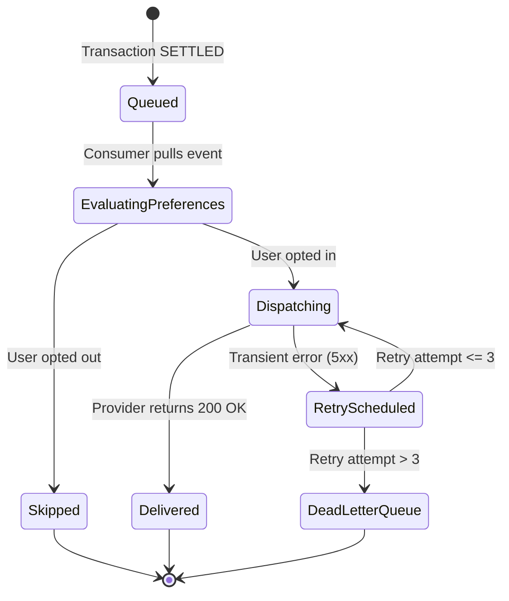
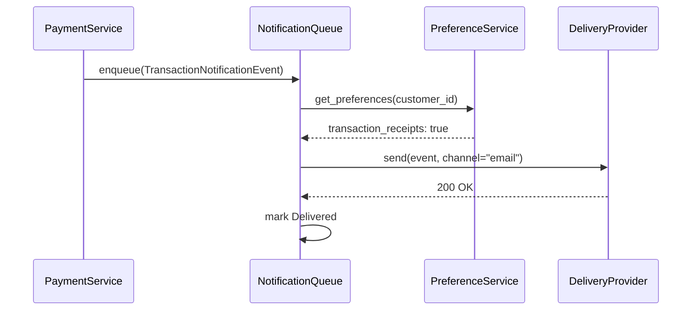

# Chapter 6: A Composite Grammar: Markdown, Schemas, Diagrams

Suppose the Payments guild at Meridian holds a spec review for the notification requirement that closed Chapter 5, and the draft on the screen is one page of careful prose. It states, correctly, that a settled transaction must enqueue a notification within two seconds, that the default channel is email, that a suppressed preference must be logged, and that a delivery failure must not reverse the transaction. Every sentence is a clean normative statement. The reviewer from Identity reads it twice and asks a question the prose cannot answer: "What are the exact fields on the event, and what type is each one?" The reviewer from the on-call rotation asks a second question the prose also cannot answer: "When a delivery fails and a retry is scheduled, and then that retry also fails, what actually happens — in order?"

The author is not being vague. The prose says a notification event is enqueued; it does not and structurally cannot say, in a form anyone can check mechanically, that the event has exactly six fields, that `amount_in_cents` is a positive integer, and that `currency` is a three-letter uppercase code. It says delivery is retried on failure; it does not show, in a form a reader can trace with a finger, the exact sequence of states a delivery attempt passes through between the moment it is queued and the moment it lands in a dead letter queue after three attempts. Prose can assert that a shape and a sequence exist. It is a poor tool for showing what they are.

The fix the guild settles on is not to write more prose. It is to stop asking one grammar to do three jobs. The normative statements stay exactly as they are, in Markdown, because English earns its place stating obligations. The event's shape moves into a JSON Schema, because a schema can enumerate every field, its type, and its bounds in a form a machine can validate and a human can scan. The delivery sequence moves into a state diagram, because a diagram can show every transition at once in a way a paragraph has to serialize into a story with a beginning that obscures the ending. The revised document is longer in line count and answers both questions in under ten seconds. That document, assembled in full at the end of this chapter, is `SPEC-PAY-042`.

## 6.1 Three layers for three jobs

A Clean Spec is not written in one language. It is written in three, each assigned to the kind of statement it expresses without loss, and the discipline is knowing which sentence belongs in which layer rather than trying to force all three into prose because prose is the layer everyone already knows.

**Markdown carries structure and norms.** It gives the document addressable headings, ordered sections, and a place for the RFC 2119 vocabulary from Chapter 5 to state what must, must not, should, and may happen. Markdown is the layer a human reads first and the layer that carries the obligations nothing else can express as cleanly, because "the system MUST reject the transaction" is a sentence, not a data shape or a sequence.

**Schemas carry data.** A payload, a command, a stored record — anything that crosses a boundary as structured data belongs in a schema, because a schema states field names, types, bounds, and required-ness exhaustively and checkably, in a form both a person and a validator can read without interpretation. Chapter 5 already showed what happens when a data shape is left to a sentence: "notification" turned out to mean four different things to four different readers. A schema does not admit that failure mode, because a field either appears in it or it does not.

**Diagrams carry dynamics.** Anything that unfolds over time — a state machine, a sequence of calls between components, a retry loop — belongs in a diagram, because a diagram shows every transition simultaneously, while prose has to pick an order to describe them in and readers reliably lose the transitions that arrive out of that order. The delivery sequence in the opening scenario is the clearest case: three sentences of prose describing five states and seven transitions is not more readable than the five states and seven transitions themselves, drawn.

It helps to think of the three layers as answering three different reviewer questions, because that is the test I use when I am not sure which layer a new sentence belongs in. "What must be true" is a Markdown question, and the answer is a normative statement. "What does it look like on the wire" is a schema question, and the answer is a field with a type and a bound. "What happens next, and after that" is a diagram question, and the answer is a transition. A sentence that cannot be sorted into one of those three questions is usually a sentence that does not belong in the specification at all — it is commentary, or it is an implementation detail dressed up as a requirement, and both have other homes.

None of the three layers is optional and none substitutes for another. A specification that is all Markdown drowns its data shapes and its sequences in paragraphs nobody can verify mechanically. A specification that is all schema has contracts with no stated obligations around them — a JSON Schema cannot say that a field must not be read by a caller under a given condition, only what the field looks like when it is present. A specification that is all diagrams shows transitions with no stated rules for why they fire. The three layers are complementary because each is precise about exactly the thing prose, schema, and diagram notation are respectively good at, and imprecise or silent about the other two.

## 6.2 Markdown conventions

The Markdown layer of a Clean Spec follows three conventions worth stating on their own, because they are what makes the document usable as a target for citation rather than only as a document to read start to finish.

Headings are addressable. Every section that states a rule gets a heading a reviewer can point to by name — "`SPEC-PAY-042` §3" is a location, not a description, and it stays valid as long as the section keeps its number even if its prose changes. Chapter 9 fixes the full section numbering scheme for the whole manuscript; what matters here is the habit: number sections, and never rename or renumber one once other documents or code comments cite it, because a citation that silently points at the wrong thing is worse than no citation.

Normative statements are numbered. Chapter 5 introduced the `N-` prefix for exactly this reason: `N-3` is citable in a review comment, a commit message, or a failed test in a way that "the third bullet in the notifications section" is not, because bullets move when someone edits the document and numbers, by convention, do not.

Tables carry anything with more than one dimension. A failure matrix, a decision table, a comparison of methods — Chapter 4's table of Waterfall, Agile, TDD, and SDD is an example already behind you — belongs in a Markdown table rather than in a paragraph enumerating the same cells in prose, because a table lets a reader scan one column in isolation, which a paragraph never allows. Every table in this book carries a one-sentence lead-in stating what it shows, and a Clean Spec should hold itself to the same rule: a table with no introduction forces the reader to reverse-engineer its purpose from its headers.

What Markdown does not carry, in a Clean Spec, is data shape or process dynamics dressed up as prose. "The payload contains a transaction identifier, an amount, and a currency" is a sentence that looks harmless and is actually the data model escaping its layer, because it states a shape informally in a place nothing will validate it against. The next section shows where that sentence belongs instead.

## 6.3 JSON Schema for contracts

Anything that crosses a boundary as data gets a JSON Schema, written against the 2020-12 specification, and every object schema in this book sets `additionalProperties: false`, because a contract that permits arbitrary extra fields is not a contract; it is a suggestion with an escape hatch. Here is the schema for the notification payload the opening scenario's reviewer asked about, keyword by keyword.

```json
{
  "$schema": "https://json-schema.org/draft/2020-12/schema",
  "title": "TransactionNotificationEvent",
  "type": "object",
  "properties": {
    "event_id": { "type": "string", "format": "uuid" },
    "transaction_id": { "type": "string", "format": "uuid" },
    "amount_in_cents": { "type": "integer", "minimum": 1 },
    "currency": { "type": "string", "pattern": "^[A-Z]{3}$" },
    "channel": { "type": "string", "enum": ["email", "sms", "push"] },
    "queued_at": { "type": "string", "format": "date-time" }
  },
  "required": [
    "event_id", "transaction_id", "amount_in_cents",
    "currency", "channel", "queued_at"
  ],
  "additionalProperties": false
}
```

`title` names the type, and it is the name generated code and generated tests both refer to, so it earns the same care as a class name. `type: object` fixes the payload's kind before anything else is said about it. Each property gets its own narrowest description rather than a shared informal type: `event_id` and `transaction_id` are both `format: uuid`, which is stricter than `string` alone and rules out every payload where a caller passed a sequential integer or a human-readable slug. `amount_in_cents` is an `integer` with `minimum: 1`, which states in one clause what Chapter 3's `amount.cents > 0` stated in prose for an operation's precondition — the same rule, expressed in the layer appropriate to a stored field rather than a function argument. `currency` uses `pattern` rather than `enum`, deliberately: a pattern says "three uppercase letters" without enumerating every ISO 4217 code the business might add, which is the schema's version of stating an invariant rather than a list of examples. `channel` is an `enum`, correctly this time, because the set of valid channels is small, closed, and exactly what N-3 from Chapter 5 already named.

`required` lists every field with no default, and the list is not the same as the property list above it by accident — in this schema every field is required, because a notification event with an absent amount or a missing channel is not a valid event with some fields unset, it is not an event. And `additionalProperties: false` closes the object: a payload with a seventh field is rejected, not silently accepted and silently ignored, which is what stops the schema from drifting the moment someone adds a field to the producer and forgets the consumer.

A schema this size answers the reviewer's first question completely and mechanically. Feed a payload to a validator and it either satisfies every clause above or it does not, with no interpretation involved, which is exactly the property Chapter 5 argued natural language cannot deliver.

## 6.4 Typed alternatives

JSON Schema is not the only way to state a data contract, and two alternatives are common enough in this book to name and place. A Pydantic model in Python and a type definition in TypeScript both express the same contract as native code:

```python
from pydantic import BaseModel, Field
from datetime import datetime
from uuid import UUID

class TransactionNotificationEvent(BaseModel):
    event_id: UUID
    transaction_id: UUID
    amount_in_cents: int = Field(gt=0)
    currency: str = Field(pattern=r"^[A-Z]{3}$")
    channel: str = Field(pattern=r"^(email|sms|push)$")
    queued_at: datetime

    class Config:
        extra = "forbid"
```

The two forms are not competitors; they answer different questions well. A JSON Schema is language-agnostic and lives naturally at a boundary between services, or teams, or organizations, where the consumer may not be written in the same language as the producer, and where the contract needs to be validated by a gateway that has no opinion about Python or TypeScript at all. A typed model lives naturally inside a single codebase, where the contract and the code that uses it share a language, and where the payoff is that a type checker enforces the contract on every call site at compile time rather than only at the moment a payload crosses a wire.

The rule I use is about where the boundary actually is. If `TransactionNotificationEvent` is produced by the payments service and consumed by a third-party delivery provider's webhook receiver, the JSON Schema is the specification and it is the only one that matters, because the two sides do not share a compiler. If the same type is constructed and consumed entirely inside one Python service, a Pydantic model is the more useful artifact day to day, because it is enforced continuously rather than only at serialization boundaries — but the JSON Schema should still exist as the canonical statement in the specification, with the Pydantic model treated as a generated or hand-synchronized projection of it, never the other way around. A specification that lives only as a class definition in one codebase stops being language-agnostic the moment a second service needs to read the same event, which is precisely the moment it starts to matter.

## 6.5 Mermaid for dynamics

The reviewer's second question — what happens, in order, when a retry also fails — belongs to the third layer. A state diagram shows every state a notification event can occupy and every transition between them, all at once, which is the property a sequence of paragraphs cannot have because paragraphs are read one at a time.



Every arrow in that diagram is a transition somebody has to have decided on, and the diagram makes a missing decision visually obvious in a way prose does not: there is no arrow leaving `DeadLetterQueue`, which is a deliberate statement that a message that exhausts its retries stays there until a human intervenes, rather than an omission a reader has to notice is missing from a paragraph.

A state diagram shows what states exist and what moves an event between them. It does not show which component initiates each move, and when that matters — when a reviewer needs to see not just that dispatch happens but which service calls which port to make it happen — a sequence diagram is the better tool, because time runs top to bottom and each participant gets its own lifeline.



The two diagrams are not redundant. The state diagram answers "what can this event's status ever be, and how does it get there." The sequence diagram answers "which component talks to which, and in what order, for one representative path through that state machine." A reviewer asking about the retry count needs the first. An engineer wiring up the `DeliveryProvider` port needs the second. A Clean Spec includes both when both questions matter, and the discipline is choosing the diagram type that answers the actual question rather than defaulting to whichever one the author drew first.

## 6.6 The assembled SPEC-PAY-042

Here is the document the Payments guild ends the meeting with, section by section, each in the layer that fits it. Nothing below is new; every clause was derived in 5.4 or drawn in 6.3 and 6.5. What is new is that all three now live under one heading, addressable as one specification.

### SPEC-PAY-042: Transaction Confirmation Notifications

#### 1. Scope

This specification governs the notification sent to a paying customer when a transaction settles. It covers channel selection, delivery timing, preference handling, and retry behavior. It does not cover the content or template of the notification message, which is governed by a separate specification owned by the messaging platform team.

#### 2. Normative Constraints

- N-1: Upon a transaction reaching `SETTLED` status, the system **MUST** enqueue a notification event within 2 seconds.
- N-2: Notification dispatch **MUST NOT** block or fail the payment transaction that triggered it.
- N-3: The default delivery channel **MUST** be email, sent to the address on the paying customer's account; the system **MAY** additionally deliver by SMS or push notification if that customer has separately opted into that specific channel.
- N-4: If the paying customer's `preferences.notifications.transaction_receipts` field is `false`, the dispatcher **MUST** suppress delivery on every channel for that event and **MUST** record an audit entry with status `SKIPPED`.
- N-5: If a delivery attempt fails for any reason other than a suppressed preference, the system **MUST** retry according to the retry policy in §4; a delivery failure **MUST NOT** cause the settled transaction to be reversed.

#### 3. Data Model

```json
{
  "$schema": "https://json-schema.org/draft/2020-12/schema",
  "title": "TransactionNotificationEvent",
  "type": "object",
  "properties": {
    "event_id": { "type": "string", "format": "uuid" },
    "transaction_id": { "type": "string", "format": "uuid" },
    "amount_in_cents": { "type": "integer", "minimum": 1 },
    "currency": { "type": "string", "pattern": "^[A-Z]{3}$" },
    "channel": { "type": "string", "enum": ["email", "sms", "push"] },
    "queued_at": { "type": "string", "format": "date-time" }
  },
  "required": [
    "event_id", "transaction_id", "amount_in_cents",
    "currency", "channel", "queued_at"
  ],
  "additionalProperties": false
}
```

#### 4. State Rules


Retry policy: exponential backoff starting at 500 milliseconds, at most 3 attempts, after which the event moves to `DeadLetterQueue` and pages the on-call rotation.

Four short sections, three grammars, and both of the reviewer's questions are now answered by pointing at a heading rather than by re-reading a paragraph and hoping. That is the entire payoff of the composite grammar: not more words, but the right notation carrying each kind of statement so that a reader — human or agent — never has to reconstruct a schema or a sequence from prose that was never precise enough to encode one.

## 6.7 What not to put in a spec

The composite grammar has a discipline of exclusion as well as inclusion, and three habits are worth naming because they creep into specifications that otherwise follow every rule in this chapter.

Screenshots do not belong in a Clean Spec. An image of a form is not addressable, not diffable, and not readable by an agent that has no vision step in its pipeline; whatever the screenshot shows — field order, validation states, labels — belongs in prose, a schema, or a diagram instead, in a form that survives being read as text.

Pseudo-code does not belong in a Clean Spec. It looks precise and is not: it has no compiler, no type checker, and no agreed grammar, which means it inherits every ambiguity of natural language while looking like it does not. Chapter 3's substitution rule and Chapter 13's Syntactic Micromanagement smell both target the same instinct from different angles — a specification states what must be true, not a sketch of how to make it true, and pseudo-code is almost always the second thing wearing the costume of the first.

Prose that duplicates the schema does not belong in a Clean Spec. "The payload contains an event identifier, a transaction identifier, an amount in cents, a currency code, a channel, and a timestamp" adds nothing the schema in 6.3 does not already say more precisely, and it adds a second copy that can silently drift out of sync with the first the next time a field is added. When a reviewer wants to know the shape of a payload, point them at the schema section by number. When they want to know why a field exists or what invariant it protects, that belongs in prose — but the shape itself has exactly one home, and duplicating it in a second layer is not redundancy for safety, it is two sources of truth wearing one heading, and Chapter 12 has a name for what happens when two sources of truth disagree.

## Key Takeaways

- A Clean Spec uses three grammars for three jobs: Markdown for structure and normative obligations, JSON Schema for data shape, and Mermaid diagrams for anything that unfolds over time.
- Markdown sections should be addressable by number and normative statements numbered with the `N-` prefix, so a review comment or a test can cite one clause without restating it.
- Every object schema in this book sets `additionalProperties: false`, because a contract that admits arbitrary extra fields is a suggestion, not a contract.
- Typed models such as Pydantic classes or TypeScript types are useful projections of a schema inside one codebase, but a schema crossing a boundary between services or organizations is the canonical form.
- A state diagram answers what states exist and how an entity moves between them; a sequence diagram answers which component initiates each move and in what order — use the one that answers the actual question.
- The assembled `SPEC-PAY-042` shows the whole method in miniature: four short sections, each written in the notation that carries its kind of statement without loss.
- Screenshots, pseudo-code, and prose that restates a schema in less precise language have no place in a Clean Spec; each either cannot be validated mechanically or creates a second source of truth that can silently drift from the first.
