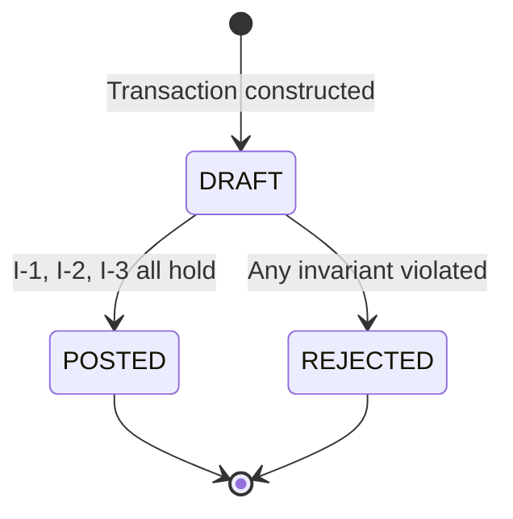

# Chapter 15: Case Study: A Double-Entry Ledger

Imagine Meridian's Ledger team inheriting a balance table that has quietly drifted out of true for three years. Account balances live as a `DECIMAL` column that started life, further back than anyone currently on the team remembers, as a `FLOAT`, and a handful of tables still carry the older type where a migration was never finished. Every quarter, a reconciliation job compares the sum of every account balance against the sum of every posted transaction, and every quarter it reports a discrepancy of a few cents — sometimes single cents, once, memorably, exactly the value of a currency-conversion rounding error nobody had traced. The team's answer for three years has been a manual adjustment entry, booked by hand, that makes the numbers match without ever addressing why they stopped matching in the first place.

The mandate this quarter is different: replace the float-based balance table with a real double-entry ledger, one where the arithmetic cannot drift because the representation makes drift impossible rather than merely unlikely. The team has read the first fourteen chapters of this book by the time the ticket lands, which means the assignment is not "write a ledger." It is "write the specification a ledger must satisfy, precisely enough that an agent's first attempt and its fiftieth attempt are both correct by construction, and prove it with tests that do not merely sample the same three cases every reconciliation job has already checked."

This chapter is that specification, `SPEC-CORE-001`, assembled in full using Chapter 9's nine-section template, followed by what an agent working from it actually produces: the derived test suite first, the domain types second, and a walkthrough of what happens when one of those tests catches the exact class of bug that put this team in a three-year cycle of manual adjustments.

## 15.1 The problem and the constraints

A double-entry ledger's entire discipline reduces to one sentence a first-year accounting student learns before anything else: every transaction records at least two entries, and the sum of its debits equals the sum of its credits, always, with no exception. The float-based table Meridian is replacing violated that sentence not through any single obvious bug but through the slow, structural failure of representing money as a type whose arithmetic was never exact to begin with — `0.1 + 0.2` does not equal `0.3` in IEEE 754 floating-point, and a ledger built on that representation is a ledger that drifts by construction, a few fractions of a cent at a time, exactly as Meridian's reconciliation job had been reporting for three years without anyone connecting the pattern to its cause.

The constraint this specification must therefore state before any other is a representation constraint: money is an integer count of the smallest currency unit — cents for most of Meridian's supported currencies — never a floating-point approximation of one. Everything else in `SPEC-CORE-001` follows from taking that one representation decision seriously enough to enforce it at every boundary the domain has, which Chapter 7's Level 1 discipline and Chapter 14's Replace Primitive with Value Object refactoring have already prepared the vocabulary for.

A second constraint follows close behind the first, and it is architectural rather than numeric: the ledger's domain core must have no dependency on a database, a web framework, or any third-party library beyond the standard library and a type validator. This is not caution for its own sake. The team's prior float-based system had accumulated, over three years, a handful of business rules that lived only inside an ORM's column definitions — a `CHECK` constraint here, a trigger there — invisible to anyone reading the application code and invisible to any agent asked to regenerate it, because nothing about `SPEC-ARCH-000`'s dependency rule from Chapter 7 was being honored in the part of the system that most needed it. A pure domain core, with every invariant stated in `SPEC-CORE-001` rather than scattered across a schema migration, is what makes it possible to regenerate the ledger's logic without first reverse-engineering three years of accumulated database triggers nobody wrote down.

The team also had to decide, early, what this specification would not attempt to solve. Currency conversion, multi-currency consolidated reporting, and historical balance queries across a date range are all real Ledger-team responsibilities, and all three are explicitly out of scope for `SPEC-CORE-001`, which governs only how one transaction's entries are validated and posted. Chapter 8's Single Responsibility Spec principle is doing the work in that decision as much as anything about accounting is: a specification that tried to be the double-entry invariant, the currency-conversion rule, and the reporting contract all at once would have been an Omniprompt in miniature, and the team split it into three planned documents before writing a line of any of them.

## 15.2 SPEC-CORE-001, in full

```yaml
---
id: SPEC-CORE-001
title: Double-Entry Ledger
version: 1.0.0
status: active
owner: ledger-guild
depends_on: [SPEC-ARCH-000]
supersedes: []
---
```

### SPEC-CORE-001: Double-Entry Ledger

#### 1. Scope

This module implements the pure domain core for financial transaction recording at Meridian. It governs how a transaction's entries are validated and posted; it does not govern how a balance is displayed, exported, or reported, which are Level 1 concerns of a separate reporting module that depends on this one.

#### 2. Normative Constraints

- N-1: All monetary operations **MUST** be performed using fixed-precision integer arithmetic, expressed as an integer count of the currency's smallest unit — cents for two-decimal currencies.
- N-2: Floating-point types (`float`, `double`) **MUST NOT** appear anywhere in this module's domain or application layers.
- N-3: A `Transaction` **MUST NOT** transition to `POSTED` status unless every invariant in §4 holds simultaneously.

The commentary worth pausing on here is what N-2 buys beyond N-1's positive requirement. N-1 alone states what representation to use; N-2 forecloses the representation the domain must never fall back to, even accidentally, through a third-party library's default numeric type or an ORM's automatic column mapping. Stating the prohibition explicitly is what turns "we use integer cents" from a convention a reviewer has to remember into a rule Chapter 10's Three Gates can enforce mechanically at the type-check gate, the moment any function signature admits a `float` where `Money` belongs.

#### 3. Data Model

**Value Object: `Money`**
- `cents`: 64-bit integer, absolute value.
- `currency`: 3-character uppercase string (ISO 4217), e.g. `"USD"`, `"EUR"`.

**Entity: `LedgerEntry`**
- `account_id`: UUIDv4.
- `direction`: enum `[DEBIT, CREDIT]`.
- `amount`: `Money`.

**Aggregate: `Transaction`**
- `transaction_id`: UUIDv4.
- `timestamp`: ISO 8601, UTC.
- `entries`: list of `LedgerEntry`, minimum 2 elements.
- `status`: enum `[DRAFT, POSTED, REJECTED]`.

#### 4. Invariants

Every transaction must satisfy all three simultaneously before it may transition to `POSTED`.

- I-1 (Balance Invariant): $$\sum \text{amount}(e) \text{ for } e \in \text{DEBIT entries} - \sum \text{amount}(e) \text{ for } e \in \text{CREDIT entries} = 0$$ In words: the exact sum of every debit entry must equal the exact sum of every credit entry.
- I-2 (Currency Uniformity Invariant): $$\forall e_i, e_j \in \text{entries}, \quad \text{currency}(e_i) = \text{currency}(e_j)$$ In words: every entry in one transaction shares the same currency; a transaction never mixes currencies.
- I-3 (Non-Zero Amount Invariant): $$\forall e \in \text{entries}, \quad e.\text{amount.cents} > 0$$ In words: no entry may carry a zero or negative amount.

#### 5. Failure Matrix

| Condition | Domain Exception | System Action |
| :--- | :--- | :--- |
| Sum of debits ≠ sum of credits | `UnbalancedTransactionError` | Transaction marked `REJECTED`; no balance altered |
| Entries carry mixed currencies | `CurrencyMismatchError` | Immediate rejection; audit log entry |
| Fewer than two entries | `InsufficientEntriesError` | Transaction rejected |
| Source account equals destination account on the same transaction | `CircularEntryError` | Transaction rejected |

#### 6. State Rules



A `Transaction` has exactly one opportunity to post. There is no path from `REJECTED` back to `DRAFT` in this version of the specification; a rejected transaction is corrected by constructing a new one, never by mutating the old one, which keeps every `REJECTED` record an honest, permanent account of what was attempted and why it failed.

#### 7. Test Requirements

The implementing agent **MUST** generate a suite including, at minimum: a property test generating $N$ randomly unbalanced transactions and asserting `UnbalancedTransactionError` on every one; an idempotency test confirming that posting the same transaction object twice does not double-post it; and a global balance property confirming that the net sum across every account in the system after $K$ posted transactions equals the net sum before those $K$ transactions were posted — the ledger-wide expression of I-1.

#### 8. Open Questions

Whether a `POSTED` transaction may ever be reversed, and if so whether through a compensating transaction or some other mechanism, is not yet decided by this specification and is out of scope for the initial implementation.

#### 9. Changelog

- **1.0.0** — 2026-09-10: Initial active version.

Read end to end, the document is under two hundred lines including its YAML header, nowhere near Chapter 9's three-hundred-line ceiling, and every section this chapter's team argued about for a day and a half is traceable to a specific clause a reviewer, or an agent, can cite by number.

Section 5's Failure Matrix deserves a second look now that it sits inside the full document rather than as a chapter-ten excerpt, because its four rows are not four independent facts about the domain — they are four ways I-1 through I-3 can fail to hold, enumerated exhaustively rather than discovered one incident at a time. `UnbalancedTransactionError` is I-1 failing. `CurrencyMismatchError` is I-2 failing. `InsufficientEntriesError` and `CircularEntryError` are both, on inspection, degenerate cases of I-1: a transaction with fewer than two entries cannot balance by definition, and a transaction whose source and destination account are identical balances trivially and pointlessly, moving no real value. Seeing the Failure Matrix as a derivation from the Invariants section rather than a separately brainstormed list is what let the team check its completeness the way Chapter 7 described: walk every way an invariant could fail, and confirm each one has a row, rather than trusting a reviewer's memory to have thought of everything.

The state rule in §6 is deliberately the smallest possible finite state machine — three states, two live transitions, no cycle — and that minimalism was itself a decision the team debated. An earlier draft included a `VOIDED` state reachable from `POSTED`, to support reversing a mistaken entry, and the team removed it during review specifically because nobody could yet state the invariant a reversal would need to preserve — does voiding a transaction net its entries to zero, or does it record a new, opposite transaction and leave the original standing? That unresolved question is exactly what belongs in §8's Open Questions rather than in a state machine built on a guess, and it is the clearest illustration in this whole specification of Chapter 9's argument that an honest gap is worth more than a silently invented answer.

## 15.3 What the agent generates first: the test suite

Per Chapter 10's ordering discipline, the agent's first deliverable from `SPEC-CORE-001` is not the ledger's implementation. It is the derived test suite, and Chapter 10 already showed the four contract tests transcribed from §5's Failure Matrix, one per row, named after the domain exception each row declares. What Chapter 10 left for this chapter to finish is the property suite §7 requires, derived directly from §4's three invariants.

```python
from hypothesis import given, strategies as st
from meridian.ledger import Money, LedgerEntry, Transaction, Direction, post

@given(
    debit_cents=st.integers(min_value=1, max_value=1_000_000),
    credit_cents=st.integers(min_value=1, max_value=1_000_000),
)
def test_i1_unbalanced_transaction_always_rejected(debit_cents, credit_cents, account_pair):
    if debit_cents == credit_cents:
        return  # balanced by construction; not the case under test
    txn = Transaction(entries=[
        LedgerEntry(account_pair[0], Direction.DEBIT, Money(debit_cents, "USD")),
        LedgerEntry(account_pair[1], Direction.CREDIT, Money(credit_cents, "USD")),
    ])
    with pytest.raises(UnbalancedTransactionError):
        post(txn)
    assert txn.status == "REJECTED"

@given(cents=st.integers(min_value=1, max_value=1_000_000))
def test_i2_mixed_currency_always_rejected(cents, account_pair):
    txn = Transaction(entries=[
        LedgerEntry(account_pair[0], Direction.DEBIT, Money(cents, "USD")),
        LedgerEntry(account_pair[1], Direction.CREDIT, Money(cents, "EUR")),
    ])
    with pytest.raises(CurrencyMismatchError):
        post(txn)

@given(k=st.integers(min_value=1, max_value=200))
def test_global_balance_invariant_holds_across_k_postings(k, balanced_transaction_factory):
    before = sum_all_account_balances()
    for _ in range(k):
        post(balanced_transaction_factory())
    after = sum_all_account_balances()
    assert after == before
```

Three tests, none of them example-based in Chapter 10's diminished sense: the first two search the entire space of debit and credit amounts and currency pairs rather than checking one hand-picked pair, and the third is the ledger-wide expression of I-1 that §7 explicitly requires, generating up to two hundred balanced transactions and confirming the net position across every account in the system never moves — exactly the property a floating-point ledger cannot honestly claim, and exactly the property Meridian's quarterly reconciliation job had been failing to observe for three years without a test that stated it as a formal, checkable claim.

## 15.4 What the agent generates second: the domain types

Only once the suite above exists and passes review does the agent write the types the tests exercise, starting with `Money`, the value object Chapter 14 already introduced for exactly this purpose.

```python
from dataclasses import dataclass
from enum import Enum
from uuid import UUID, uuid4
from datetime import datetime, timezone

@dataclass(frozen=True)
class Money:
    cents: int
    currency: str

    def __post_init__(self) -> None:
        if self.cents <= 0:
            raise ValueError("Money must be a positive integer count of cents")
        if len(self.currency) != 3 or not self.currency.isupper():
            raise ValueError("currency must be a 3-letter uppercase code")

class Direction(Enum):
    DEBIT = "DEBIT"
    CREDIT = "CREDIT"

@dataclass(frozen=True)
class LedgerEntry:
    account_id: UUID
    direction: Direction
    amount: Money

@dataclass
class Transaction:
    entries: list[LedgerEntry]
    transaction_id: UUID = None
    timestamp: datetime = None
    status: str = "DRAFT"

    def __post_init__(self) -> None:
        self.transaction_id = self.transaction_id or uuid4()
        self.timestamp = self.timestamp or datetime.now(timezone.utc)


def post(txn: Transaction) -> None:
    if len(txn.entries) < 2:
        txn.status = "REJECTED"
        raise InsufficientEntriesError(txn.transaction_id)
    currencies = {e.amount.currency for e in txn.entries}
    if len(currencies) > 1:
        txn.status = "REJECTED"
        raise CurrencyMismatchError(txn.transaction_id)
    debits = sum(e.amount.cents for e in txn.entries if e.direction is Direction.DEBIT)
    credits = sum(e.amount.cents for e in txn.entries if e.direction is Direction.CREDIT)
    if debits != credits:
        txn.status = "REJECTED"
        raise UnbalancedTransactionError(txn.transaction_id)
    txn.status = "POSTED"
```

Notice how directly each line of `post` traces to a clause. The entry-count check is I-3's companion condition from §5's `InsufficientEntriesError` row. The currency check is I-2. The sum comparison is I-1. There is no line in this function an agent had to invent from a statistical prior, because every decision it makes was already made, in writing, in `SPEC-CORE-001` — which is the entire promise Chapter 4 made about the SDD pipeline, delivered here as forty lines of Python instead of an argument.

`Money`'s constructor enforcing `cents > 0` is worth flagging against §4's I-3, because it means the non-zero and non-negative amount invariant is not merely tested by the property suite in 15.3 — it is unconstructible to violate in the first place, exactly the strengthening Chapter 3 and Chapter 14 both argued a value object buys over a validation branch. A property test still exists for it, per §7's requirement, but that test is now checking a belt the domain layer's own construction already wears a matching pair of suspenders for.

## 15.5 A walkthrough of one failure

Trace what happens when `post` receives a transaction with a debit of four hundred cents and a credit of three hundred and ninety-nine — the off-by-one class of bug that a floating-point ledger would have silently absorbed into its next quarter's reconciliation discrepancy.

`post` first checks the entry count: two entries, passes. It checks currency uniformity: both `USD`, passes. It sums debits: four hundred. It sums credits: three hundred and ninety-nine. The two integers are compared with ordinary integer equality — no epsilon, no tolerance, no "close enough," because I-1 stated an exact equality and `Money`'s integer representation makes exact equality a meaningful thing to check in the first place. The sums differ, `txn.status` is set to `REJECTED`, and `UnbalancedTransactionError` is raised, carrying the transaction's identifier.

Nothing about the account balances changed, which is §5's stated system action for this row and which `post`'s structure guarantees by never touching a balance until every check above it has passed. The audit trail records a `REJECTED` transaction with its own permanent identifier, per §6's state rule that a rejection is never silently retried in place. And `test_unbalanced_transaction_error`, the contract test Chapter 10 already wrote for this exact row, is the test that catches this exact scenario the moment a future change to `post` — a hasty refactor, an agent's misreading of an unrelated adjacent clause — reintroduces the possibility of comparing two sums with anything looser than exact integer equality.

Compare this to what Meridian's original float-based system would have done with the identical inputs. A four-hundred-cent debit and a three-hundred-ninety-nine-cent credit, represented as `4.00` and `3.99`, do not trigger any exception at all in a system with no exact-equality check, because nothing in that system was ever asking the question `post` asks here. The discrepancy simply enters the balance table, one cent lighter than it should be, and waits quietly for the next quarterly reconciliation job to notice — which is not a defect in the reconciliation job. It is the predictable consequence of a system that had no mechanism for rejecting an unbalanced transaction at the only moment rejecting it was actually cheap: before it was ever accepted.

## 15.6 Lessons

`SPEC-CORE-001` is a small document — under two hundred lines — governing a problem domain accountants have understood for centuries, and both facts are the point rather than a coincidence. A double-entry ledger's correctness rests on exactly three invariants, and Chapter 3 promised, three chapters before this one existed as more than a forward reference, that this chapter would show a specification whose entire weight sits on that small a foundation. It does: I-1, I-2, and I-3 are the whole of what makes this ledger a ledger, and once they are stated precisely, quantified as universal claims rather than as three examples, and made testable by Hypothesis's search rather than by three hand-picked numbers, the implementation that satisfies them is almost mechanical to produce, as 15.4's forty lines demonstrated.

The deeper lesson is what the float-based system was actually missing, and it was never cleverness. Nobody on Meridian's original team was careless, and the rounding bug that cost three years of manual quarterly adjustments was not a bug anyone could have caught by reading the code more carefully, because the code was, in its own terms, doing exactly what floating-point arithmetic does. The missing artifact was a specification precise enough to make the representation choice a decision instead of a default — N-2's explicit prohibition on `float` is one sentence, and one sentence, enforced by a type checker at Chapter 10's second gate, is what a three-year pattern of manual adjustments was actually waiting for.

There is a final lesson worth stating plainly, because it is easy to read a case study this clean and conclude that double-entry bookkeeping was simply an easy domain to specify. It was not easy; it was old. Three invariants that feel obvious once written down took centuries of accounting practice to settle on, and the appearance of simplicity in `SPEC-CORE-001` is centuries of prior art compressed into two hundred lines, not evidence that specification work is generally this fast. A domain without that history — a novel fraud-scoring rule, a first-of-its-kind loyalty program — does not get to borrow three pre-validated invariants from a discipline older than double-entry bookkeeping, and the team that specifies one should expect the 15.1-style argument over scope and representation to take longer, not shorter, than it took here. What transfers from this chapter is not the specific invariants. It is the method: state the smallest set of properties that must always hold, quantify them, make violating them a type error wherever construction allows it, and let the property suite catch what construction alone cannot.

## Key Takeaways

- A double-entry ledger's correctness rests on three invariants — balanced debits and credits, currency uniformity, and non-zero amounts — and `SPEC-CORE-001` states all three as quantified clauses rather than as examples, which is what makes them testable by search rather than by sample.
- Representation is a specification decision, not an implementation detail: N-2's prohibition on floating-point types is one sentence that closes an entire class of drift a three-year pattern of manual reconciliation adjustments never addressed.
- The agent's first deliverable is the property suite derived from §4 and §7, not the implementation; the suite in 15.3 searches the space of unbalanced transactions and currency mismatches rather than checking one hand-picked case each.
- `Money`'s constructor enforcing a positive integer count of cents makes I-3 unconstructible to violate, which is Chapter 14's Replace Primitive with Value Object refactoring delivering a stronger guarantee than the property test alone would provide.
- Every line of the `post` function traces to a specific clause — entry count to §5's `InsufficientEntriesError` row, currency check to I-2, sum comparison to I-1 — leaving nothing for an agent to have invented from a statistical prior.
- A rejected transaction is never mutated back to draft; §6's state rule keeps every failed posting attempt a permanent, honest record rather than a silently retried mutation.
- A specification under two hundred lines, written once and enforced by Chapter 10's Three Gates on every subsequent change, replaced three years of a manual adjustment ritual that never addressed its own root cause.
